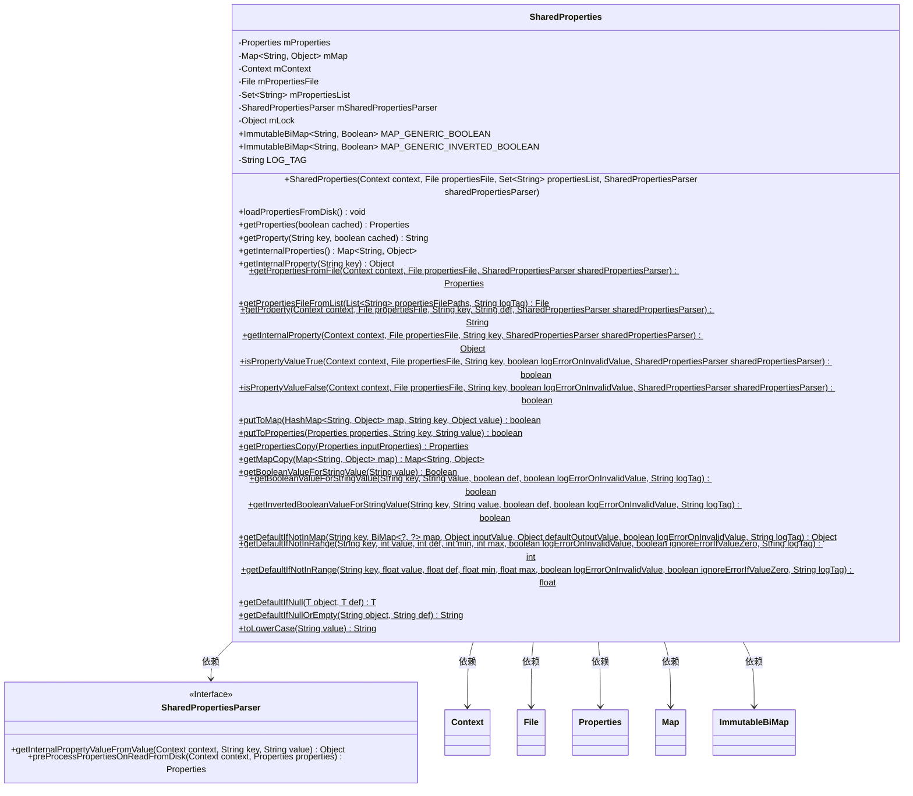
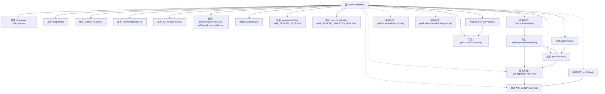

# 基础信息

|      |      |
|------|------|
| 名称 | SharedProperties |
| 编码语言 | .java |
| 代码路径 | termux-app/termux-shared/src/main/java/com/termux/shared/settings/properties/SharedProperties.java |
| 包名 | com.termux.shared.settings.properties |
| 依赖项 | ['android.content.Context', 'android.widget.Toast', 'androidx.annotation.NonNull', 'androidx.annotation.Nullable', 'com.google.common.collect.BiMap', 'com.google.common.collect.ImmutableBiMap', 'com.google.common.primitives.Primitives', 'com.termux.shared.file.FileUtils', 'com.termux.shared.file.filesystem.FileType', 'com.termux.shared.logger.Logger', 'java.io.File', 'java.io.FileInputStream', 'java.io.InputStreamReader', 'java.nio.charset.StandardCharsets', 'java.util.HashMap', 'java.util.List', 'java.util.Map', 'java.util.Properties', 'java.util.Set'] |
| 概述说明 | SharedProperties类用于管理属性文件的内存缓存，支持加载、解析和获取属性值。 |

# 说明

SharedProperties类是一个用于管理属性文件的工具类，提供从文件加载属性、缓存属性值及转换属性类型的功能。它包含两个核心缓存：Properties对象存储原始键值对，HashMap存储经过解析的内部值。类支持通过SharedPropertiesParser接口自定义属性解析逻辑，并提供静态方法处理布尔值、数值范围校验及默认值回退。线程安全通过内部锁机制保证，同时支持属性文件的动态加载和条件读取。类还包含工具方法用于处理常见数据类型转换和校验场景，如字符串到布尔值的映射、数值范围检查等。

# 类列表 Class Summary

| 名称   | 类型  | 说明 |
|-------|------|-------------|
| SharedProperties | class | SharedProperties类用于管理属性文件的内存缓存，支持键值对操作和布尔值转换。 |

## 类 SharedProperties

|      |      |
|------|------|
| 访问范围 | public |
| 类型 | class |
| 名称 | SharedProperties |
| 说明 | SharedProperties类用于管理属性文件的内存缓存，支持键值对操作和布尔值转换。 |

### UML类图

该代码实现了一个共享属性管理类，主要用于从属性文件中读取配置并转换为内部对象。核心功能包括：1) 通过Properties文件管理键值对；2) 使用SharedPropertiesParser接口进行值转换；3) 提供线程安全的属性访问；4) 包含多种类型转换和验证方法。类图展示了与Context、File、Properties等核心类的依赖关系，以及通过接口实现的扩展点设计。

### 内部方法调用关系图

该流程图展示了SharedProperties类的核心结构和主要方法调用关系。类包含多个属性用于管理配置文件(mPropertiesFile)的内存缓存(mProperties和mMap)，通过同步锁(mLock)保证线程安全。关键方法loadPropertiesFromDisk()实现了从磁盘加载配置到内存的核心逻辑，依赖getProperties()和静态方法getPropertiesFromFile()完成文件读取。静态工具方法提供了布尔值转换、属性验证等通用功能，形成完整的配置管理体系。

### 字段列表 Field List

| 名称  | 类型  | 说明 |
|-------|-------|------|
| mContext | Context | 私有上下文变量mContext |
| mLock = new Object() | Object | 私有锁对象初始化 |
| MAP_GENERIC_BOOLEAN =        new ImmutableBiMap.Builder<String, Boolean>()            .put("true", true)            .put("false", false)            .build() | ImmutableBiMap<String, Boolean> | 定义不可变双向映射，键为字符串"true"/"false"，对应布尔值true/false。 |
| mPropertiesList | Set<String> | 私有字符串集合属性列表 |
| MAP_GENERIC_INVERTED_BOOLEAN =        new ImmutableBiMap.Builder<String, Boolean>()            .put("true", false)            .put("false", true)            .build() | ImmutableBiMap<String, Boolean> | 定义不可变双向映射，反转布尔值对应关系。 |
| mSharedPropertiesParser | SharedPropertiesParser | 私有共享属性解析器实例。 |
| mMap | Map<String, Object> | 私有映射变量mMap，键为字符串，值为对象。 |
| LOG_TAG = "SharedProperties" | String | 私有静态常量LOG_TAG值为"SharedProperties"。 |
| mPropertiesFile | File | 私有属性文件对象 |
| mProperties | Properties | 私有属性mProperties |

### 方法列表 Method List

| 名称  | 类型  | 说明 |
|-------|-------|------|
| getDefaultIfNull | T | 空时返回默认值，非空返回原值。 |
| getInternalProperty | Object | 同步方法获取内部属性，非空键返回对应值，否则返回空。 |
| getProperties | Properties | 获取属性方法：根据缓存参数返回属性副本或从文件读取。 |
| getPropertiesFromFile | Properties | 从文件加载属性，处理异常并返回结果。 |
| getInvertedBooleanValueForStringValue | boolean | 静态方法返回布尔值，基于键值对和默认值处理逻辑。 |
| isPropertyValueTrue | boolean | 检查属性值是否为真，支持日志记录和自定义解析器。 |
| getDefaultIfNotInRange | int | 检查数值是否在范围内，否则返回默认值并记录错误。 |
| isPropertyValueFalse | boolean | 检查属性值是否为假，支持上下文、文件、键和错误日志配置。 |
| loadPropertiesFromDisk | void | 从磁盘加载属性文件，同步处理并更新内存映射和属性列表。 |
| getProperty | String | 从上下文和属性文件获取指定键的值，默认返回def。 |
| getDefaultIfNullOrEmpty | String | 检查字符串为空或null时返回默认值。 |
| toLowerCase | String | 静态方法将字符串转为小写，若输入为空则返回空。 |
| getBooleanValueForStringValue | boolean | 静态方法返回布尔值，基于键值对和默认值处理，可选记录错误日志。 |
| getInternalProperties | Map<String, Object> | 同步方法返回内部属性映射的副本。 |
| getDefaultIfNotInMap | Object | 方法根据键从BiMap取值，若无则返回默认值并可选记录错误日志。 |
| getInternalProperty | Object | 静态方法通过解析器获取文件属性值并返回内部值。 |
| putToMap | boolean | 向Map安全添加键值，检查非空及类型，仅允许基本类型和字符串。 |
| isPropertyValueTrue | boolean | 静态方法检查属性值是否为真，支持上下文、文件、键和错误日志参数。 |
| getProperty | String | 获取属性值，支持文件解析和默认值。 |
| getPropertiesCopy | Properties | 复制Properties对象，返回新实例。 |
| isPropertyValueFalse | boolean | 检查属性文件键值是否为false，支持错误日志记录。 |
| getPropertiesFileFromList | File | 从路径列表获取可读属性文件，忽略非常规文件或不可读项，未找到返回空。 |
| getDefaultIfNotInRange | float | 检查数值是否在范围内，否则返回默认值并记录错误。 |
| getMapCopy | Map<String, Object> | 复制Map对象，原Map为null时返回null。 |
| getBooleanValueForStringValue | Boolean | 静态方法通过字符串值返回对应布尔值，忽略大小写。 |
| putToProperties | boolean | 静态方法检查属性和键非空后存储或删除键值。 |
| getProperty | String | 同步方法获取指定键的属性值，支持缓存。 |

