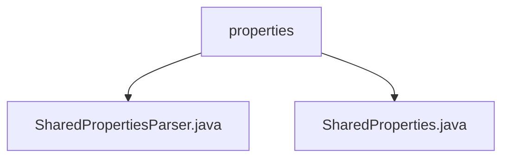

# 基础信息

|      |      |
|------|------|
| 名称 | properties |
| 编码语言 | .java |
| 代码路径 | termux-app/termux-shared/src/main/java/com/termux/shared/settings/properties |
| 包名 | termux-app.termux-shared.src.main.java.com.termux.shared.settings.properties |
| 概述说明 | SharedProperties类管理属性文件，支持加载、缓存、类型转换及线程安全。 |

# 说明

```markdown
## 概述
该代码模块为Termux应用提供属性文件管理的核心功能，主要包含`SharedProperties`和`SharedPropertiesParser`两个关键类。模块通过统一的接口实现属性文件的加载、解析、缓存及类型转换，支持动态加载和线程安全操作。其核心设计特点包括：
1. **双缓存机制**：使用`Properties`对象存储原始键值对，`HashMap`缓存解析后的内部值，提升高频访问性能。
2. **可扩展解析**：通过`SharedPropertiesParser`接口允许自定义属性解析逻辑。
3. **类型安全处理**：内置静态方法支持布尔值转换、数值范围校验及默认值回退策略。
4. **线程安全**：采用内部锁机制保证多线程环境下的数据一致性。

## 主要业务场景
1. **动态配置管理**  
   处理Termux运行时属性文件的加载与更新（如`termux.properties`），支持条件读取和热重载。

2. **数据类型转换**  
   - 字符串到布尔值的智能映射（如"1/on/true"均转为`true`）
   - 数值范围校验（如验证端口号是否在有效区间）
   - 默认值回退（属性缺失时返回预定义默认值）

3. **线程安全访问**  
   在多线程环境下安全读写共享属性，例如：
   - 后台服务读取终端配色配置
   - 并行任务检查功能开关状态（如`allow-external-apps`属性）

4. **校验与工具场景**  
   提供工具方法用于常见校验逻辑，如文件路径合法性检查、枚举值匹配等。
```


### 包内部结构视图



该流程图展示了Termux项目中共享设置属性相关的文件结构。顶层节点"properties"包含两个Java文件：SharedPropertiesParser.java和SharedProperties.java，这两个文件都位于termux-shared模块的settings/properties目录下，用于处理Termux应用的共享属性配置。这种结构体现了属性解析功能的模块化设计，其中主类与解析器分离，便于维护和扩展。

# 文件列表 File List

| 名称   | 类型  | 说明 |
|-------|------|-------------|
| [SharedPropertiesParser.java](SharedPropertiesParser.md) | file | 信息内容为空，无法生成概要描述。 |
| [SharedProperties.java](SharedProperties.md) | file | SharedProperties类用于管理属性文件的内存缓存，支持加载、解析和获取属性值。 |


