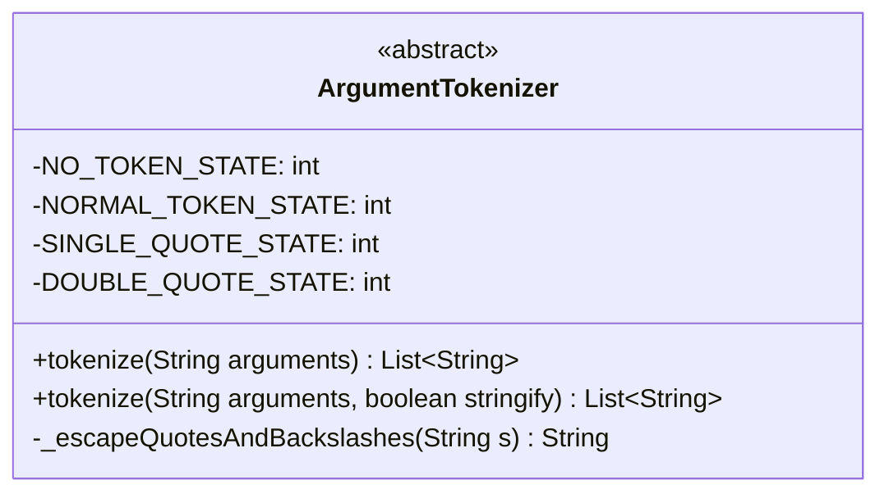
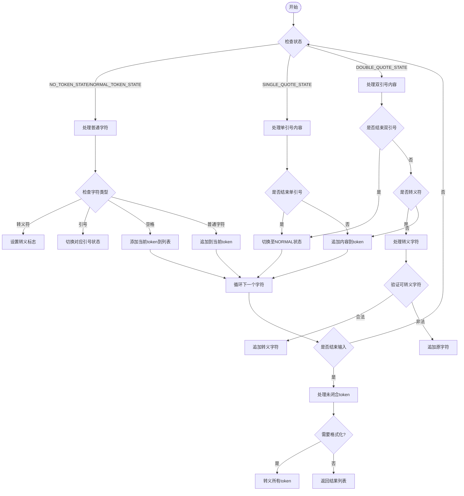
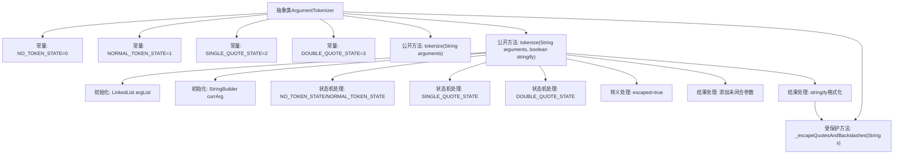

# 基础信息

|      |      |
|------|------|
| 名称 | ArgumentTokenizer |
| 编码语言 | .java |
| 代码路径 | termux-app/termux-shared/src/main/java/com/termux/shared/shell/ArgumentTokenizer.java |
| 包名 | com.termux.shared.shell |
| 依赖项 | ['java.util.List', 'java.util.LinkedList'] |
| 概述说明 | 命令行参数分词器，支持引号转义和特殊字符处理。 |

# 说明

ArgumentTokenizer是一个抽象类，用于将命令行风格的字符串参数解析为令牌列表。它定义了四种状态：无令牌、普通令牌、单引号和双引号状态。核心方法tokenize通过遍历输入字符串，根据当前状态处理字符，包括处理转义字符、引号内的内容以及空白符分隔。当stringify参数为true时，会对结果中的每个令牌添加双引号并转义内部引号和反斜杠。辅助方法_escapeQuotesAndBackslashes负责转义特殊字符，如换行符、制表符等，并在引号和反斜杠前插入转义字符。该工具类能正确处理各种复杂参数情况。

# 类列表 Class Summary

| 名称   | 类型  | 说明 |
|-------|------|-------------|
| ArgumentTokenizer | class | ArgumentTokenizer类用于解析命令行参数，支持引号和转义字符处理。 |

## 类 ArgumentTokenizer

|      |      |
|------|------|
| 访问范围 | public abstract |
| 类型 | class |
| 名称 | ArgumentTokenizer |
| 说明 | ArgumentTokenizer类用于解析命令行参数，支持引号和转义字符处理。 |

### UML类图

这段代码实现了一个命令行参数解析器，主要功能是将包含空格和引号的字符串拆分为多个token。类图显示这是一个抽象类，包含4个状态常量和2个公开的tokenize方法，以及1个受保护的转义处理方法。流程图详细描述了基于状态机的解析过程：通过NO_TOKEN_STATE、NORMAL_TOKEN_STATE和两种引号状态来处理普通字符、转义符和引号嵌套，最终生成格式化后的参数列表。该设计能正确处理引号嵌套、字符转义和特殊字符替换等边界情况。

### 内部方法调用关系图

该流程图展示了ArgumentTokenizer类的核心结构和处理流程。这个抽象类通过状态机模式解析命令行参数，主要包含4种状态常量和3个关键方法。tokenize方法通过遍历输入字符串，根据当前状态（普通状态、单引号状态、双引号状态）和转义字符处理参数分割，最终生成参数列表。特殊字符转义方法会处理引号、反斜杠和各类控制字符，当stringify为true时会对结果进行引号包装。整个过程体现了严谨的状态转换和边界条件处理。

### 字段列表 Field List

| 名称  | 类型  | 说明 |
|-------|-------|------|
| NORMAL_TOKEN_STATE = 1 | int | 定义常量NORMAL_TOKEN_STATE值为1。 |
| SINGLE_QUOTE_STATE = 2 | int | 私有静态常量单引号状态值为2。 |
| NO_TOKEN_STATE = 0 | int | 私有静态常量NO_TOKEN_STATE值为0。 |
| DOUBLE_QUOTE_STATE = 3 | int | 私有静态常量DOUBLE_QUOTE_STATE值为3。 |

### 方法列表 Method List

| 名称  | 类型  | 说明 |
|-------|-------|------|
| tokenize | List<String> | 静态方法tokenize接收字符串参数，返回字符串列表，默认不处理特殊标记。 |
| tokenize | List<String> | Java方法：解析字符串参数，处理转义和引号，返回列表。 |
| _escapeQuotesAndBackslashes | String | 转义字符串中的引号、反斜杠及特殊字符。 |

