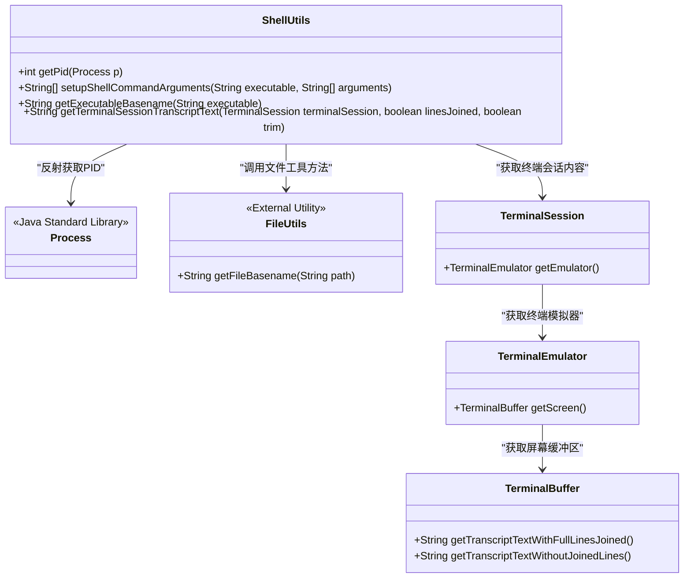
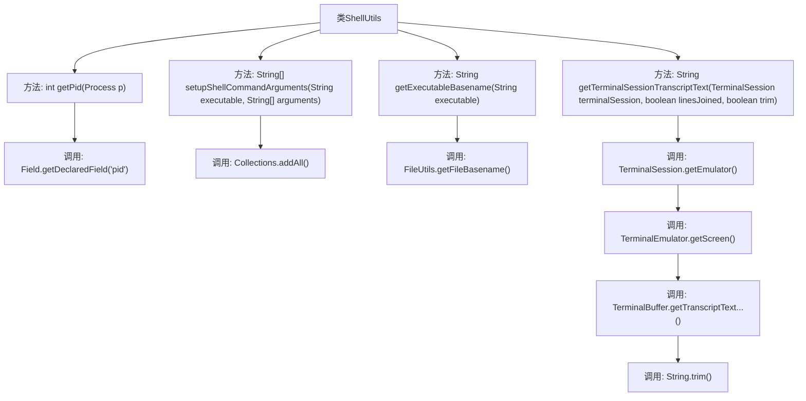

# 基础信息

|      |      |
|------|------|
| 名称 | ShellUtils |
| 编码语言 | .java |
| 代码路径 | termux-app/termux-shared/src/main/java/com/termux/shared/shell/ShellUtils.java |
| 包名 | com.termux.shared.shell |
| 依赖项 | ['androidx.annotation.NonNull', 'androidx.annotation.Nullable', 'com.termux.shared.file.FileUtils', 'com.termux.terminal.TerminalBuffer', 'com.termux.terminal.TerminalEmulator', 'com.termux.terminal.TerminalSession', 'java.lang.reflect.Field', 'java.util.ArrayList', 'java.util.Collections', 'java.util.List'] |
| 概述说明 | ShellUtils类提供进程PID获取、Shell命令参数设置、可执行文件基名提取及终端会话转录文本获取功能。 |

# 说明

ShellUtils类提供了四个实用方法：getPid通过反射获取Process对象的进程ID，失败返回-1；setupShellCommandArguments将可执行文件路径和参数合并为字符串数组；getExecutableBasename调用FileUtils获取可执行文件的基本名称；getTerminalSessionTranscriptText从TerminalSession对象提取终端模拟器的文本记录，支持控制是否合并行和修剪空白。所有方法均包含空值检查和异常处理。

# 类列表 Class Summary

| 名称   | 类型  | 说明 |
|-------|------|-------------|
| ShellUtils | class | ShellUtils工具类：获取进程PID、设置Shell命令参数、获取可执行文件基名、终端会话转录文本。 |

## 类 ShellUtils

|      |      |
|------|------|
| 访问范围 | public |
| 类型 | class |
| 名称 | ShellUtils |
| 说明 | ShellUtils工具类：获取进程PID、设置Shell命令参数、获取可执行文件基名、终端会话转录文本。 |

### UML类图

这段类图展示了ShellUtils工具类的核心功能结构。该类提供四个主要方法：通过反射获取进程PID、组装Shell命令参数、获取可执行文件基名，以及提取终端会话文本。工具类依赖Java标准库的Process类进行进程操作，调用外部FileUtils处理路径，并通过TerminalSession-TerminalEmulator-TerminalBuffer三级调用链获取终端内容。所有方法均为静态公有方法，体现了工具类的无状态特性，其中getPid方法使用异常处理保障健壮性，getTerminalSessionTranscriptText通过多层空值检查确保安全性。

### 内部方法调用关系图

该流程图展示了ShellUtils类的四个核心方法及其调用关系。getPid()通过反射获取进程ID，setupShellCommandArguments()构建shell命令参数数组，getExecutableBasename()委托FileUtils获取可执行文件基名，最复杂的getTerminalSessionTranscriptText()通过多层调用（TerminalSession→TerminalEmulator→TerminalBuffer）获取终端会话文本，最终根据参数决定是否合并行或修剪空白。所有方法都包含完善的空值检查和异常处理逻辑。

### 字段列表 Field List

| 名称  | 类型  | 说明 |
|-------|-------|------|

### 方法列表 Method List

| 名称  | 类型  | 说明 |
|-------|-------|------|
| getPid | int | 获取进程PID的Java方法，通过反射访问私有字段，失败返回-1。 |
| setupShellCommandArguments | String[] | 静态方法合并可执行文件路径与参数数组，返回字符串数组。 |
| getExecutableBasename | String | 可空静态方法，返回可执行文件基名。 |
| getTerminalSessionTranscriptText | String | 获取终端会话的文本内容，支持行连接和修剪。 |

