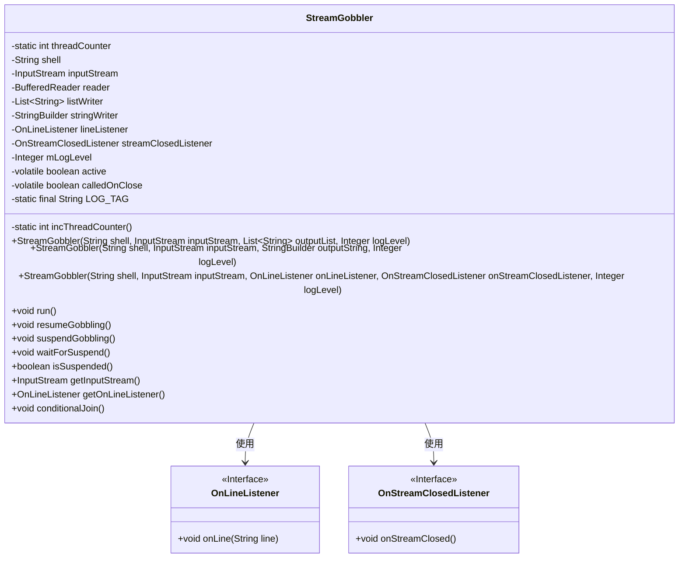
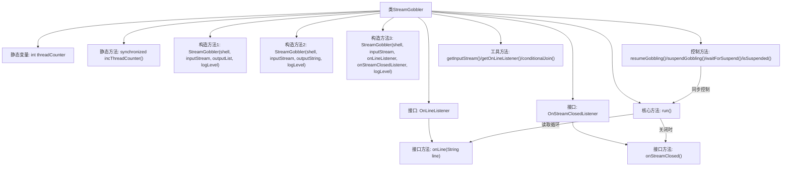

# 基础信息

|      |      |
|------|------|
| 名称 | StreamGobbler |
| 编码语言 | .java |
| 代码路径 | termux-app/termux-shared/src/main/java/com/termux/shared/shell/StreamGobbler.java |
| 包名 | com.termux.shared.shell |
| 依赖项 | ['java.io.BufferedReader', 'java.io.IOException', 'java.io.InputStream', 'java.io.InputStreamReader', 'java.util.List', 'java.util.Locale', 'androidx.annotation.AnyThread', 'androidx.annotation.NonNull', 'androidx.annotation.Nullable', 'androidx.annotation.WorkerThread', 'com.termux.shared.logger.Logger'] |
| 概述说明 | StreamGobbler线程类，用于快速读取Shell流，防止死锁，支持回调、暂停和恢复功能。 |

# 说明

StreamGobbler是一个线程类，用于高效读取Shell命令的输入流（如STDOUT/STDERR），防止缓冲区满导致死锁。它提供三种构造方式：将输出写入List、StringBuilder或通过回调接口处理。核心功能包括：实时逐行读取流数据，支持暂停/恢复读取操作，线程安全计数器命名线程，并包含流关闭回调机制。通过同步块控制读取状态，确保资源释放，同时允许外部监听行数据和流关闭事件。日志级别可定制，适用于需要异步处理Shell输出的场景。

# 类列表 Class Summary

| 名称   | 类型  | 说明 |
|-------|------|-------------|
| StreamGobbler | class | StreamGobbler类用于快速读取Shell输出，防止死锁，支持回调、暂停和恢复功能。 |

## 类 StreamGobbler

|      |      |
|------|------|
| 访问范围 | @SuppressWarnings({"WeakerAccess"});public |
| 类型 | class |
| 名称 | StreamGobbler |
| 说明 | StreamGobbler类用于快速读取Shell输出，防止死锁，支持回调、暂停和恢复功能。 |

### UML类图

这段代码定义了一个`StreamGobbler`类，继承自`Thread`，用于异步读取输入流并处理数据。该类提供了三种构造方式：输出到列表、输出到字符串构建器或通过回调接口处理数据。主要功能包括暂停/恢复读取、等待暂停状态检查等线程控制操作，并通过两个接口`OnLineListener`和`OnStreamClosedListener`实现事件回调。设计目的是防止Shell命令执行时因缓冲区满导致的死锁问题，确保流数据被及时处理。

### 内部方法调用关系图

流程图描述：该流程图展示了StreamGobbler类的完整结构，包含3个构造方法、核心运行逻辑和线程控制机制。核心流程是run()方法通过循环读取输入流，根据配置将数据写入不同目标（列表/StringBuilder/回调接口），同时支持通过同步机制暂停/恢复处理。类包含两个回调接口用于行处理和流关闭事件，并通过synchronized方法保证线程安全计数和状态控制。

### 字段列表 Field List

| 名称  | 类型  | 说明 |
|-------|-------|------|
| mLogLevel | Integer | 可空私有整型日志级别变量 |
| inputStream | InputStream | 非空私有输入流 |
| LOG_TAG = "StreamGobbler" | String | 日志标签设为"StreamGobbler" |
| shell | String | 非空私有终态字符串shell |
| calledOnClose = false | boolean | 私有易变布尔变量，标记关闭调用状态。 |
| streamClosedListener | OnStreamClosedListener | 可空私有终态流关闭监听器 |
| reader | BufferedReader | 非空只读BufferedReader对象 |
| threadCounter = 0 | int | 私有静态整型变量threadCounter，初始值为0。 |
| stringWriter | StringBuilder | 可空私有终态StringBuilder变量stringWriter |
| active = true | boolean | 私有易变布尔变量active初始化为true |
| lineListener | OnLineListener | 可空私有终态在线监听器lineListener |
| listWriter | List<String> | 可空字符串列表变量listWriter |

### 方法列表 Method List

| 名称  | 类型  | 说明 |
|-------|-------|------|
| getInputStream | InputStream | 非空多线程安全方法，返回输入流对象。 |
| conditionalJoin | void | 避免死锁和自等待的条件连接方法。 |
| incThreadCounter | int | 同步方法递增线程计数器并返回当前值。 |
| suspendGobbling | void | 暂停线程处理，同步设置active为false并唤醒所有等待线程。 |
| getOnLineListener | OnLineListener | 获取可空线程安全在线监听器实例。 |
| run | void | 重写run方法，读取输入流并处理每行数据，支持日志记录和暂停功能，确保资源释放。 |
| isSuspended | boolean | 检查线程是否挂起，同步返回非活动状态。 |
| waitForSuspend | void | 工作线程等待挂起，同步检查活动状态，若活跃则等待32毫秒。 |
| resumeGobbling | void | 恢复线程处理，激活时通知所有等待线程。 |

