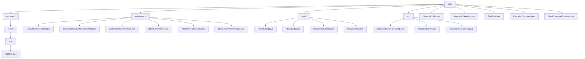

# 基础信息

|      |      |
|------|------|
| 名称 | shell |
| 编码语言 | .java |
| 代码路径 | termux-app/termux-shared/src/main/java/com/termux/shared/shell |
| 包名 | termux-app.termux-shared.src.main.java.com.termux.shared.shell |
| 概述说明 | Shell框架管理Termux命令执行，含环境控制、进程管理和结果处理。AM套接字服务器处理远程命令。StreamGobbler高效读取Shell输出。ArgumentTokenizer解析命令行参数。ShellUtils提供进程工具方法。 |

# 说明

## 概述

该代码模块是一个面向Termux类应用的综合性Shell命令执行与管理框架，集成了环境管理、命令执行、进程控制和结果处理等核心功能。模块采用分层架构设计，主要包含以下子系统：

1. **Shell命令执行框架**  
   - 提供从环境配置到结果处理的全生命周期管理
   - 支持同步/异步执行模式及跨平台环境适配
   - 包含`ExecutionCommand`状态机和`AppShell`进程控制器

2. **本地套接字服务系统**  
   - 实现AM命令的远程执行与反馈机制
   - 包含`AmSocketServer`服务器核心及权限管理组件

3. **基础工具组件**  
   - `StreamGobbler`：异步流处理线程
   - `ArgumentTokenizer`：命令行参数解析器
   - `ShellUtils`：Shell相关工具方法集

## 主要业务场景

### 1. Shell命令全流程管理
- **环境初始化**  
  - 通过`UnixShellEnvironment`/`AndroidShellEnvironment`自动配置平台相关变量
  - 动态构建执行上下文（SHELL_ID等）

- **命令执行控制**  
  - 支持TERMINAL_SESSION/APP_SHELL等多种执行模式
  - 进程状态跟踪（PRE_EXECUTION→EXECUTING→SUCCESS/FAILED）

- **结果处理**  
  - 结构化输出（`ResultData`存储stdout/stderr/exit_code）
  - 多通道返回机制（PendingIntent/文件分片）

### 2. AM命令远程服务
- **套接字通信**  
  - 监听本地套接字接收AM命令请求
  - 解析执行后通过套接字返回结果

- **权限控制**  
  - 动态检查`SYSTEM_ALERT_WINDOW`权限
  - 错误码体系（100-150范围）

### 3. 流与参数处理
- **异步流读取**  
  - `StreamGobbler`线程防止缓冲区死锁
  - 支持List/StringBuilder/回调三种输出方式

- **命令行解析**  
  - `ArgumentTokenizer`处理引号/转义等复杂参数
  - 支持stringify模式生成可执行字符串

### 4. 典型应用场景
- **交互式终端**  
  - 实时命令执行与状态跟踪
  - 后台任务管理

- **插件系统集成**  
  - 通过`ResultConfig`定制结果格式
  - 跨进程通信（PendingIntent）

- **自动化测试**  
  - 批量命令执行与多格式日志收集
  - 终端会话记录提取（`ShellUtils`）

- **系统服务扩展**  
  - AM命令远程调用
  - 安全权限校验机制

### 包内部结构视图

该流程图展示了Termux共享模块中shell相关功能的完整层级结构。顶层为shell目录，下分command、environment、result、am四个主要子目录及多个工具类文件。其中command目录包含命令运行器及AppShell实现；environment目录管理不同Shell环境实现；result目录处理命令结果相关类；am目录包含Socket服务器组件。每个子目录下又细分具体实现类，形成清晰的树状结构。

# 文件列表 File List

| 名称   | 类型  | 说明 |
|-------|------|-------------|
| [command](command/_module.md) | package | AppShell类封装命令行执行功能，支持同步异步模式。Shell环境模块管理变量配置和命令执行环境。结果处理模块提供结果存储、发送和错误处理。ExecutionCommand管理命令状态和参数。ShellCommandConstants定义结果输出格式规范。 |
| [ArgumentTokenizer.java](ArgumentTokenizer.md) | file | 命令行参数分词器，支持引号转义和特殊字符处理。 |
| [StreamGobbler.java](StreamGobbler.md) | file | StreamGobbler线程类，用于快速读取Shell流，防止死锁，支持回调、暂停和恢复功能。 |
| [ShellUtils.java](ShellUtils.md) | file | ShellUtils类提供进程PID获取、Shell命令参数设置、可执行文件基名提取及终端会话转录文本获取功能。 |
| [am](am/_module.md) | package | AmSocketServerRunConfig类配置Android套接字服务器参数，含权限检查方法。AmSocketServer类实现本地套接字服务器，处理AM命令请求。AmSocketServerErrno类定义相关错误类型。 |

