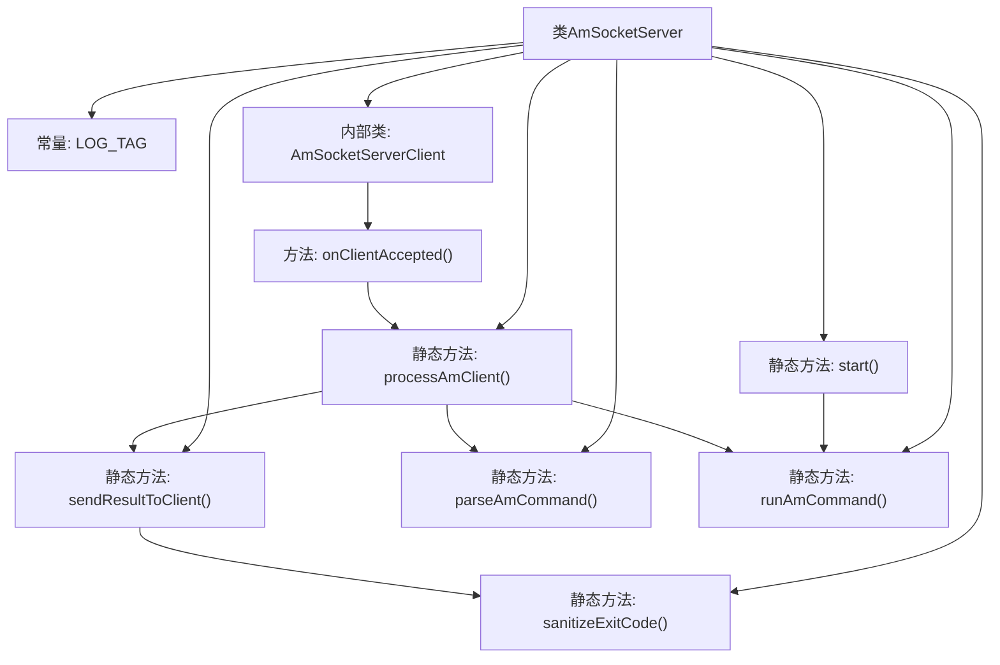
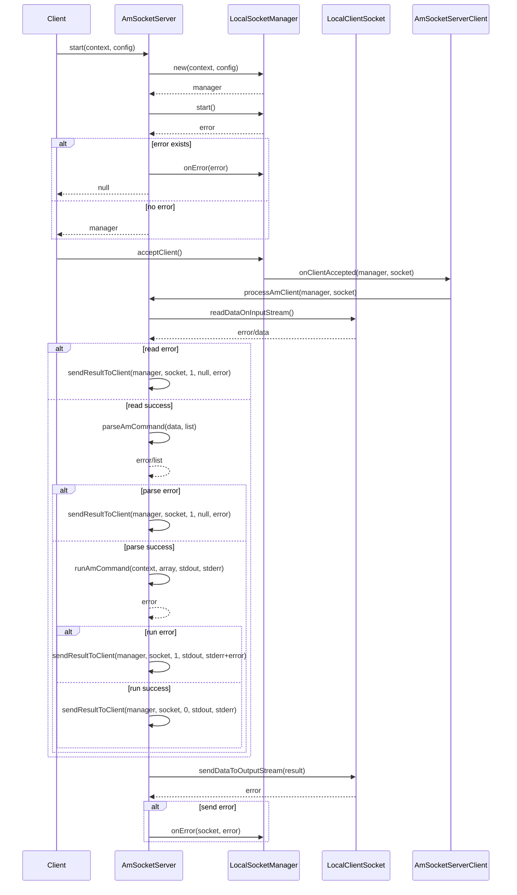

# 基础信息

|      |      |
|------|------|
| 名称 | AmSocketServer |
| 编码语言 | .java |
| 代码路径 | termux-app/termux-shared/src/main/java/com/termux/shared/shell/am/AmSocketServer.java |
| 包名 | com.termux.shared.shell.am |
| 依赖项 | ['android.Manifest', 'android.app.Application', 'android.content.Context', 'androidx.annotation.NonNull', 'androidx.annotation.Nullable', 'com.termux.am.Am', 'com.termux.shared.R', 'com.termux.shared.android.PackageUtils', 'com.termux.shared.android.PermissionUtils', 'com.termux.shared.errors.Error', 'com.termux.shared.logger.Logger', 'com.termux.shared.net.socket.local.ILocalSocketManager', 'com.termux.shared.net.socket.local.LocalClientSocket', 'com.termux.shared.net.socket.local.LocalServerSocket', 'com.termux.shared.net.socket.local.LocalSocketManager', 'com.termux.shared.net.socket.local.LocalSocketManagerClientBase', 'com.termux.shared.net.socket.local.LocalSocketRunConfig', 'com.termux.shared.shell.ArgumentTokenizer', 'com.termux.shared.shell.command.ExecutionCommand', 'java.io.ByteArrayOutputStream', 'java.io.PrintStream', 'java.nio.charset.StandardCharsets', 'java.util.ArrayList', 'java.util.Arrays', 'java.util.List'] |
| 概述说明 | AmSocketServer类实现本地套接字服务，处理am命令并返回执行结果。 |

# 说明

AmSocketServer类实现了一个本地套接字服务器，用于处理AM命令请求。主要功能包括启动LocalSocketManager监听客户端连接，处理客户端发送的AM命令字符串，解析命令参数，执行命令并返回结果。关键方法包括start()启动服务器，processAmClient()处理客户端请求，parseAmCommand()解析命令，runAmCommand()执行命令，sendResultToClient()返回执行结果。类还包含错误处理、退出码校验和权限检查等功能，通过AmSocketServerClient类处理客户端连接事件。整个过程涉及命令解析、执行、结果收集和返回等完整流程。

# 类列表 Class Summary

| 名称   | 类型  | 说明 |
|-------|------|-------------|
| AmSocketServer | class | AmSocketServer类实现本地Socket服务，处理AM命令执行及结果返回。 |

## 类 AmSocketServer

|      |      |
|------|------|
| 访问范围 | public |
| 类型 | class |
| 名称 | AmSocketServer |
| 说明 | AmSocketServer类实现本地Socket服务，处理AM命令执行及结果返回。 |

### UML类图

```mermaid
classDiagram
    class AmSocketServer {
        +String LOG_TAG
        +LocalSocketManager start(Context context, LocalSocketRunConfig localSocketRunConfig)
        +void processAmClient(LocalSocketManager localSocketManager, LocalClientSocket clientSocket)
        +void sendResultToClient(LocalSocketManager localSocketManager, LocalClientSocket clientSocket, int exitCode, String stdout, String stderr)
        +int sanitizeExitCode(LocalClientSocket clientSocket, int exitCode)
        +Error parseAmCommand(String amCommandString, List~String~ amCommandList)
        +Error runAmCommand(Context context, String[] amCommandArray, StringBuilder stdout, StringBuilder stderr, boolean checkDisplayOverAppsPermission)
    }

    class LocalSocketManager {
        +Context context
        +LocalSocketRunConfig localSocketRunConfig
        +Error start()
        +void onError(Error error)
        +void onError(LocalClientSocket clientSocket, Error error)
        +LocalSocketRunConfig getLocalSocketRunConfig()
    }

    class LocalClientSocket {
        +PeerCred getPeerCred()
        +Error readDataOnInputStream(StringBuilder data, boolean closeStream)
        +Error sendDataToOutputStream(String data, boolean closeStream)
    }

    class AmSocketServerRunConfig {
        <<LocalSocketRunConfig>>
        +boolean shouldCheckDisplayOverAppsPermission()
    }

    class Am {
        +Am(PrintStream stdout, PrintStream stderr, Application application)
        +void run(String[] amCommandArray)
    }

    class AmSocketServerClient {
        <<LocalSocketManagerClientBase>>
        +void onClientAccepted(LocalSocketManager localSocketManager, LocalClientSocket clientSocket)
    }

    class ArgumentTokenizer {
        +List~String~ tokenize(String commandString)
    }

    class PermissionUtils {
        +boolean validateDisplayOverOtherAppsPermissionForPostAndroid10(Context context, boolean showToast)
    }

    class PackageUtils {
        +String getAppNameForPackage(Context context)
    }

    class AmSocketServerErrno {
        +Error ERRNO_PARSE_AM_COMMAND_FAILED_WITH_EXCEPTION
        +Error ERRNO_RUN_AM_COMMAND_FAILED_WITH_EXCEPTION
        +Error getError(Exception e, String details, String message)
    }

    AmSocketServer --> LocalSocketManager : 依赖
    AmSocketServer --> LocalClientSocket : 依赖
    AmSocketServer --> AmSocketServerRunConfig : 依赖
    AmSocketServer --> Am : 依赖
    AmSocketServer --> ArgumentTokenizer : 依赖
    AmSocketServer --> PermissionUtils : 依赖
    AmSocketServer --> PackageUtils : 依赖
    AmSocketServer --> AmSocketServerErrno : 依赖
    AmSocketServerClient --> AmSocketServer : 依赖
    LocalSocketManager --> LocalSocketRunConfig : 依赖
    LocalSocketManager --> LocalClientSocket : 依赖
    AmSocketServerRunConfig --|> LocalSocketRunConfig : 实现
    AmSocketServerClient --|> LocalSocketManagerClientBase : 实现
```

这段代码实现了一个Android本地Socket服务器（AmSocketServer），用于处理客户端发送的am命令（Activity Manager命令）。核心类AmSocketServer提供了启动服务、处理客户端请求、解析和执行am命令的功能，并通过LocalSocketManager管理Socket连接。流程涉及命令解析、权限检查、命令执行和结果返回，通过多个工具类（如ArgumentTokenizer、PermissionUtils）协作完成。错误处理通过AmSocketServerErrno统一管理，Am类负责实际命令执行。整体设计采用分层架构，职责明确，适合处理高并发的本地Socket请求。

### 内部方法调用关系图

这段代码实现了一个基于本地套接字的AM命令服务器，主要功能包括启动服务、处理客户端连接、解析和执行AM命令、返回执行结果。流程图展示了类结构和方法调用关系，时序图详细描述了从服务启动到命令执行的完整流程。核心组件包括LocalSocketManager管理套接字连接，AmSocketServer处理业务逻辑，通过静态方法实现命令解析和执行，内部类AmSocketServerClient处理客户端连接事件。整个过程包含错误处理和日志记录，确保命令执行的可靠性和可追踪性。

### 字段列表 Field List

| 名称  | 类型  | 说明 |
|-------|-------|------|
| LOG_TAG = "AmSocketServer" | String | 日志标签为AmSocketServer |

### 方法列表 Method List

| 名称  | 类型  | 说明 |
|-------|-------|------|
| parseAmCommand | Error | 解析AM命令字符串，若为空返回null，成功则存入列表，异常返回错误信息。 |
| processAmClient | void | 处理客户端AM命令：读取、解析、执行并返回结果。 |
| start | LocalSocketManager | 静态同步方法启动本地Socket管理器，成功返回实例，失败返回null。 |
| sendResultToClient | void | 发送结果给客户端，包含退出码、标准输出和错误输出，并处理错误。 |
| sanitizeExitCode | int | 检查并修正退出码，无效时设为1。 |
| runAmCommand | Error | 执行AM命令并处理输出，检查悬浮窗权限，异常返回错误。 |

