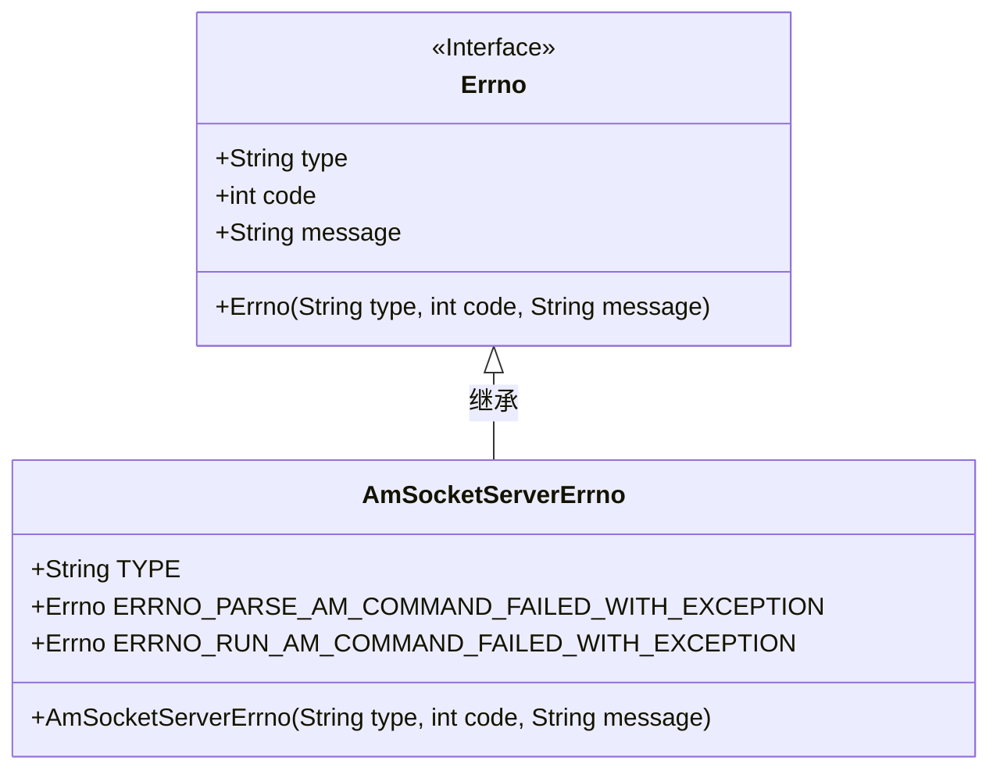
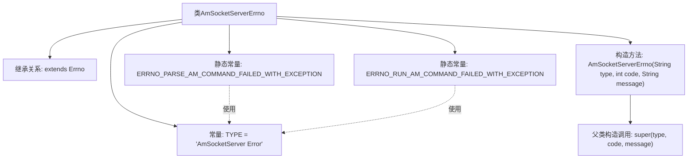

# 基础信息

|      |      |
|------|------|
| 名称 | AmSocketServerErrno |
| 编码语言 | .java |
| 代码路径 | termux-app/termux-shared/src/main/java/com/termux/shared/shell/am/AmSocketServerErrno.java |
| 包名 | com.termux.shared.shell.am |
| 依赖项 | ['com.termux.shared.errors.Errno'] |
| 概述说明 | AmSocketServer错误码类，包含解析和运行am命令失败的异常信息。 |

# 说明

AmSocketServerErrno类继承自Errno，定义了AmSocketServer相关的错误类型。错误类型标识为"AmSocketServer Error"。包含两个静态错误实例：ERRNO_PARSE_AM_COMMAND_FAILED_WITH_EXCEPTION（代码100，表示解析am命令失败并附带异常信息）和ERRNO_RUN_AM_COMMAND_FAILED_WITH_EXCEPTION（代码101，表示执行am命令失败并附带异常信息）。构造函数接收类型、代码和消息参数并调用父类构造函数。错误代码范围在100-150之间。

# 类列表 Class Summary

| 名称   | 类型  | 说明 |
|-------|------|-------------|
| AmSocketServerErrno | class | AmSocketServer错误类，定义解析和运行命令失败的异常代码100-101。 |

## 类 AmSocketServerErrno

|      |      |
|------|------|
| 访问范围 | public |
| 类型 | class |
| 名称 | AmSocketServerErrno |
| 说明 | AmSocketServer错误类，定义解析和运行命令失败的异常代码100-101。 |

### UML类图

这段类图展示了AmSocketServerErrno类继承自Errno接口的结构。AmSocketServerErrno是处理AmSocketServer相关错误的类，包含两个静态错误码常量（ERRNO_PARSE_AM_COMMAND_FAILED_WITH_EXCEPTION和ERRNO_RUN_AM_COMMAND_FAILED_WITH_EXCEPTION），分别对应解析AM命令失败和运行AM命令失败的异常情况。类中定义了TYPE常量标识错误类型，并通过构造函数初始化父类的错误类型、代码和消息。该设计实现了错误码的标准化管理，便于统一处理socket服务器相关的异常情况。

### 内部方法调用关系图

该流程图描述了AmSocketServerErrno类的结构，这是一个继承自Errno的异常处理类。图中展示了类继承关系、两个静态错误码常量的定义（均使用TYPE常量），以及构造方法的实现细节（调用父类构造器）。错误码常量用于描述AM命令解析和运行时的异常场景，构造方法遵循父类Errno的参数规范。整个设计用于封装与AmSocketServer相关的特定错误类型。

### 字段列表 Field List

| 名称  | 类型  | 说明 |
|-------|-------|------|
| TYPE = "AmSocketServer Error" | String | AmSocketServer错误类型常量定义 |
| ERRNO_PARSE_AM_COMMAND_FAILED_WITH_EXCEPTION = new Errno(TYPE, 100, "Parse am command `%1$s` failed.\nException: %2$s") | Errno | 解析am命令失败，异常信息：%2$s |
| ERRNO_RUN_AM_COMMAND_FAILED_WITH_EXCEPTION = new Errno(TYPE, 101, "Run am command `%1$s` failed.\nException: %2$s") | Errno | 运行am命令失败，异常信息：%2$s |

### 方法列表 Method List

| 名称  | 类型  | 说明 |
|-------|-------|------|

