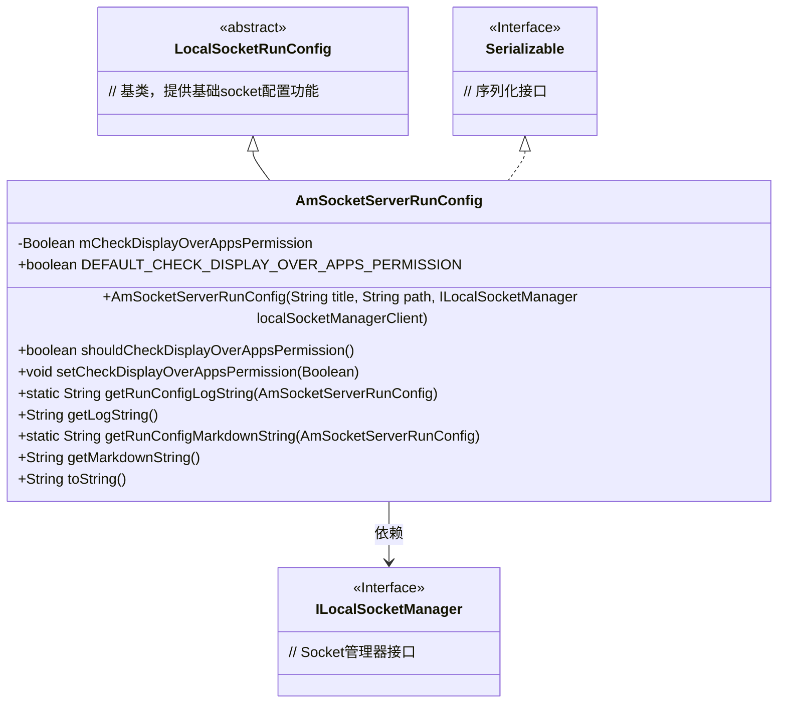
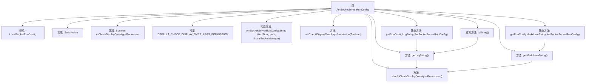

# 基础信息

|      |      |
|------|------|
| 名称 | AmSocketServerRunConfig |
| 编码语言 | .java |
| 代码路径 | termux-app/termux-shared/src/main/java/com/termux/shared/shell/am/AmSocketServerRunConfig.java |
| 包名 | com.termux.shared.shell.am |
| 依赖项 | ['android.Manifest', 'androidx.annotation.NonNull', 'com.termux.shared.logger.Logger', 'com.termux.shared.markdown.MarkdownUtils', 'com.termux.shared.net.socket.local.ILocalSocketManager', 'com.termux.shared.net.socket.local.LocalSocketRunConfig', 'java.io.Serializable'] |
| 概述说明 | AmSocketServerRunConfig类，检查Android权限，含日志和Markdown输出功能。 |

# 说明

AmSocketServerRunConfig类继承自LocalSocketRunConfig并实现Serializable接口，主要用于配置Android套接字服务器运行参数。关键属性mCheckDisplayOverAppsPermission用于检查Android 10及以上版本是否授予SYSTEM_ALERT_WINDOW权限，默认值为true。提供构造方法初始化标题、路径和本地套接字管理器客户端。包含获取/设置权限检查的方法shouldCheckDisplayOverAppsPermission和setCheckDisplayOverAppsPermission。提供日志和Markdown格式的字符串生成方法getLogString和getMarkdownString，用于输出配置信息。toString方法默认返回日志字符串。

# 类列表 Class Summary

| 名称   | 类型  | 说明 |
|-------|------|-------------|
| AmSocketServerRunConfig | class | AmSocketServerRunConfig类扩展LocalSocketRunConfig，检查Android 10+的SYSTEM_ALERT_WINDOW权限，提供日志和Markdown输出功能。 |

## 类 AmSocketServerRunConfig

|      |      |
|------|------|
| 访问范围 | public |
| 类型 | class |
| 名称 | AmSocketServerRunConfig |
| 说明 | AmSocketServerRunConfig类扩展LocalSocketRunConfig，检查Android 10+的SYSTEM_ALERT_WINDOW权限，提供日志和Markdown输出功能。 |

### UML类图

类图描述：
AmSocketServerRunConfig是LocalSocketRunConfig的具体实现类，同时实现了Serializable接口，用于Android环境下Socket服务器的运行时配置管理。该类核心功能包括检查SYSTEM_ALERT_WINDOW权限的配置管理（通过mCheckDisplayOverAppsPermission字段）、提供日志和Markdown格式的输出方法（getLogString/getMarkdownString），并依赖ILocalSocketManager接口进行Socket管理。作为配置类，它继承了基类的通用配置属性，同时扩展了Android特定的权限检查功能。

### 内部方法调用关系图

这段代码是Android环境下用于配置和管理本地Socket服务器的类，继承自LocalSocketRunConfig并实现Serializable接口。核心功能包括权限检查标志位管理（mCheckDisplayOverAppsPermission）、日志和Markdown格式的输出生成（getLogString/getMarkdownString），以及通过toString()方法提供默认的日志输出。类中定义了静态工具方法用于处理null安全的对象转换，所有字符串处理方法都会调用shouldCheckDisplayOverAppsPermission()来获取当前权限检查状态。

### 字段列表 Field List

| 名称  | 类型  | 说明 |
|-------|-------|------|
| DEFAULT_CHECK_DISPLAY_OVER_APPS_PERMISSION = true | boolean | 默认允许检查悬浮窗权限。 |
| mCheckDisplayOverAppsPermission | Boolean | 检查应用悬浮窗权限的布尔变量。 |

### 方法列表 Method List

| 名称  | 类型  | 说明 |
|-------|-------|------|
| getRunConfigLogString | String | 获取运行配置日志字符串，若配置为空返回"null"。 |
| setCheckDisplayOverAppsPermission | void | 设置检查悬浮窗权限的方法。 |
| toString | String | 非空toString方法返回getLogString结果 |
| shouldCheckDisplayOverAppsPermission | boolean | 检查显示覆盖应用权限的方法，返回默认值或指定值。 |
| getMarkdownString | String | 生成Markdown字符串，包含父类内容和Am Command检查权限信息。 |
| getRunConfigMarkdownString | String | 静态方法返回运行配置的Markdown字符串，若配置为空返回"null"。 |
| getLogString | String | 方法生成日志字符串，包含父类日志及检查悬浮窗权限信息。 |

