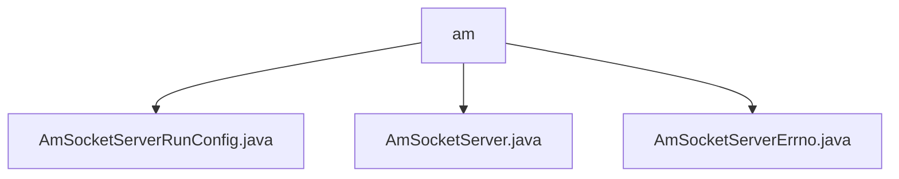

# 基础信息

|      |      |
|------|------|
| 名称 | am |
| 编码语言 | .java |
| 代码路径 | termux-app/termux-shared/src/main/java/com/termux/shared/shell/am |
| 包名 | termux-app.termux-shared.src.main.java.com.termux.shared.shell.am |
| 概述说明 | AmSocketServerRunConfig类配置Android套接字服务器参数，含权限检查方法。AmSocketServer类实现本地套接字服务器，处理AM命令请求。AmSocketServerErrno类定义相关错误类型。 |

# 说明

```markdown
## 概述

该代码模块实现了一个Android本地套接字服务器系统，主要用于处理AM（Activity Manager）命令请求。核心组件包括：
- `AmSocketServerRunConfig`：服务器运行参数配置类，继承自`LocalSocketRunConfig`并支持序列化
- `AmSocketServer`：核心服务器实现类，负责命令监听、解析、执行及结果返回
- `AmSocketServerErrno`：自定义错误码枚举类，继承自基础`Errno`类

模块通过本地套接字通信机制，实现了AM命令的远程执行和结果反馈功能，包含完整的权限检查、错误处理和日志记录机制。

## 主要业务场景

1. **AM命令远程执行**
   - 通过本地套接字接收客户端发送的AM命令字符串
   - 解析命令参数并校验格式有效性（`parseAmCommand`）
   - 执行实际AM命令操作（`runAmCommand`）
   - 将执行结果通过套接字返回客户端（`sendResultToClient`）

2. **权限管理**
   - 自动检查Android 10+的`SYSTEM_ALERT_WINDOW`权限（通过`mCheckDisplayOverAppsPermission`配置）
   - 支持动态启用/禁用权限检查（`shouldCheckDisplayOverAppsPermission`/`setCheckDisplayOverAppsPermission`）

3. **错误处理**
   - 定义专用错误码范围（100-150）
   - 明确区分命令解析失败（ERRNO_PARSE_AM_COMMAND_FAILED_WITH_EXCEPTION）和命令执行失败（ERRNO_RUN_AM_COMMAND_FAILED_WITH_EXCEPTION）
   - 异常信息附带机制

4. **日志与监控**
   - 支持生成标准日志字符串（`getLogString`）
   - 提供Markdown格式配置输出（`getMarkdownString`）
   - 默认`toString()`方法返回可读性日志

5. **服务器管理**
   - 通过`LocalSocketManager`实现客户端连接监听
   - 独立线程处理每个客户端请求（`processAmClient`）
   - 完整的启动流程控制（`start`方法）
```


### 包内部结构视图



该流程图展示了Termux项目中am目录下的三个Java文件结构关系。am作为父节点，包含AmSocketServerRunConfig.java、AmSocketServer.java和AmSocketServerErrno.java三个子节点文件，这些文件均属于Android模块的Socket服务器相关实现代码，体现了功能模块的文件组织方式。

# 文件列表 File List

| 名称   | 类型  | 说明 |
|-------|------|-------------|
| [AmSocketServerErrno.java](AmSocketServerErrno.md) | file | AmSocketServer错误码类，包含解析和运行am命令失败的异常信息。 |
| [AmSocketServer.java](AmSocketServer.md) | file | AmSocketServer类实现本地套接字服务，处理am命令并返回执行结果。 |
| [AmSocketServerRunConfig.java](AmSocketServerRunConfig.md) | file | AmSocketServerRunConfig类，检查Android权限，含日志和Markdown输出功能。 |


