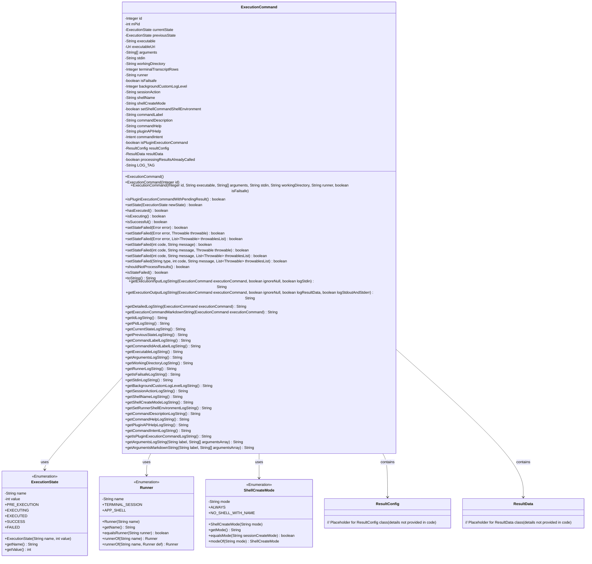

# 基础信息

|      |      |
|------|------|
| 名称 | ExecutionCommand |
| 编码语言 | .java |
| 代码路径 | termux-app/termux-shared/src/main/java/com/termux/shared/shell/command/ExecutionCommand.java |
| 包名 | com.termux.shared.shell.command |
| 依赖项 | ['android.content.Intent', 'android.net.Uri', 'androidx.annotation.NonNull', 'androidx.annotation.Nullable', 'com.termux.shared.data.IntentUtils', 'com.termux.shared.shell.command.result.ResultConfig', 'com.termux.shared.shell.command.result.ResultData', 'com.termux.shared.errors.Error', 'com.termux.shared.logger.Logger', 'com.termux.shared.markdown.MarkdownUtils', 'com.termux.shared.data.DataUtils', 'com.termux.shared.shell.command.runner.app.AppShell', 'com.termux.terminal.TerminalSession', 'java.util.Collections', 'java.util.List'] |
| 概述说明 | ExecutionCommand类管理命令执行状态、参数和结果，支持终端和AppShell运行器。 |

# 说明

ExecutionCommand类用于管理命令执行状态和参数，包含执行状态枚举ExecutionState（PRE_EXECUTION、EXECUTING等）、运行环境枚举Runner（TERMINAL_SESSION、APP_SHELL）和Shell创建模式枚举ShellCreateMode（ALWAYS、NO_SHELL_WITH_NAME）。关键属性包括命令ID、进程ID、当前/先前状态、可执行文件路径、参数、工作目录、运行环境等。提供状态设置方法如setState、setStateFailed，支持错误处理和日志记录。包含辅助方法生成日志字符串和Markdown格式输出，详细记录命令输入输出参数和执行状态。支持插件执行和结果配置，通过ResultConfig和ResultData管理结果处理。

# 类列表 Class Summary

| 名称   | 类型  | 说明 |
|-------|------|-------------|
| ExecutionCommand | class | ExecutionCommand类定义命令执行状态、运行方式和参数，支持终端会话和应用Shell运行，包含错误处理和日志功能。 |

## 类 ExecutionCommand

|      |      |
|------|------|
| 访问范围 | public |
| 类型 | class |
| 名称 | ExecutionCommand |
| 说明 | ExecutionCommand类定义命令执行状态、运行方式和参数，支持终端会话和应用Shell运行，包含错误处理和日志功能。 |

### UML类图

这段代码定义了一个`ExecutionCommand`类，用于管理命令执行的生命周期和状态。它包含多个枚举类型（`ExecutionState`、`Runner`、`ShellCreateMode`）来定义执行状态、运行环境和创建模式，并通过`ResultConfig`和`ResultData`类处理命令执行结果。主要功能包括状态管理、错误处理、日志记录和Markdown格式化输出，适用于终端命令执行的场景。

### 内部方法调用关系图

该流程图展示了ExecutionCommand类的完整结构，包含3个内部枚举类型(ExecutionState、Runner、ShellCreateMode)、34个属性字段和43个方法。类主要负责命令执行状态管理，提供丰富的日志记录和Markdown生成功能，支持终端会话和应用Shell两种运行模式。状态转换遵循严格顺序(PRE_EXECUTION→EXECUTING→EXECUTED→SUCCESS/FAILED)，包含完善的错误处理机制，同时维护前后状态记录和结果数据。

### 字段列表 Field List

| 名称  | 类型  | 说明 |
|-------|-------|------|
| shellName | String | 定义字符串变量shellName |
| resultConfig = new ResultConfig() | ResultConfig | 创建ResultConfig实例并赋值给resultConfig。 |
| backgroundCustomLogLevel | Integer | 后台自定义日志级别整型变量 |
| currentState = ExecutionState.PRE_EXECUTION | ExecutionState | 执行状态初始化为预执行阶段。 |
| resultData = new ResultData() | ResultData | 创建ResultData实例resultData并设为不可变。 |
| arguments | String[] | 公开字符串数组参数。 |
| isPluginExecutionCommand | boolean | 插件执行命令判断 |
| commandHelp | String | 命令帮助信息 |
| isFailsafe | boolean | 布尔变量isFailsafe表示是否为安全模式。 |
| pluginAPIHelp | String | 插件API帮助文档 |
| terminalTranscriptRows | Integer | 终端显示行数配置项。 |
| stdin | String | 字符串类型变量stdin |
| executableUri | Uri | 可执行文件的公共URI。 |
| shellCreateMode | String | 创建shell的模式参数。 |
| previousState = ExecutionState.PRE_EXECUTION | ExecutionState | 私有变量previousState初始化为PRE_EXECUTION状态。 |
| processingResultsAlreadyCalled | boolean | 布尔变量标记处理结果是否已调用 |
| sessionAction | String | 定义字符串类型变量sessionAction。 |
| commandLabel | String | 定义公共字符串变量commandLabel。 |
| executable | String | 定义字符串变量executable。 |
| runner | String | 定义字符串类型变量runner |
| workingDirectory | String | 工作目录路径变量 |
| commandDescription | String | 命令描述信息。 |
| mPid = -1 | int | 变量mPid初始化为-1，类型为public int。 |
| commandIntent | Intent | 声明公共意图变量commandIntent |
| setShellCommandShellEnvironment | boolean | 设置Shell命令的Shell环境布尔值。 |
| id | Integer | 整数类型ID字段 |
| LOG_TAG = "ExecutionCommand" | String | 私有常量LOG_TAG值为"ExecutionCommand"。 |

### 方法列表 Method List

| 名称  | 类型  | 说明 |
|-------|-------|------|
| getShellNameLogString | String | 方法返回Shell名称的单行日志字符串。 |
| getIsFailsafeLogString | String | 方法返回字符串"isFailsafe: "加变量isFailsafe值。 |
| hasExecuted | boolean | 检查当前状态是否已执行。 |
| getStdinLogString | String | 方法返回标准输入日志字符串，空时显示"-"，非空时格式化输出。 |
| getBackgroundCustomLogLevelLogString | String | 获取后台自定义日志级别的日志字符串。 |
| setStateFailed | boolean | 同步方法setStateFailed，设置失败状态，参数包括错误码、消息和异常列表。 |
| getExecutionOutputLogString | String | 生成执行命令日志字符串，包含ID、状态及结果数据。 |
| getCurrentStateLogString | String | 获取当前状态名称的日志字符串。 |
| getArgumentsLogString | String | 方法返回参数字符串日志，调用内部方法处理。 |
| getPluginAPIHelpLogString | String | Java方法：生成插件API帮助日志字符串。 |
| isExecuting | boolean | 检查当前状态是否为执行中。 |
| getCommandHelpLogString | String | 生成单行日志字符串，记录命令帮助信息。 |
| getSessionActionLogString | String | 方法返回会话动作的单行日志字符串，格式为"Session Action-动作内容"。 |
| getExecutionCommandMarkdownString | String | 生成执行命令的Markdown字符串，包含状态、参数、目录等信息。 |
| setStateFailed | boolean | 同步方法setStateFailed，传入错误和异常，调用重载方法设置失败状态。 |
| getShellCreateModeLogString | String | 方法返回Shell创建模式的单行日志字符串。 |
| shouldNotProcessResults | boolean | 同步方法检查是否已处理结果，未处理则标记并返回false。 |
| getIdLogString | String | 生成ID日志字符串，非空时返回带括号的ID，否则返回空。 |
| getSetRunnerShellEnvironmentLogString | String | 设置Shell环境命令字符串 |
| getExecutionInputLogString | String | 生成执行命令日志字符串，包含ID、状态、参数、目录、运行器等信息，忽略空值可选。 |
| setStateFailed | boolean | 同步方法设置失败状态，含错误码、消息和异常。 |
| getCommandDescriptionLogString | String | 方法返回单行日志字符串，记录命令描述。 |
| getRunnerLogString | String | 方法返回Runner的单行日志字符串，格式为"Runner-值"。 |
| isSuccessful | boolean | 同步方法检查当前状态是否为成功。 |
| getCommandIdAndLabelLogString | String | 方法返回ID和标签的日志字符串组合。 |
| toString | String | 重写toString方法，根据执行状态返回不同日志字符串。 |
| isPluginExecutionCommandWithPendingResult | boolean | 检查插件命令是否执行且结果待定。 |
| getPreviousStateLogString | String | 返回前状态名称的字符串。 |
| getPidLogString | String | 方法返回字符串"Pid: `"加变量mPid值。 |
| setStateFailed | boolean | 同步方法设置失败状态，返回布尔值，接受状态码和消息参数。 |
| getWorkingDirectoryLogString | String | 方法返回工作目录日志字符串，格式为"Working Directory: `路径`"。 |
| getCommandLabelLogString | String | 方法返回命令标签，若空则返回默认文本"Execution Command"。 |
| setStateFailed | boolean | 同步方法setStateFailed，通过error和throwablesList设置失败状态，返回布尔值。 |
| setStateFailed | boolean | 同步方法设置失败状态，返回布尔值，参数为错误对象。 |
| isStateFailed | boolean | 检查状态是否为失败，若非失败或错误数据无效则返回假，否则返回真。 |
| getDetailedLogString | String | 静态方法生成执行命令的详细日志字符串，包含输入输出及描述信息。 |
| setStateFailed | boolean | 同步方法设置失败状态，记录错误日志并返回执行状态。 |
| getExecutableLogString | String | 方法返回字符串"Executable: `"加变量executable值。 |
| setState | boolean | 同步方法setState检查状态转换有效性，禁止回退或修改SUCCESS状态，FAILED状态可重复设置但保留前状态，成功更新返回true。 |
| getCommandIntentLogString | String | 方法返回命令意图日志字符串，空时显示"-"，非空时格式化输出。 |
| getIsPluginExecutionCommandLogString | String | 返回插件执行命令状态字符串。 |
| getArgumentsLogString | String | 静态方法生成带标签的参数日志字符串，处理空数组时输出"-"。 |
| getArgumentsMarkdownString | String | 静态方法生成带标签的参数Markdown字符串，处理空数组时输出短横线。 |

