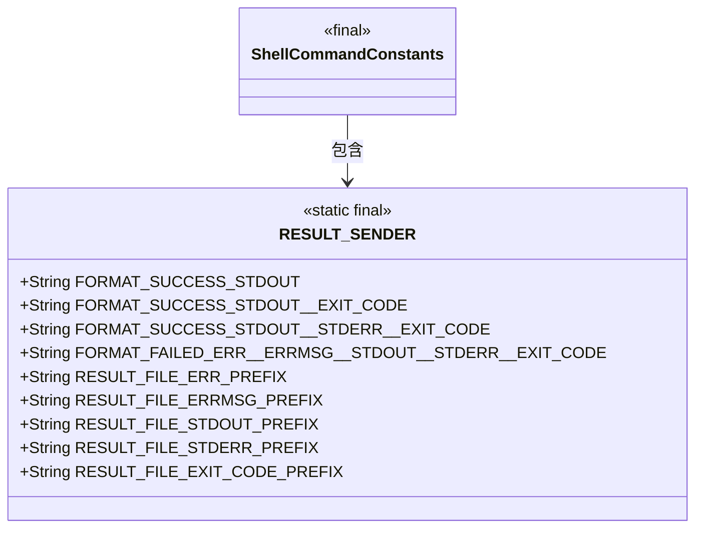
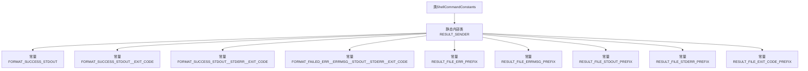

# 基础信息

|      |      |
|------|------|
| 名称 | ShellCommandConstants |
| 编码语言 | .java |
| 代码路径 | termux-app/termux-shared/src/main/java/com/termux/shared/shell/command/ShellCommandConstants.java |
| 包名 | com.termux.shared.shell.command |
| 依赖项 | ['com.termux.shared.errors.Errno', 'com.termux.shared.shell.command.result.ResultConfig', 'java.util.Formatter', 'java.util.IllegalFormatException'] |
| 概述说明 | ShellCommandConstants类定义了命令结果发送的格式和文件前缀。 |

# 说明

ShellCommandConstants类定义了RESULT_SENDER静态内部类，用于规范命令执行结果的输出格式和文件命名规则。包含五种格式化字符串：成功时仅输出stdout的FORMAT_SUCCESS_STDOUT；成功时输出stdout和exit_code的FORMAT_SUCCESS_STDOUT__EXIT_CODE；成功时输出stdout、stderr和exit_code的FORMAT_SUCCESS_STDOUT__STDERR__EXIT_CODE；失败时输出err、errmsg、stdout、stderr和exit_code的FORMAT_FAILED_ERR__ERRMSG__STDOUT__STDERR__EXIT_CODE。同时定义了多文件输出时的前缀命名规则：err、errmsg、stdout、stderr和exit_code。所有格式均支持Markdown代码块和内联代码标记。

# 类列表 Class Summary

| 名称   | 类型  | 说明 |
|-------|------|-------------|
| ShellCommandConstants | class | Shell命令结果常量类，定义输出格式和文件前缀。 |

## 类 ShellCommandConstants

|      |      |
|------|------|
| 访问范围 | public |
| 类型 | class |
| 名称 | ShellCommandConstants |
| 说明 | Shell命令结果常量类，定义输出格式和文件前缀。 |

### UML类图

这段代码定义了一个`ShellCommandConstants`类，其中包含一个静态内部类`RESULT_SENDER`，用于存储Shell命令执行结果的格式化字符串和文件前缀常量。`RESULT_SENDER`提供了5种格式化字符串常量，用于不同场景下的命令输出格式化（成功/失败、有无错误输出等），以及5个文件前缀常量，用于多文件输出模式时的文件名前缀。所有字段均为public static final，表明这是一个不可变的常量类，主要用于集中管理命令结果处理的配置参数。

### 内部方法调用关系图

该流程图展示了ShellCommandConstants类及其静态内部类RESULT_SENDER的结构关系。RESULT_SENDER类包含多个格式化字符串常量，用于定义不同场景下命令执行结果的输出格式，包括成功时仅输出stdout、同时输出stdout和exit_code、输出stdout/stderr/exit_code的组合，以及失败时输出err/errmsg/stdout/stderr/exit_code的完整格式。此外还包含多个结果文件前缀常量，用于在多文件输出模式下标识不同类型的输出内容。这些常量主要用于标准化shell命令执行结果的输出格式和文件命名规范。

### 字段列表 Field List

| 名称  | 类型  | 说明 |
|-------|-------|------|

### 方法列表 Method List

| 名称  | 类型  | 说明 |
|-------|-------|------|

