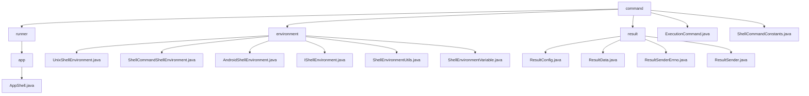

# 基础信息

|      |      |
|------|------|
| 名称 | command |
| 编码语言 | .java |
| 代码路径 | termux-app/termux-shared/src/main/java/com/termux/shared/shell/command |
| 包名 | termux-app.termux-shared.src.main.java.com.termux.shared.shell.command |
| 概述说明 | AppShell类封装命令行执行功能，支持同步异步模式。Shell环境模块管理变量配置和命令执行环境。结果处理模块提供结果存储、发送和错误处理。ExecutionCommand管理命令状态和参数。ShellCommandConstants定义结果输出格式规范。 |

# 说明

```markdown
## 概述

该代码模块是一个完整的Shell命令执行与管理框架，专为Termux类应用设计，提供从环境配置、命令执行到结果处理的全生命周期管理。模块采用分层架构设计，包含环境管理、命令执行、进程控制和结果处理四大核心子系统，支持同步/异步执行、跨平台环境适配和结构化结果返回。主要特点包括：

1. **多层级抽象**  
   - 环境变量管理（Unix/Android环境抽象）
   - 命令执行状态机（ExecutionCommand）
   - 进程运行时控制（AppShell）

2. **全链路处理**  
   - 支持从环境初始化→命令执行→状态跟踪→结果收集的完整流程
   - 内置错误处理与资源回收机制

3. **Android特性集成**  
   - 深度整合PendingIntent跨进程通信
   - 适配Android文件系统权限模型

## 主要业务场景

### 1. Shell环境初始化与管理
- **平台适配**  
  - 通过`UnixShellEnvironment`/`AndroidShellEnvironment`自动配置PATH等基础变量
  - 处理Android特有目录（如`ANDROID_DATA`）与Termux工作目录

- **执行环境构建**  
  - 使用`ShellCommandShellEnvironment`动态注入执行上下文（SHELL_ID等）
  - 环境变量格式转换与校验（`.env`↔HashMap）

### 2. 命令执行控制
- **进程生命周期管理**  
  - `AppShell`提供同步/异步执行模式，支持stdin/stderr重定向
  - 通过`ExecutionCommand`维护状态机（PRE_EXECUTION→EXECUTING→SUCCESS/FAILED）
  - 进程终止控制（kill方法）与资源释放

- **多运行模式支持**  
  - TERMINAL_SESSION/APP_SHELL等不同执行器类型
  - Shell创建策略（ALWAYS/NO_SHELL_WITH_NAME）

### 3. 结果处理系统
- **结构化结果输出**  
  - `ResultData`统一存储stdout/stderr/exit_code
  - 支持Markdown格式化输出（通过`ShellCommandConstants`定义模板）

- **多通道结果返回**  
  - **PendingIntent方式**：用于Android组件间通信，自动处理数据大小限制
  - **文件方式**：支持多文件分片（按stdout/stderr/error分文件存储）

- **错误处理**  
  - `ResultSenderErrno`定义标准错误码体系
  - 自动处理文件权限冲突、格式转换异常等场景

### 4. 典型应用场景
- **交互式终端**  
  - 实时命令执行+结果回显
  - 后台任务状态跟踪

- **插件系统**  
  - 通过`ResultConfig`定制插件结果返回方式
  - 错误信息结构化传递

- **自动化测试**  
  - 批量命令执行与结果收集
  - 多格式日志生成（Markdown/纯文本）

- **Android服务集成**  
  - 通过PendingIntent将结果返回给Activity
  - 跨进程环境变量同步
```


### 包内部结构视图



该流程图展示了Termux项目中shell命令模块的层级结构，以command为根节点，下分runner、environment和result三个主要子目录。其中runner包含app层级的AppShell.java实现，environment包含6个不同环境实现类，result目录则管理4个结果处理相关类。整体结构清晰地反映了shell命令模块的功能划分，包含环境实现、运行控制和结果处理三大核心功能组件。

# 文件列表 File List

| 名称   | 类型  | 说明 |
|-------|------|-------------|
| [ShellCommandConstants.java](ShellCommandConstants.md) | file | ShellCommandConstants类定义了命令结果发送的格式和文件前缀。 |
| [ExecutionCommand.java](ExecutionCommand.md) | file | ExecutionCommand类管理命令执行状态、参数和结果，支持终端和AppShell运行器。 |
| [runner](runner/_module.md) | package | AppShell类用于执行命令，支持同步异步操作，处理进程输出和错误流，提供进程管理和回调接口。 |
| [result](result/_module.md) | package | ResultConfig配置命令结果返回方式。ResultData存储命令执行结果。ResultSenderErrno处理发送错误。ResultSender提供两种发送结果方式。 |
| [environment](environment/_module.md) | package | UnixShellEnvironment定义Unix环境变量和Shell配置。ShellCommandShellEnvironment管理命令执行环境变量。AndroidShellEnvironment扩展Unix环境，添加Android特有变量。ShellEnvironmentUtils提供环境变量工具方法。ShellEnvironmentVariable封装环境变量数据。 |


