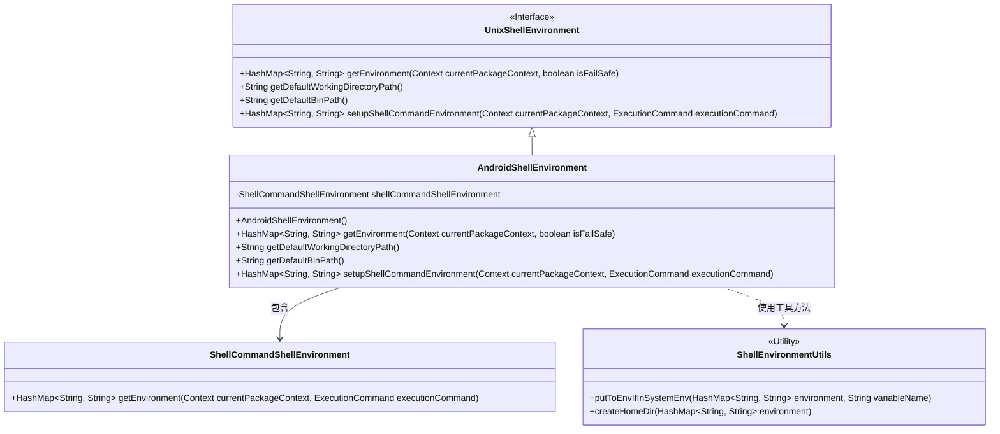
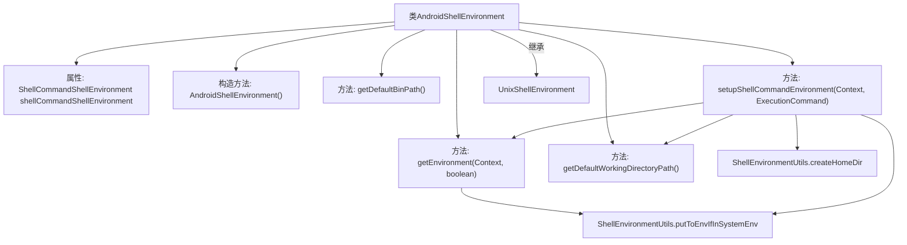
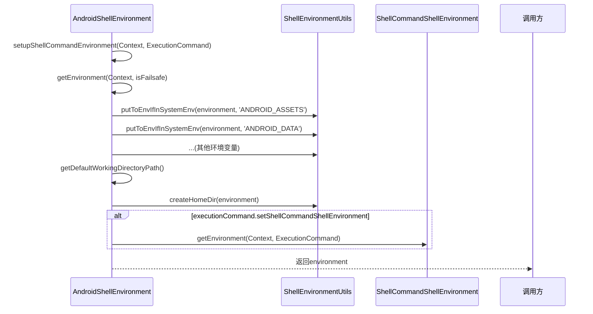

# 基础信息

|      |      |
|------|------|
| 名称 | AndroidShellEnvironment |
| 编码语言 | .java |
| 代码路径 | termux-app/termux-shared/src/main/java/com/termux/shared/shell/command/environment/AndroidShellEnvironment.java |
| 包名 | com.termux.shared.shell.command.environment |
| 依赖项 | ['android.content.Context', 'androidx.annotation.NonNull', 'com.termux.shared.shell.command.ExecutionCommand', 'java.io.File', 'java.util.HashMap'] |
| 概述说明 | AndroidShellEnvironment类继承UnixShellEnvironment，提供Android环境变量和路径配置。 |

# 说明

AndroidShellEnvironment类继承自UnixShellEnvironment，用于管理Android系统的Shell环境。它初始化一个ShellCommandShellEnvironment实例，并通过getEnvironment方法设置一系列环境变量，包括HOME、LANG、PATH、TMPDIR等基础变量，以及ANDROID_ASSETS、ANDROID_DATA等Android特有变量。此外，它还处理外部存储和运行时相关变量。类提供了默认工作目录路径和二进制路径，并通过setupShellCommandEnvironment方法配置执行命令时的环境，包括工作目录和Shell命令环境。

# 类列表 Class Summary

| 名称   | 类型  | 说明 |
|-------|------|-------------|
| AndroidShellEnvironment | class | AndroidShellEnvironment类继承UnixShellEnvironment，提供Android环境变量和默认路径配置。 |

## 类 AndroidShellEnvironment

|      |      |
|------|------|
| 访问范围 | public |
| 类型 | class |
| 名称 | AndroidShellEnvironment |
| 说明 | AndroidShellEnvironment类继承UnixShellEnvironment，提供Android环境变量和默认路径配置。 |

### UML类图

这段代码描述了一个AndroidShellEnvironment类，它继承自UnixShellEnvironment接口，用于管理Android系统的Shell环境变量。该类包含一个ShellCommandShellEnvironment实例，并通过ShellEnvironmentUtils工具类处理环境变量。主要功能包括获取默认环境变量、工作目录路径、二进制路径，以及设置Shell命令执行环境。代码特别关注Android特有的环境变量（如ANDROID_ROOT、EXTERNAL_STORAGE等），并确保PWD路径的绝对性。整体设计体现了对Android系统特性的适配和环境管理的完整性。

### 内部方法调用关系图

流程图描述：该流程图展示了AndroidShellEnvironment类的结构及其方法调用关系。该类继承自UnixShellEnvironment，主要功能是构建Android shell环境。核心方法getEnvironment()负责设置基础环境变量，setupShellCommandEnvironment()则整合了环境变量设置、工作目录处理和Shell命令环境配置。通过ShellEnvironmentUtils工具类进行环境变量操作，并在特定条件下调用ShellCommandShellEnvironment获取额外环境配置。整个流程体现了Android环境下Shell环境的构建过程。

### 字段列表 Field List

| 名称  | 类型  | 说明 |
|-------|-------|------|
| shellCommandShellEnvironment | ShellCommandShellEnvironment | 保护字段shellCommandShellEnvironment，类型ShellCommandShellEnvironment。 |

### 方法列表 Method List

| 名称  | 类型  | 说明 |
|-------|-------|------|
| setupShellCommandEnvironment | HashMap<String, String> | 设置Shell命令环境，处理工作目录和环境变量，返回配置好的HashMap。 |
| getEnvironment | HashMap<String, String> | Java方法：创建并填充Android环境变量哈希映射。 |
| getDefaultBinPath | String | Java方法重写，返回默认路径"/system/bin"。 |
| getDefaultWorkingDirectoryPath | String | 方法返回默认工作目录路径"/"。 |

