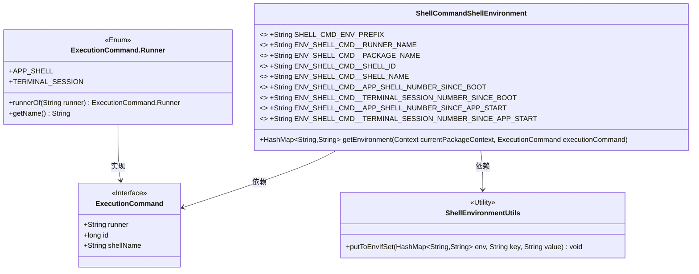
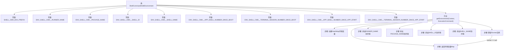

# 基础信息

|      |      |
|------|------|
| 名称 | ShellCommandShellEnvironment |
| 编码语言 | .java |
| 代码路径 | termux-app/termux-shared/src/main/java/com/termux/shared/shell/command/environment/ShellCommandShellEnvironment.java |
| 包名 | com.termux.shared.shell.command.environment |
| 依赖项 | ['android.content.Context', 'androidx.annotation.NonNull', 'com.termux.shared.shell.command.ExecutionCommand', 'java.util.HashMap'] |
| 概述说明 | ShellCommandShellEnvironment类定义了执行命令的环境变量前缀及多个相关变量，并提供了获取环境信息的方法。 |

# 说明

该代码定义了一个ShellCommandShellEnvironment类，用于管理执行命令时的环境变量。主要包含以SHELL_CMD__为前缀的环境变量常量，如RUNNER_NAME、PACKAGE_NAME、SHELL_ID、SHELL_NAME等，用于标识运行器名称、包名、Shell ID和Shell名称。还提供了自启动或应用启动以来的APP_SHELL和TERMINAL_SESSION计数变量。getEnvironment方法根据传入的上下文和执行命令，构建并返回包含相关环境变量的HashMap。这些环境变量用于在执行命令时传递关键信息。

# 类列表 Class Summary

| 名称   | 类型  | 说明 |
|-------|------|-------------|
| ShellCommandShellEnvironment | class | 定义Shell命令环境变量前缀及键名，提供获取执行命令环境信息的方法。 |

## 类 ShellCommandShellEnvironment

|      |      |
|------|------|
| 访问范围 | public |
| 类型 | class |
| 名称 | ShellCommandShellEnvironment |
| 说明 | 定义Shell命令环境变量前缀及键名，提供获取执行命令环境信息的方法。 |

### UML类图

这段代码描述了一个Shell命令环境配置类ShellCommandShellEnvironment，它通过多个常量定义环境变量前缀和具体变量名，并提供一个核心方法getEnvironment来构建包含执行命令相关信息的HashMap。该类依赖于ExecutionCommand接口（包含Runner枚举）来获取运行器类型和命令参数，同时使用工具类ShellEnvironmentUtils来安全地设置环境变量。整体设计用于为不同的shell运行环境（APP_SHELL或TERMINAL_SESSION）提供标准化的环境变量配置。

### 内部方法调用关系图

这段代码定义了一个ShellCommandShellEnvironment类，主要用于管理和生成与执行命令相关的环境变量。类中包含多个静态常量，定义了环境变量的前缀和具体名称。核心方法是getEnvironment，它接收上下文和执行命令对象，构建并返回一个包含运行器名称、包名、Shell ID和Shell名称等信息的HashMap。流程图展示了从常量定义到环境变量构建的完整过程，包括空值检查和安全添加环境变量的步骤。

### 字段列表 Field List

| 名称  | 类型  | 说明 |
|-------|-------|------|
| ENV_SHELL_CMD__TERMINAL_SESSION_NUMBER_SINCE_APP_START = SHELL_CMD_ENV_PREFIX + "TERMINAL_SESSION_NUMBER_SINCE_APP_START" | String | 静态常量定义终端会话编号环境变量 |
| ENV_SHELL_CMD__APP_SHELL_NUMBER_SINCE_APP_START = SHELL_CMD_ENV_PREFIX + "APP_SHELL_NUMBER_SINCE_APP_START" | String | 定义环境变量：APP_SHELL_NUMBER_SINCE_APP_START |
| ENV_SHELL_CMD__SHELL_NAME = SHELL_CMD_ENV_PREFIX + "SHELL_NAME" | String | 定义环境变量SHELL_NAME的常量，前缀为SHELL_CMD_ENV_。 |
| SHELL_CMD_ENV_PREFIX = "SHELL_CMD__" | String | 定义常量字符串前缀"SHELL_CMD__"。 |
| ENV_SHELL_CMD__APP_SHELL_NUMBER_SINCE_BOOT = SHELL_CMD_ENV_PREFIX + "APP_SHELL_NUMBER_SINCE_BOOT" | String | 定义环境变量，记录自启动后的应用Shell序号。 |
| ENV_SHELL_CMD__PACKAGE_NAME = SHELL_CMD_ENV_PREFIX + "PACKAGE_NAME" | String | 静态常量定义包名环境变量键 |
| ENV_SHELL_CMD__SHELL_ID = SHELL_CMD_ENV_PREFIX + "SHELL_ID" | String | 静态常量定义环境变量键名"SHELL_ID"。 |
| ENV_SHELL_CMD__RUNNER_NAME = SHELL_CMD_ENV_PREFIX + "RUNNER_NAME" | String | 静态常量定义环境变量键名，格式为前缀加RUNNER_NAME。 |
| ENV_SHELL_CMD__TERMINAL_SESSION_NUMBER_SINCE_BOOT = SHELL_CMD_ENV_PREFIX + "TERMINAL_SESSION_NUMBER_SINCE_BOOT" | String | 静态常量定义终端启动后的会话数环境变量名。 |

### 方法列表 Method List

| 名称  | 类型  | 说明 |
|-------|-------|------|
| getEnvironment | HashMap<String, String> | 获取执行命令的环境变量映射，包含运行器名称、包名、ID和shell名称。 |

