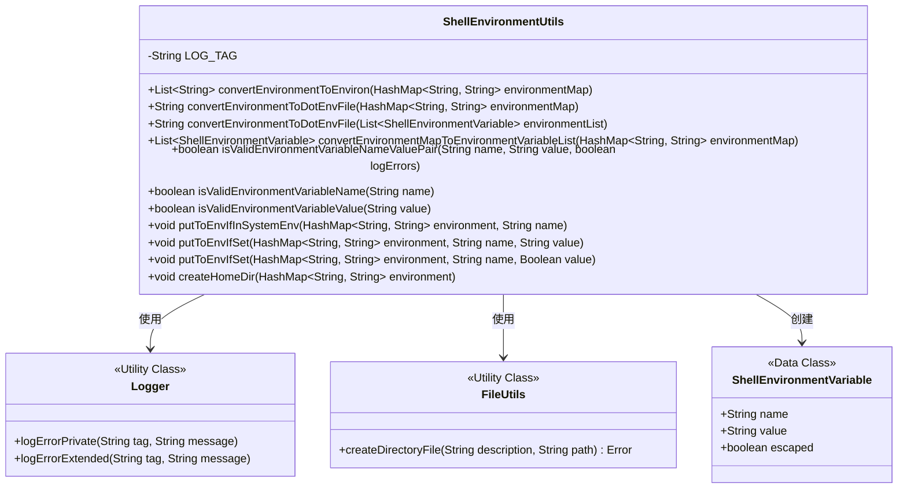
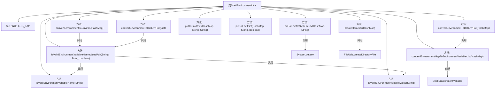

# 基础信息

|      |      |
|------|------|
| 名称 | ShellEnvironmentUtils |
| 编码语言 | .java |
| 代码路径 | termux-app/termux-shared/src/main/java/com/termux/shared/shell/command/environment/ShellEnvironmentUtils.java |
| 包名 | com.termux.shared.shell.command.environment |
| 依赖项 | ['com.termux.shared.shell.command.environment.UnixShellEnvironment', 'androidx.annotation.NonNull', 'androidx.annotation.Nullable', 'com.termux.shared.errors.Error', 'com.termux.shared.file.FileUtils', 'com.termux.shared.logger.Logger', 'java.util.ArrayList', 'java.util.Collections', 'java.util.HashMap', 'java.util.List', 'java.util.Map'] |
| 概述说明 | Shell工具类：转换环境变量格式并验证有效性。 |

# 说明

ShellEnvironmentUtils类提供环境变量相关工具方法，包含环境变量格式转换、校验及系统环境操作。主要功能包括：将HashMap转为environ格式列表（name=value）或.env文件格式（export name="value"），支持转义处理；校验变量名（非空、不含空字节、字母开头）和值（非空、不含空字节）；提供便捷方法将系统环境变量或预设值加入HashMap；支持自动创建HOME目录。校验失败会记录错误日志。

# 类列表 Class Summary

| 名称   | 类型  | 说明 |
|-------|------|-------------|
| ShellEnvironmentUtils | class | ShellEnvironmentUtils类提供环境变量转换与验证功能，支持HashMap转List、String及.env文件格式，包含有效性检查。 |

## 类 ShellEnvironmentUtils

|      |      |
|------|------|
| 访问范围 | public |
| 类型 | class |
| 名称 | ShellEnvironmentUtils |
| 说明 | ShellEnvironmentUtils类提供环境变量转换与验证功能，支持HashMap转List、String及.env文件格式，包含有效性检查。 |

### UML类图

类图描述：
ShellEnvironmentUtils是一个环境变量处理工具类，提供环境变量格式转换、校验和系统环境操作等功能。核心功能包括将HashMap转换为environ格式列表或.env文件字符串，验证变量名/值的合法性，以及条件性写入环境变量。该类依赖Logger记录错误日志，使用FileUtils创建目录，并操作ShellEnvironmentVariable数据类。所有方法均为静态工具方法，体现了实用类的设计模式。

### 内部方法调用关系图

这段代码是ShellEnvironmentUtils工具类，主要用于处理环境变量的转换和验证。包含将HashMap转换为环境变量列表或.env文件格式的方法，以及验证环境变量名/值的有效性。类中方法可分为三类：1) 环境变量格式转换方法（如convertEnvironmentToEnviron）；2) 环境变量验证方法（如isValidEnvironmentVariableName）；3) 环境变量操作辅助方法（如putToEnvIfSet）。所有方法都是静态的，且包含严格的空值检查和格式验证逻辑，确保环境变量符合POSIX标准。

### 字段列表 Field List

| 名称  | 类型  | 说明 |
|-------|-------|------|
| LOG_TAG = "ShellEnvironmentUtils" | String | 私有静态常量LOG_TAG值为ShellEnvironmentUtils |

### 方法列表 Method List

| 名称  | 类型  | 说明 |
|-------|-------|------|
| isValidEnvironmentVariableValue | boolean | 检查环境变量值非空且不含空字符。 |
| putToEnvIfSet | void | 静态方法，若值非空则将其加入环境变量映射。 |
| convertEnvironmentToDotEnvFile | String | 将环境变量列表转换为.env文件格式的字符串，处理转义并排序。 |
| isValidEnvironmentVariableName | boolean | 检查环境变量名是否合法：非空、不含空字符且符合命名规范。 |
| convertEnvironmentToDotEnvFile | String | 将HashMap环境变量转换为.env文件格式字符串。 |
| convertEnvironmentToEnviron | List<String> | 将HashMap转换为环境变量列表，过滤无效项。 |
| isValidEnvironmentVariableNameValuePair | boolean | 检查环境变量名和值有效性，无效时记录错误并返回false。 |
| putToEnvIfInSystemEnv | void | 检查系统环境变量并存入HashMap。 |
| convertEnvironmentMapToEnvironmentVariableList | List<ShellEnvironmentVariable> | 将HashMap转换为ShellEnvironmentVariable列表。 |
| putToEnvIfSet | void | 静态方法：若布尔值非空，将其字符串形式存入环境变量映射。 |
| createHomeDir | void | 创建指定环境变量中的家目录，失败时记录错误日志。 |

