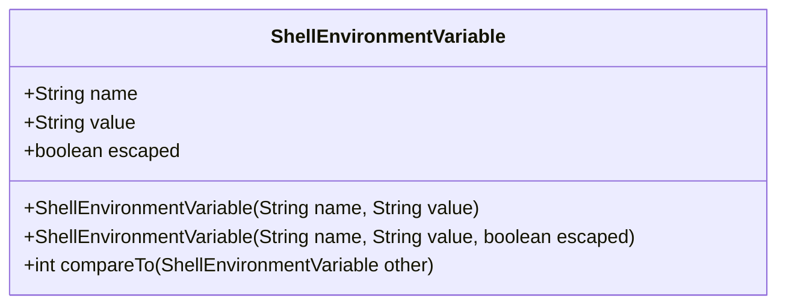
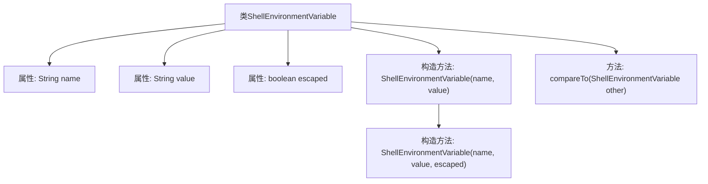

# 基础信息

|      |      |
|------|------|
| 名称 | ShellEnvironmentVariable |
| 编码语言 | .java |
| 代码路径 | termux-app/termux-shared/src/main/java/com/termux/shared/shell/command/environment/ShellEnvironmentVariable.java |
| 包名 | com.termux.shared.shell.command.environment |
| 依赖项 | [] |
| 概述说明 | Shell环境变量类，含名称、值及转义标记，可比较名称。 |

# 说明

该代码定义了一个名为ShellEnvironmentVariable的类，用于表示Shell环境变量。类包含三个成员变量：name表示环境变量名称，value表示环境变量值，escaped标识值是否已转义。提供了两个构造函数，分别支持设置名称和值，以及名称、值和转义标志。类实现了Comparable接口，通过名称进行比较。整个类结构简洁，专注于环境变量的封装和比较功能。

# 类列表 Class Summary

| 名称   | 类型  | 说明 |
|-------|------|-------------|
| ShellEnvironmentVariable | class | Shell环境变量类，含名称、值和转义标志，可比较。 |

## 类 ShellEnvironmentVariable

|      |      |
|------|------|
| 访问范围 | public |
| 类型 | class |
| 名称 | ShellEnvironmentVariable |
| 说明 | Shell环境变量类，含名称、值和转义标志，可比较。 |

### UML类图

该类图展示了ShellEnvironmentVariable类的结构，它是一个实现了Comparable接口的类，用于表示Shell环境变量。该类包含三个公有字段：name（环境变量名）、value（环境变量值）和escaped（标识值是否已转义），以及两个构造函数和一个比较方法compareTo。compareTo方法通过比较环境变量名来实现对象排序功能，体现了该类可排序的特性。整个设计简洁明了，专注于环境变量的存储和比较操作。

### 内部方法调用关系图

这段代码定义了一个名为ShellEnvironmentVariable的类，用于表示Shell环境变量。该类包含三个属性：name（环境变量名）、value（环境变量值）和escaped（标识值是否已转义）。提供了两个构造方法，一个默认不转义，另一个可指定转义状态。类实现了Comparable接口，通过compareTo方法按name字典序比较环境变量。流程图展示了类结构、属性及方法间的层级关系。

### 字段列表 Field List

| 名称  | 类型  | 说明 |
|-------|-------|------|
| value | String | 公开字符串变量value。 |
| escaped | boolean | 布尔变量escaped表示是否已转义。 |
| name | String | 声明公共字符串变量name。 |

### 方法列表 Method List

| 名称  | 类型  | 说明 |
|-------|-------|------|
| compareTo | int | 重写compareTo方法，按name比较ShellEnvironmentVariable对象。 |

