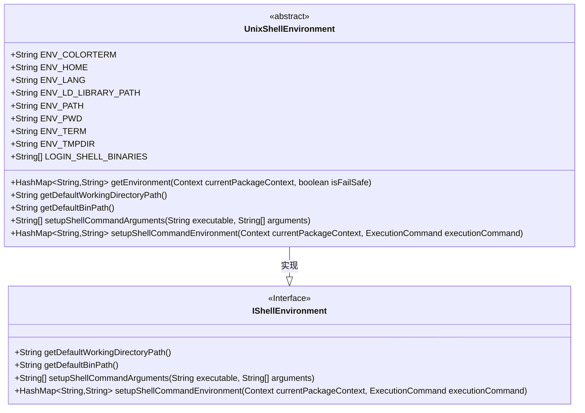
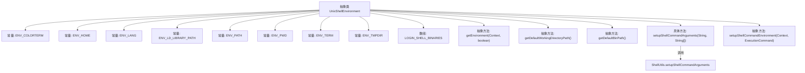

# 基础信息

|      |      |
|------|------|
| 名称 | UnixShellEnvironment |
| 编码语言 | .java |
| 代码路径 | termux-app/termux-shared/src/main/java/com/termux/shared/shell/command/environment/UnixShellEnvironment.java |
| 包名 | com.termux.shared.shell.command.environment |
| 依赖项 | ['android.content.Context', 'androidx.annotation.NonNull', 'androidx.annotation.Nullable', 'com.termux.shared.shell.ShellUtils', 'com.termux.shared.shell.command.ExecutionCommand', 'java.util.HashMap'] |
| 概述说明 | UnixShellEnvironment抽象类定义常用环境变量和Shell相关方法。 |

# 说明

UnixShellEnvironment是一个抽象类，实现了IShellEnvironment接口，定义了Unix/Linux系统中常见的环境变量和登录Shell相关配置。该类包含多个静态常量，如COLORTERM（终端颜色支持）、HOME（用户主目录路径）、LANG（本地化设置）、LD_LIBRARY_PATH（动态库搜索路径）、PATH（可执行文件搜索路径）、PWD（当前工作目录）、TERM（终端类型）和TMPDIR（临时目录路径）。此外，还定义了常见的登录Shell二进制文件名列表（如bash、zsh等）。该类提供了多个抽象方法，包括获取环境变量、默认工作目录路径、默认二进制路径，以及设置Shell命令参数和环境的方法。这些方法需要子类具体实现，用于配置和执行Shell命令时的环境设置。

# 类列表 Class Summary

| 名称   | 类型  | 说明 |
|-------|------|-------------|
| UnixShellEnvironment | class | UnixShellEnvironment类定义Unix环境变量和登录Shell，提供获取环境、工作目录和命令参数的方法。 |

## 类 UnixShellEnvironment

|      |      |
|------|------|
| 访问范围 | public abstract |
| 类型 | class |
| 名称 | UnixShellEnvironment |
| 说明 | UnixShellEnvironment类定义Unix环境变量和登录Shell，提供获取环境、工作目录和命令参数的方法。 |

### UML类图

该类图展示了UnixShellEnvironment抽象类与IShellEnvironment接口的关系。UnixShellEnvironment定义了多个环境变量常量（如PATH、HOME等）和登录Shell二进制名称数组，并实现了接口中声明的4个核心方法，包括获取环境变量、工作目录路径、二进制路径以及设置Shell命令参数和环境的方法。类通过抽象方法强制子类实现关键环境配置逻辑，同时提供部分默认实现（如setupShellCommandArguments）。

### 内部方法调用关系图

该流程图展示了UnixShellEnvironment抽象类的结构，包含9个环境变量常量定义、1个登录Shell二进制名称数组，以及4个核心方法（3个抽象方法和1个具体实现方法）。具体方法setupShellCommandArguments会调用ShellUtils工具类的静态方法，而其他抽象方法需要子类实现。类设计聚焦于Shell环境配置，包括路径处理、命令参数和环境变量设置等功能，为不同Unix系统提供统一的Shell环境抽象接口。

### 字段列表 Field List

| 名称  | 类型  | 说明 |
|-------|-------|------|
| ENV_TERM = "TERM" | String | 定义环境变量TERM的常量字符串。 |
| ENV_PATH = "PATH" | String | 定义常量ENV_PATH，值为"PATH"。 |
| ENV_TMPDIR = "TMPDIR" | String | 定义常量ENV_TMPDIR，值为"TMPDIR"。 |
| LOGIN_SHELL_BINARIES = new String[]{"login", "bash", "zsh", "fish", "sh"} | String[] | 定义登录Shell二进制文件列表：login、bash、zsh、fish、sh。 |
| ENV_LANG = "LANG" | String | 定义常量ENV_LANG表示环境变量"LANG"。 |
| ENV_LD_LIBRARY_PATH = "LD_LIBRARY_PATH" | String | 定义环境变量LD_LIBRARY_PATH的静态常量。 |
| ENV_PWD = "PWD" | String | 定义常量ENV_PWD，值为"PWD"。 |
| ENV_COLORTERM = "COLORTERM" | String | 定义常量ENV_COLORTERM，值为"COLORTERM"。 |
| ENV_HOME = "HOME" | String | 定义静态常量ENV_HOME，值为"HOME"。 |

### 方法列表 Method List

| 名称  | 类型  | 说明 |
|-------|-------|------|
| getDefaultWorkingDirectoryPath | String | 非空抽象方法，返回默认工作目录路径。 |
| setupShellCommandArguments | String[] | 重写Shell命令参数方法，调用ShellUtils工具类处理。 |
| setupShellCommandEnvironment | HashMap<String, String> | 重写抽象方法，设置Shell命令环境，返回HashMap。 |
| getDefaultBinPath | String | 非空抽象方法，返回默认二进制路径。 |
| getEnvironment | HashMap<String, String> | 抽象方法：获取环境变量，需上下文参数和容错标志，返回字符串映射。 |

