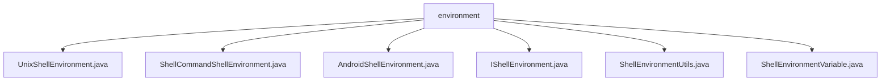

# 基础信息

|      |      |
|------|------|
| 名称 | environment |
| 编码语言 | .java |
| 代码路径 | termux-app/termux-shared/src/main/java/com/termux/shared/shell/command/environment |
| 包名 | termux-app.termux-shared.src.main.java.com.termux.shared.shell.command.environment |
| 概述说明 | UnixShellEnvironment定义Unix环境变量和Shell配置。ShellCommandShellEnvironment管理命令执行环境变量。AndroidShellEnvironment扩展Unix环境，添加Android特有变量。ShellEnvironmentUtils提供环境变量工具方法。ShellEnvironmentVariable封装环境变量数据。 |

# 说明

## 概述

该代码模块主要围绕Shell环境管理进行设计，提供了一套完整的工具类和接口，用于处理Unix/Linux和Android系统中的Shell环境变量、命令执行环境配置及相关工具方法。模块采用面向对象设计，包含抽象基类、具体实现类及工具类，支持环境变量的定义、校验、转换和封装等功能。

核心组件包括：
- **UnixShellEnvironment**：抽象基类，定义Unix/Linux系统环境变量标准和抽象方法
- **AndroidShellEnvironment**：继承UnixShellEnvironment，实现Android特有环境配置
- **ShellCommandShellEnvironment**：管理命令执行时的上下文环境变量
- **ShellEnvironmentUtils**：提供环境变量格式转换、校验等工具方法
- **ShellEnvironmentVariable**：封装单个环境变量的数据结构

## 主要业务场景

1. **Shell环境初始化配置**
   - 通过UnixShellEnvironment和AndroidShellEnvironment设置基础环境变量（PATH、HOME等）
   - 配置Android特有变量（ANDROID_DATA、ANDROID_ROOT等）
   - 提供默认工作目录和二进制路径

2. **命令执行环境管理**
   - 使用ShellCommandShellEnvironment生成包含运行上下文的环境变量（如SHELL_ID、PACKAGE_NAME）
   - 通过setupShellCommandEnvironment方法配置命令执行环境

3. **环境变量处理**
   - 变量格式转换：HashMap与environ格式/.env文件格式互转
   - 变量校验：检查变量名合法性（字母开头）和值有效性（非空等）
   - 变量封装：通过ShellEnvironmentVariable类实现变量对象化

4. **跨平台支持**
   - 抽象Unix/Linux基础环境配置
   - 特殊处理Android平台环境需求
   - 支持多种Shell类型（bash、zsh等）的兼容配置

5. **工具辅助功能**
   - 自动创建HOME目录
   - 系统环境变量合并
   - 变量值转义处理
   - 环境变量排序比较

### 包内部结构视图

该流程图展示了Termux应用中shell命令环境相关的类文件结构。根节点"environment"下包含6个直接子文件，分别处理不同类型的shell环境实现和工具类，包括Unix环境、Android环境、命令环境等核心组件，以及环境变量和工具类文件。所有文件均位于同一层级，没有更深层次的嵌套关系。

# 文件列表 File List

| 名称   | 类型  | 说明 |
|-------|------|-------------|
| [UnixShellEnvironment.java](UnixShellEnvironment.md) | file | UnixShellEnvironment抽象类定义常用环境变量和Shell相关方法。 |
| [ShellEnvironmentVariable.java](ShellEnvironmentVariable.md) | file | Shell环境变量类，含名称、值及转义标记，可比较名称。 |
| [ShellEnvironmentUtils.java](ShellEnvironmentUtils.md) | file | Shell工具类：转换环境变量格式并验证有效性。 |
| [IShellEnvironment.java](IShellEnvironment.md) | file | 输入内容为空，无法生成概要描述。请提供具体信息以便总结。 |
| [AndroidShellEnvironment.java](AndroidShellEnvironment.md) | file | AndroidShellEnvironment类继承UnixShellEnvironment，提供Android环境变量和路径配置。 |
| [ShellCommandShellEnvironment.java](ShellCommandShellEnvironment.md) | file | ShellCommandShellEnvironment类定义了执行命令的环境变量前缀及多个相关变量，并提供了获取环境信息的方法。 |

