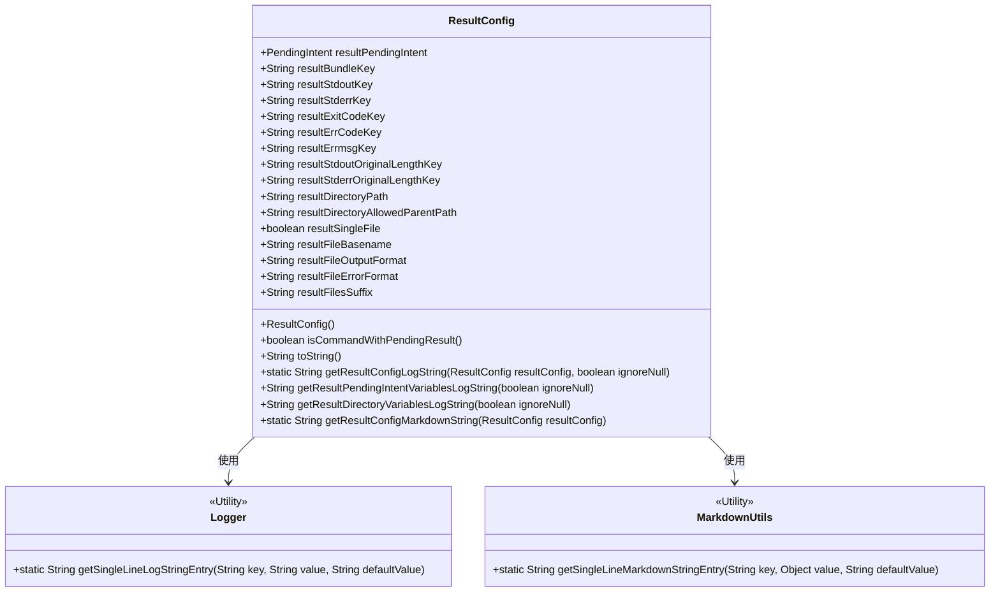

# 基础信息

|      |      |
|------|------|
| 名称 | ResultConfig |
| 编码语言 | .java |
| 代码路径 | termux-app/termux-shared/src/main/java/com/termux/shared/shell/command/result/ResultConfig.java |
| 包名 | com.termux.shared.shell.command.result |
| 依赖项 | ['android.app.PendingIntent', 'androidx.annotation.NonNull', 'com.termux.shared.logger.Logger', 'com.termux.shared.markdown.MarkdownUtils', 'java.util.Formatter'] |
| 概述说明 | ResultConfig类定义命令结果的PendingIntent和文件输出配置。 |

# 说明

ResultConfig类用于配置命令执行结果的返回方式，支持通过PendingIntent或文件目录两种形式返回结果。PendingIntent相关配置包括结果Bundle的键、标准输出键、标准错误键、退出码键、错误码键、错误消息键及原始输出长度键。文件目录相关配置包括结果目录路径、允许的父目录路径、是否单文件输出、文件基础名、输出格式、错误格式及文件后缀。类提供方法检查是否存在待处理结果，并支持生成日志友好字符串和Markdown格式字符串以描述配置信息。

# 类列表 Class Summary

| 名称   | 类型  | 说明 |
|-------|------|-------------|
| ResultConfig | class | ResultConfig类定义命令结果的PendingIntent和文件存储配置。 |

## 类 ResultConfig

|      |      |
|------|------|
| 访问范围 | public |
| 类型 | class |
| 名称 | ResultConfig |
| 说明 | ResultConfig类定义命令结果的PendingIntent和文件存储配置。 |

### UML类图

这段代码定义了一个`ResultConfig`类，用于配置命令执行结果的输出方式。该类包含两类主要配置：通过`PendingIntent`返回结果的键值配置（如`resultStdoutKey`等），以及通过文件系统输出结果的路径和格式配置（如`resultDirectoryPath`等）。提供了日志和Markdown格式的字符串生成方法，依赖`Logger`和`MarkdownUtils`工具类进行字符串格式化。核心方法`isCommandWithPendingResult()`用于判断是否配置了结果返回方式。

### 内部方法调用关系图

```mermaid
graph TD
    A["类ResultConfig"]
    B["属性: PendingIntent resultPendingIntent"]
    C["属性: String resultBundleKey"]
    D["属性: String resultStdoutKey"]
    E["属性: String resultStderrKey"]
    F["属性: String resultExitCodeKey"]
    G["属性: String resultErrCodeKey"]
    H["属性: String resultErrmsgKey"]
    I["属性: String resultStdoutOriginalLengthKey"]
    J["属性: String resultStderrOriginalLengthKey"]
    K["属性: String resultDirectoryPath"]
    L["属性: String resultDirectoryAllowedParentPath"]
    M["属性: boolean resultSingleFile"]
    N["属性: String resultFileBasename"]
    O["属性: String resultFileOutputFormat"]
    P["属性: String resultFileErrorFormat"]
    Q["属性: String resultFilesSuffix"]
    R["构造方法: ResultConfig()"]
    S["方法: isCommandWithPendingResult()"]
    T["方法: toString()"]
    U["静态方法: getResultConfigLogString(ResultConfig, boolean)"]
    V["方法: getResultPendingIntentVariablesLogString(boolean)"]
    W["方法: getResultDirectoryVariablesLogString(boolean)"]
    X["静态方法: getResultConfigMarkdownString(ResultConfig)"]

    A --> B
    A --> C
    A --> D
    A --> E
    A --> F
    A --> G
    A --> H
    A --> I
    A --> J
    A --> K
    A --> L
    A --> M
    A --> N
    A --> O
    A --> P
    A --> Q
    A --> R
    A --> S
    A --> T
    A --> U
    A --> V
    A --> W
    A --> X
    T --> U
    U --> V
    U --> W
    X --> V
    X --> W
```

这段代码定义了一个`ResultConfig`类，用于配置命令执行结果的输出方式。类包含两类主要属性：一类用于配置通过`PendingIntent`返回结果的参数（如各种键名），另一类用于配置将结果写入文件的参数（如目录路径、文件名格式等）。核心方法包括检查是否有待处理结果`isCommandWithPendingResult()`、生成日志字符串`getResultConfigLogString()`和生成Markdown格式字符串`getResultConfigMarkdownString()`，这些方法会调用内部方法处理不同输出方式的参数。整体设计支持灵活的结果输出配置，适用于需要多种结果返回方式的场景。

### 字段列表 Field List

| 名称  | 类型  | 说明 |
|-------|-------|------|
| resultFileOutputFormat | String | 字符串类型变量，定义结果文件输出格式。 |
| resultSingleFile | boolean | 检查单个文件结果 |
| resultStderrOriginalLengthKey | String | 字符串变量存储原始标准错误长度键 |
| resultStdoutKey | String | 定义字符串变量resultStdoutKey。 |
| resultFilesSuffix | String | 字符串类型变量，存储结果文件后缀名。 |
| resultFileBasename | String | 定义字符串变量resultFileBasename，存储结果文件基础名。 |
| resultDirectoryPath | String | 声明字符串变量resultDirectoryPath。 |
| resultPendingIntent | PendingIntent | 声明一个公共的PendingIntent变量resultPendingIntent。 |
| resultErrmsgKey | String | 定义字符串变量resultErrmsgKey。 |
| resultErrCodeKey | String | 定义字符串变量resultErrCodeKey。 |
| resultDirectoryAllowedParentPath | String | 定义字符串变量resultDirectoryAllowedParentPath。 |
| resultExitCodeKey | String | 定义字符串变量resultExitCodeKey。 |
| resultStderrKey | String | 定义字符串变量resultStderrKey |
| resultBundleKey | String | 定义字符串变量resultBundleKey |
| resultStdoutOriginalLengthKey | String | 字符串变量存储原始长度键值。 |
| resultFileErrorFormat | String | 字符串变量resultFileErrorFormat用于存储结果文件的错误格式。 |

### 方法列表 Method List

| 名称  | 类型  | 说明 |
|-------|-------|------|
| getResultPendingIntentVariablesLogString | String | 生成PendingIntent日志字符串，包含创建者及各类结果键值。 |
| getResultConfigLogString | String | 生成ResultConfig日志字符串，包含待定结果、待定意图和目录路径信息。 |
| toString | String | 重写toString方法，返回带配置信息的日志字符串。 |
| isCommandWithPendingResult | boolean | 检查命令是否有待处理结果，返回布尔值。 |
| getResultDirectoryVariablesLogString | String | 生成结果目录变量日志字符串，包含路径、文件、格式等信息。 |
| getResultConfigMarkdownString | String | 生成结果配置的Markdown字符串，包含PendingIntent和目录路径等信息。 |

