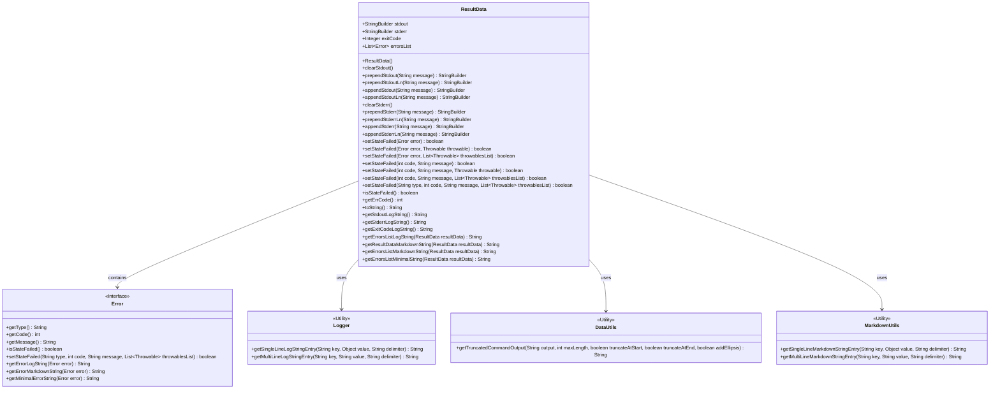
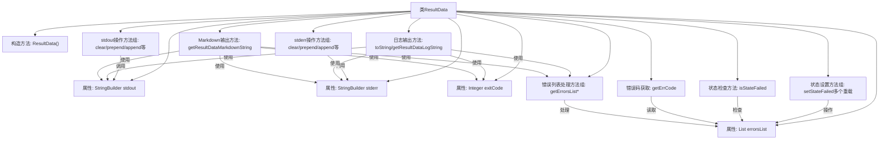

# 基础信息

|      |      |
|------|------|
| 名称 | ResultData |
| 编码语言 | .java |
| 代码路径 | termux-app/termux-shared/src/main/java/com/termux/shared/shell/command/result/ResultData.java |
| 包名 | com.termux.shared.shell.command.result |
| 依赖项 | ['androidx.annotation.NonNull', 'com.termux.shared.data.DataUtils', 'com.termux.shared.logger.Logger', 'com.termux.shared.markdown.MarkdownUtils', 'com.termux.shared.errors.Errno', 'com.termux.shared.errors.Error', 'java.io.Serializable', 'java.util.ArrayList', 'java.util.Collections', 'java.util.List'] |
| 概述说明 | 存储命令执行结果，包含输出、错误码和错误列表。 |

# 说明

ResultData类是一个可序列化的Java类，用于存储命令执行结果。它包含标准输出(stdout)和标准错误(stderr)的StringBuilder对象，以及命令的退出码(exitCode)和错误列表(errorsList)。类提供了多种方法来操作stdout和stderr，包括清空、前后追加内容等。还提供了设置和检查失败状态的方法，以及生成日志友好字符串和Markdown格式字符串的功能。错误处理方面，支持添加错误信息并检查是否存在失败状态，还能获取错误代码。最后，类提供了多种格式化输出方法，包括日志字符串、Markdown字符串和最小化错误字符串。

# 类列表 Class Summary

| 名称   | 类型  | 说明 |
|-------|------|-------------|
| ResultData | class | ResultData类存储命令执行结果，包括stdout、stderr、exitCode和错误列表，提供日志和Markdown输出功能。 |

## 类 ResultData

|      |      |
|------|------|
| 访问范围 | public |
| 类型 | class |
| 名称 | ResultData |
| 说明 | ResultData类存储命令执行结果，包括stdout、stderr、exitCode和错误列表，提供日志和Markdown输出功能。 |

### UML类图

这段代码定义了一个`ResultData`类，用于封装命令执行结果，包括标准输出、标准错误、退出码和错误列表。该类提供了丰富的操作方法，如追加/前置输出内容、设置失败状态、生成日志和Markdown格式的字符串等。`ResultData`依赖于`Error`类来管理错误信息，并使用了`Logger`、`DataUtils`和`MarkdownUtils`等工具类进行字符串处理和格式化。整体设计注重结果的可读性和可操作性，适合用于命令行工具或批处理系统的结果封装。

### 内部方法调用关系图

这段代码定义了一个ResultData类，用于封装命令执行结果数据。主要功能包括：1) 通过StringBuilder存储标准输出和错误输出；2) 记录退出码和错误列表；3) 提供丰富的输出操作方法；4) 支持多种格式的结果转换(日志/Markdown)。类结构清晰，通过方法重载提供多种错误状态设置方式，并实现了完善的结果输出功能，包括日志截断处理和多种格式化输出选项。

### 字段列表 Field List

| 名称  | 类型  | 说明 |
|-------|-------|------|
| exitCode | Integer | 整数型退出码。 |
| stderr = new StringBuilder() | StringBuilder | 定义字符串构建器stderr用于存储错误信息。 |
| stdout = new StringBuilder() | StringBuilder | 公共StringBuilder stdout初始化为新实例。 |
| errorsList =  new ArrayList<>() | List<Error> | 声明错误列表变量并初始化为空数组。 |

### 方法列表 Method List

| 名称  | 类型  | 说明 |
|-------|-------|------|
| getResultDataLogString | String | 生成ResultData日志字符串，包含标准输出、错误输出、退出码和错误列表。 |
| prependStdoutLn | StringBuilder | 在StringBuilder开头插入带换行的消息。 |
| setStateFailed | boolean | 同步方法设置失败状态，记录错误信息到列表并返回结果。 |
| appendStdout | StringBuilder | 方法appendStdout将消息追加到stdout并返回StringBuilder实例。 |
| getErrCode | int | 获取错误列表末位错误码，无错误则返回成功码。 |
| setStateFailed | boolean | 同步方法设置失败状态，接收错误参数并调用内部方法。 |
| toString | String | 非空toString方法返回带日志的结果数据字符串。 |
| clearStdout | void | 清除标准输出内容。 |
| getStderrLogString | String | 获取标准错误日志字符串，空时返回单行日志，非空返回多行截断日志。 |
| appendStderr | StringBuilder | Java方法：将消息追加到stderr字符串构建器。 |
| prependStderrLn | StringBuilder | 在StringBuilder前添加错误信息及换行符。 |
| clearStderr | void | 清除标准错误流内容。 |
| prependStdout | StringBuilder | 在字符串构建器开头插入消息并返回。 |
| setStateFailed | boolean | 同步方法设置失败状态，返回错误类型、代码、消息和异常列表。 |
| isStateFailed | boolean | 检查错误列表是否存在失败状态。 |
| setStateFailed | boolean | 同步方法设置失败状态，返回布尔值，参数含错误码、消息和异常。 |
| prependStderr | StringBuilder | 在StringBuilder开头插入错误信息。 |
| setStateFailed | boolean | 同步方法设置失败状态，返回布尔值。 |
| setStateFailed | boolean | 同步方法setStateFailed，传入错误和异常，调用同名方法处理。 |
| getStdoutLogString | String | 方法返回标准输出日志字符串，空时返回单行日志，非空返回截断的多行日志。 |
| appendStdoutLn | StringBuilder | 方法追加消息到标准输出并换行。 |
| appendStderrLn | StringBuilder | 追加错误信息并换行。 |
| setStateFailed | boolean | 同步方法setStateFailed，设置失败状态，参数为错误码、消息和异常列表。 |
| getExitCodeLogString | String | 方法返回单行日志字符串，格式为"Exit Code"加退出码，未设置时显示"-"。 |
| getErrorsListLogString | String | 将ResultData中的错误列表转换为日志字符串，失败状态错误换行拼接。 |
| getResultDataMarkdownString | String | 将ResultData转为Markdown字符串，包含标准输出、错误输出、退出码和错误列表。 |
| getErrorsListMarkdownString | String | 将ResultData的错误列表转为Markdown字符串，空返回"null"。 |
| getErrorsListMinimalString | String | 静态方法获取失败错误列表的简洁字符串，空返回"null"。 |

