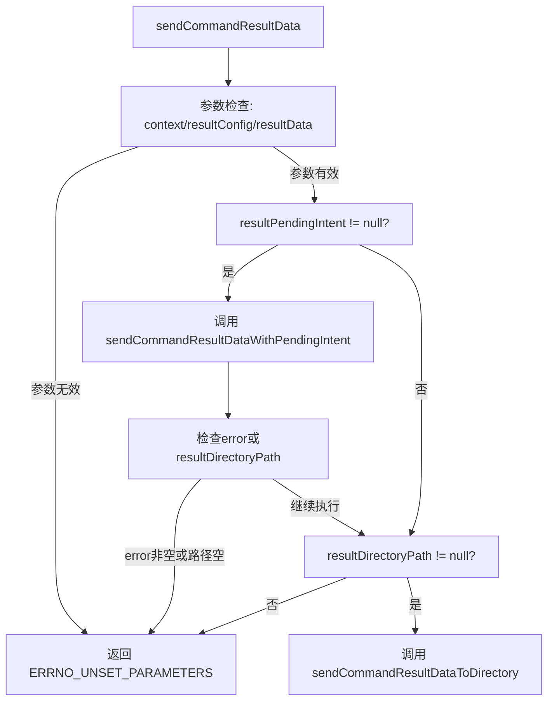
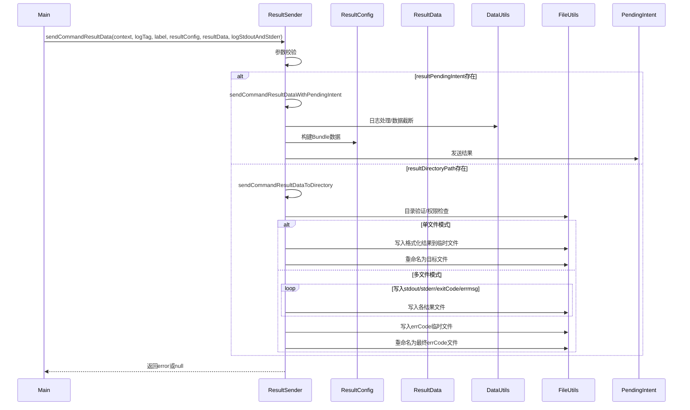

# 基础信息

|      |      |
|------|------|
| 名称 | ResultSender |
| 编码语言 | .java |
| 代码路径 | termux-app/termux-shared/src/main/java/com/termux/shared/shell/command/result/ResultSender.java |
| 包名 | com.termux.shared.shell.command.result |
| 依赖项 | ['android.app.Activity', 'android.app.PendingIntent', 'android.content.Context', 'android.content.Intent', 'android.os.Bundle', 'com.termux.shared.R', 'com.termux.shared.data.DataUtils', 'com.termux.shared.markdown.MarkdownUtils', 'com.termux.shared.errors.Error', 'com.termux.shared.file.FileUtils', 'com.termux.shared.logger.Logger', 'com.termux.shared.errors.FunctionErrno', 'com.termux.shared.android.AndroidUtils', 'com.termux.shared.shell.command.ShellCommandConstants.RESULT_SENDER'] |
| 概述说明 | 发送命令结果数据，支持PendingIntent或文件目录两种方式。 |

# 说明

ResultSender类提供了两种发送命令结果的方式：通过PendingIntent或写入指定目录文件。主方法sendCommandResultData会根据ResultConfig配置选择发送方式，若两者都配置则同时执行。sendCommandResultDataWithPendingIntent方法通过PendingIntent返回结果，包含标准输出、错误输出、退出码等信息，并对超长内容进行截断处理。sendCommandResultDataToDirectory方法将结果写入文件，支持单文件或多文件模式，包含权限检查、临时文件处理等机制。所有方法均进行参数校验并返回错误信息。

# 类列表 Class Summary

| 名称   | 类型  | 说明 |
|-------|------|-------------|
| ResultSender | class | 发送命令结果数据，支持PendingIntent或文件目录两种方式。 |

## 类 ResultSender

|      |      |
|------|------|
| 访问范围 | public |
| 类型 | class |
| 名称 | ResultSender |
| 说明 | 发送命令结果数据，支持PendingIntent或文件目录两种方式。 |

### UML类图

```mermaid
classDiagram
    class ResultSender {
        -String LOG_TAG
        +Error sendCommandResultData(Context context, String logTag, String label, ResultConfig resultConfig, ResultData resultData, boolean logStdoutAndStderr)
        +Error sendCommandResultDataWithPendingIntent(Context context, String logTag, String label, ResultConfig resultConfig, ResultData resultData, boolean logStdoutAndStderr)
        +Error sendCommandResultDataToDirectory(Context context, String logTag, String label, ResultConfig resultConfig, ResultData resultData, boolean logStdoutAndStderr)
    }

    class ResultConfig {
        +PendingIntent resultPendingIntent
        +String resultDirectoryPath
        +String resultBundleKey
        +String resultStdoutKey
        +String resultStderrKey
        +String resultExitCodeKey
        +String resultErrCodeKey
        +String resultErrmsgKey
        +String resultStdoutOriginalLengthKey
        +String resultStderrOriginalLengthKey
        +String resultDirectoryAllowedParentPath
        +boolean resultSingleFile
        +String resultFileBasename
        +String resultFileErrorFormat
        +String resultFileOutputFormat
        +String resultFilesSuffix
    }

    class ResultData {
        +StringBuilder stdout
        +StringBuilder stderr
        +Integer exitCode
        +boolean isStateFailed()
        +int getErrCode()
        +String getErrorsListLogString()
        +static String getResultDataLogString(ResultData resultData, boolean logStdoutAndStderr)
    }

    class Error {
        +String message
        +Error appendMessage(String message)
    }

    class FunctionErrno {
        <<Enumeration>>
        +ERRNO_NULL_OR_EMPTY_PARAMETERS
        +ERRNO_UNSET_PARAMETERS
        +ERRNO_NULL_OR_EMPTY_PARAMETER
        +Error getError(String paramName, String methodName)
    }

    class ResultSenderErrno {
        <<Enumeration>>
        +ERROR_RESULT_FILE_BASENAME_NULL_OR_INVALID
        +ERROR_FORMAT_RESULT_ERROR_FAILED_WITH_EXCEPTION
        +ERROR_FORMAT_RESULT_OUTPUT_FAILED_WITH_EXCEPTION
        +ERROR_RESULT_FILES_SUFFIX_INVALID
        +Error getError(String paramName)
    }

    class DataUtils {
        <<Utility>>
        +static String getDefaultIfNull(String value, String defaultValue)
        +static boolean isNullOrEmpty(String value)
        +static String getTruncatedCommandOutput(String output, int maxSize, boolean trimFromEnd, boolean addEllipsis, boolean addNewLine)
    }

    class FileUtils {
        <<Utility>>
        +static String getCanonicalPath(String path, String defaultPath)
        +static Error validateDirectoryFileExistenceAndPermissions(String description, String directoryPath, String allowedParentPath, boolean createIfNotExists, String requiredPermissions, boolean setMissingPermissions, boolean ignoreExecutePermissions, boolean checkReadable, boolean checkWritable)
        +static Error writeTextToFile(String description, String filePath, String allowedParentPath, String text, boolean append)
        +static Error moveRegularFile(String description, String sourceFilePath, String destinationFilePath, boolean overwrite)
    }

    class Logger {
        <<Utility>>
        +static void logDebugExtended(String logTag, String message)
        +static void logWarn(String logTag, String message)
        +static void logDebug(String logTag, String message)
    }

    ResultSender --> ResultConfig : 使用
    ResultSender --> ResultData : 使用
    ResultSender --> Error : 返回
    ResultSender --> FunctionErrno : 使用
    ResultSender --> ResultSenderErrno : 使用
    ResultSender --> DataUtils : 使用
    ResultSender --> FileUtils : 使用
    ResultSender --> Logger : 使用
    ResultData --> DataUtils : 使用
    FileUtils --> Error : 返回
```

类图描述：该图展示了ResultSender类及其相关依赖，包括配置类ResultConfig、数据类ResultData、错误处理类Error和多个工具类。ResultSender提供三种静态方法用于发送命令结果，通过PendingIntent或文件目录两种方式传输数据。图中清晰呈现了参数校验、日志记录、文件操作等关键功能模块的交互关系，以及错误码枚举类的使用方式。各工具类以<<Utility>>标记，体现了职责分离的设计原则。

### 内部方法调用关系图

流程图描述了ResultSender类的核心逻辑流程，首先进行参数校验，然后根据resultConfig配置选择通过PendingIntent发送结果或写入目录文件。时序图展示了完整的调用链，包括与DataUtils和FileUtils的工具类交互，以及根据单文件/多文件模式采用不同的文件处理策略。整个过程严格处理了参数校验、日志记录、数据截断、文件操作等关键步骤，确保结果发送的可靠性和事务完整性。

### 字段列表 Field List

| 名称  | 类型  | 说明 |
|-------|-------|------|
| LOG_TAG = "ResultSender" | String | 私有常量LOG_TAG值为"ResultSender"。 |

### 方法列表 Method List

| 名称  | 类型  | 说明 |
|-------|-------|------|
| sendCommandResultData | Error | 发送命令结果数据方法：检查参数后，根据配置选择发送方式（PendingIntent或目录），参数无效返回错误。 |
| sendCommandResultDataWithPendingIntent | Error | 发送命令结果数据，检查参数后截断输出并打包，通过PendingIntent返回。 |
| sendCommandResultDataToDirectory | Error | 将命令结果数据写入指定目录，包括stdout、stderr、退出码和错误信息，支持单文件或多文件格式，检查目录权限并处理错误。 |

