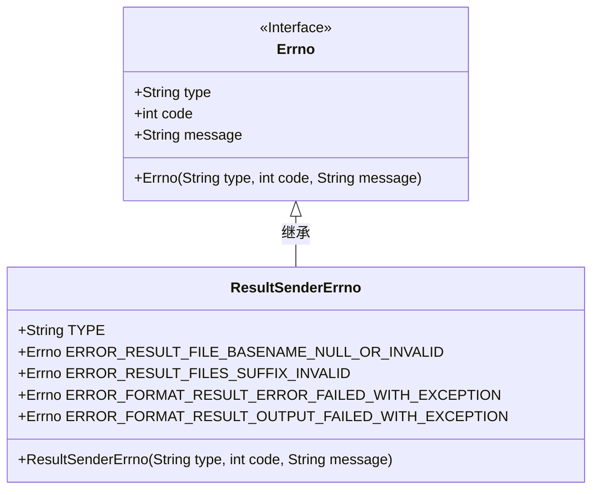
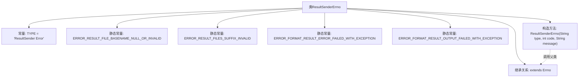

# 基础信息

|      |      |
|------|------|
| 名称 | ResultSenderErrno |
| 编码语言 | .java |
| 代码路径 | termux-app/termux-shared/src/main/java/com/termux/shared/shell/command/result/ResultSenderErrno.java |
| 包名 | com.termux.shared.shell.command.result |
| 依赖项 | ['com.termux.shared.errors.Errno'] |
| 概述说明 | 结果发送错误类，定义文件命名异常及格式化失败错误码。 |

# 说明

该代码定义了一个名为ResultSenderErrno的Java类，继承自Errno类，用于处理结果发送相关的错误。类中定义了类型常量TYPE和四个静态错误码常量，分别对应不同错误场景：结果文件基名为空或无效（100）、结果文件后缀无效（101）、格式化结果错误失败（102）、格式化结果输出失败（103）。每个错误码包含类型、代码和描述信息。类还包含一个构造函数，用于初始化错误类型、代码和消息。

# 类列表 Class Summary

| 名称   | 类型  | 说明 |
|-------|------|-------------|
| ResultSenderErrno | class | 结果发送错误类，定义文件命名异常及格式化失败错误码。 |

## 类 ResultSenderErrno

|      |      |
|------|------|
| 访问范围 | public |
| 类型 | class |
| 名称 | ResultSenderErrno |
| 说明 | 结果发送错误类，定义文件命名异常及格式化失败错误码。 |

### UML类图

这段代码展示了一个错误码处理类ResultSenderErrno，它继承自Errno接口。该类定义了四种特定的错误类型常量，用于处理结果发送过程中的各种异常情况，包括无效文件名、文件后缀格式错误以及格式化结果时出现的异常。每个错误码都包含类型标识、错误代码和详细描述信息。通过继承Errno接口，该类实现了统一的错误处理机制，便于在系统中进行错误分类和管理。

### 内部方法调用关系图

这段代码定义了一个继承自Errno的ResultSenderErrno类，主要用于处理结果发送过程中的错误类型。类中包含4个预定义的静态错误常量(100-103号错误)，分别对应不同的错误场景：结果文件基名为空/无效、结果文件后缀无效、格式化结果错误异常和格式化输出异常。每个错误常量都包含类型标识、错误代码和格式化消息模板。构造方法调用父类Errno进行初始化，实现了错误类型的标准化封装。

### 字段列表 Field List

| 名称  | 类型  | 说明 |
|-------|-------|------|
| ERROR_RESULT_FILE_BASENAME_NULL_OR_INVALID = new Errno(TYPE, 100, "The result file basename \"%1$s\" is null, empty or contains forward slashes \"/\".") | Errno | 错误码100：结果文件名为空或含斜杠。 |
| ERROR_FORMAT_RESULT_ERROR_FAILED_WITH_EXCEPTION = new Errno(TYPE, 102, "Formatting result error failed.\nException: %1$s") | Errno | 格式化结果错误，异常：%1$s |
| TYPE = "ResultSender Error" | String | 静态常量字符串，值为"ResultSender Error"。 |
| ERROR_RESULT_FILES_SUFFIX_INVALID = new Errno(TYPE, 101, "The result files suffix \"%1$s\" contains forward slashes \"/\".") | Errno | 结果文件后缀含斜杠无效 |
| ERROR_FORMAT_RESULT_OUTPUT_FAILED_WITH_EXCEPTION = new Errno(TYPE, 103, "Formatting result output failed.\nException: %1$s") | Errno | 格式化结果输出失败，异常：%1$s |

### 方法列表 Method List

| 名称  | 类型  | 说明 |
|-------|-------|------|

