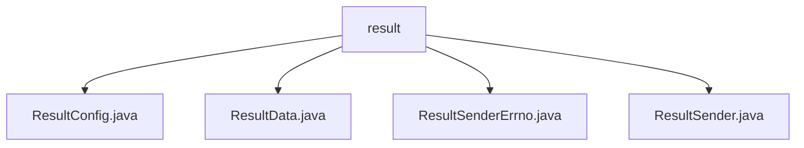

# 基础信息

|      |      |
|------|------|
| 名称 | result |
| 编码语言 | .java |
| 代码路径 | termux-app/termux-shared/src/main/java/com/termux/shared/shell/command/result |
| 包名 | termux-app.termux-shared.src.main.java.com.termux.shared.shell.command.result |
| 概述说明 | ResultConfig配置命令结果返回方式。ResultData存储命令执行结果。ResultSenderErrno处理发送错误。ResultSender提供两种发送结果方式。 |

# 说明

```markdown
## 概述

该代码模块主要提供了一套完整的命令执行结果处理机制，包含结果配置、数据存储、错误处理和结果发送等功能。模块通过`ResultConfig`类支持多种结果返回方式（PendingIntent或文件目录），使用`ResultData`类结构化存储命令执行结果，并通过`ResultSender`类实现结果的灵活发送。错误处理由`ResultSenderErrno`类专门管理，定义了结果发送过程中可能出现的各类错误场景。

## 主要业务场景

1. **命令结果配置管理**  
   - 通过`ResultConfig`动态配置结果返回方式（PendingIntent参数键值或文件目录结构）
   - 支持结果Bundle的键名自定义、文件输出格式控制（单文件/多文件、命名规则等）

2. **命令结果数据存储**  
   - `ResultData`作为核心数据容器，存储标准输出、标准错误、退出码及错误列表
   - 提供丰富的操作方法（内容追加/清空、失败状态标记、多格式转换等）

3. **结果发送与错误处理**  
   - `ResultSender`实现双通道发送：
     - PendingIntent方式：适合Android组件间通信，自动处理数据截断
     - 文件方式：支持权限校验、临时文件机制和格式化输出
   - `ResultSenderErrno`定义标准化错误码，覆盖文件命名无效、格式转换失败等场景

4. **日志与调试支持**  
   - 所有核心类均实现日志友好字符串和Markdown格式输出能力
   - 错误信息结构化存储（包含错误码、类型和描述）

典型应用场景包括：  
- Android环境下命令行工具的结果回调处理
- 批量任务执行结果的持久化存储
- 跨进程/组件的结果传递（如Service与Activity通信）
- 自动化测试框架的结果收集与分析
```


### 包内部结构视图



该流程图展示了Termux应用中shell命令结果处理模块的层级结构。根节点"result"表示结果处理目录，其下包含四个Java文件：ResultConfig.java用于配置管理，ResultData.java处理数据结果，ResultSenderErrno.java处理错误码，ResultSender.java负责结果发送。这种结构清晰地体现了命令结果处理功能的模块化设计，各文件职责分明。

# 文件列表 File List

| 名称   | 类型  | 说明 |
|-------|------|-------------|
| [ResultSender.java](ResultSender.md) | file | 发送命令结果数据，支持PendingIntent或文件目录两种方式。 |
| [ResultSenderErrno.java](ResultSenderErrno.md) | file | 结果发送错误类，定义文件命名异常及格式化失败错误码。 |
| [ResultData.java](ResultData.md) | file | 存储命令执行结果，包含输出、错误码和错误列表。 |
| [ResultConfig.java](ResultConfig.md) | file | ResultConfig类定义命令结果的PendingIntent和文件输出配置。 |


