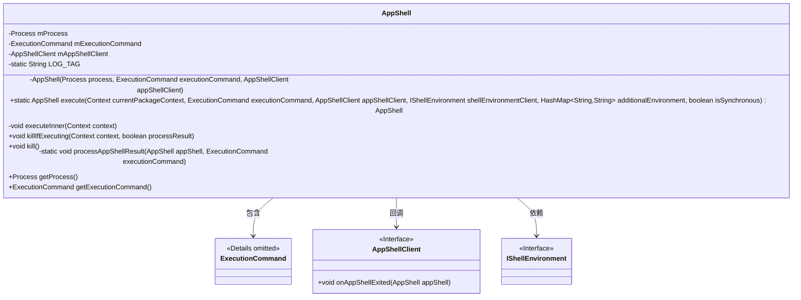
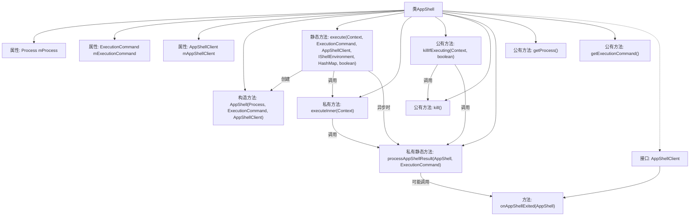

# 基础信息

|      |      |
|------|------|
| 名称 | AppShell |
| 编码语言 | .java |
| 代码路径 | termux-app/termux-shared/src/main/java/com/termux/shared/shell/command/runner/app/AppShell.java |
| 包名 | com.termux.shared.shell.command.runner.app |
| 依赖项 | ['android.content.Context', 'android.system.ErrnoException', 'android.system.Os', 'android.system.OsConstants', 'androidx.annotation.NonNull', 'androidx.annotation.Nullable', 'com.google.common.base.Joiner', 'com.termux.shared.R', 'com.termux.shared.data.DataUtils', 'com.termux.shared.shell.command.ExecutionCommand', 'com.termux.shared.shell.command.environment.ShellEnvironmentUtils', 'com.termux.shared.shell.command.result.ResultData', 'com.termux.shared.errors.Errno', 'com.termux.shared.logger.Logger', 'com.termux.shared.shell.command.ExecutionCommand.ExecutionState', 'com.termux.shared.shell.command.environment.IShellEnvironment', 'com.termux.shared.shell.ShellUtils', 'com.termux.shared.shell.StreamGobbler', 'java.io.DataOutputStream', 'java.io.File', 'java.io.IOException', 'java.nio.charset.StandardCharsets', 'java.util.Collections', 'java.util.HashMap', 'java.util.List'] |
| 概述说明 | AppShell类用于执行命令，支持同步异步操作，处理进程输出和错误流，提供进程管理和回调接口。 |

# 说明

AppShell类是一个用于执行命令行命令的工具类，封装了进程管理、命令执行和结果处理功能。它通过execute方法启动命令执行，支持同步和异步模式，并可设置环境变量和工作目录。内部使用Process和ExecutionCommand管理进程和命令状态，提供stdin、stdout和stderr的读写处理。包含kill方法终止进程，并通过AppShellClient回调通知执行结果。该类还处理命令执行失败和异常情况，确保资源正确释放。

# 类列表 Class Summary

| 名称   | 类型  | 说明 |
|-------|------|-------------|
| AppShell | class | AppShell类用于执行命令，支持同步异步操作，处理进程输出和错误流，提供回调接口。 |

## 类 AppShell

|      |      |
|------|------|
| 访问范围 | public final |
| 类型 | class |
| 名称 | AppShell |
| 说明 | AppShell类用于执行命令，支持同步异步操作，处理进程输出和错误流，提供回调接口。 |

### UML类图

这段代码展示了一个AppShell类，用于执行外部进程命令并管理其生命周期。核心功能包括同步/异步执行命令、进程监控、资源清理和结果回调处理。类通过ExecutionCommand封装执行参数，依赖IShellEnvironment设置执行环境，并通过AppShellClient接口实现回调机制。设计上严格处理了进程状态管理、错误处理和资源释放，适用于需要精细控制外部进程执行的场景。

### 内部方法调用关系图

这段代码是AppShell类的实现，主要用于执行外部命令并管理其生命周期。流程图展示了类结构、主要方法调用关系和接口实现。核心功能包括同步/异步执行命令、进程管理、结果处理和回调通知。execute()方法是入口点，根据参数决定同步或异步执行，最终通过processAppShellResult()处理结果并回调客户端。类还提供了进程终止方法和状态查询功能。

### 字段列表 Field List

| 名称  | 类型  | 说明 |
|-------|-------|------|
| mAppShellClient | AppShellClient | 私有应用外壳客户端实例。 |
| LOG_TAG = "AppShell" | String | 私有常量LOG_TAG值为"AppShell"。 |
| mExecutionCommand | ExecutionCommand | 私有执行命令对象 |
| mProcess | Process | 私有进程变量mProcess |

### 方法列表 Method List

| 名称  | 类型  | 说明 |
|-------|-------|------|
| getProcess | Process | 获取当前进程对象。 |
| getExecutionCommand | ExecutionCommand | 获取执行命令的方法。 |
| executeInner | void | 执行命令并处理输入输出流，等待进程结束并记录状态和退出码。 |
| kill | void | 终止进程：发送SIGKILL信号，失败则记录日志。 |
| processAppShellResult | void | 处理AppShell结果，检查执行命令状态，记录日志并触发回调或设置成功状态。 |
| killIfExecuting | void | 方法killIfExecuting检查命令是否执行完毕，未完成则发送SIGKILL终止进程并处理结果。 |
| execute | AppShell | 执行AppShell命令，处理参数和环境，同步或异步运行进程。 |

