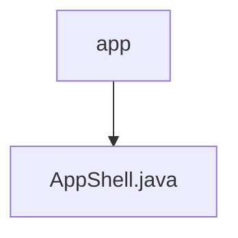

# 基础信息

|      |      |
|------|------|
| 名称 | app |
| 编码语言 | .java |
| 代码路径 | termux-app/termux-shared/src/main/java/com/termux/shared/shell/command/runner/app |
| 包名 | termux-app.termux-shared.src.main.java.com.termux.shared.shell.command.runner.app |
| 概述说明 | AppShell类用于执行命令，支持同步异步操作，处理进程输出和错误流，提供进程管理和回调接口。 |

# 说明

AppShell类是一个用于执行命令行命令的工具类，封装了进程管理、命令执行和结果处理功能。它通过execute方法启动命令执行，支持同步和异步模式，并可设置环境变量和工作目录。内部使用Process和ExecutionCommand管理进程和命令状态，提供stdin、stdout和stderr的读写处理。包含kill方法终止进程，并通过AppShellClient回调通知执行结果。该类还处理命令执行失败和异常情况，确保资源正确释放。

### 包内部结构视图

该流程图展示了Termux项目中shell命令运行模块的层级结构。顶层节点"app"代表命令运行器的包目录，其下包含一个具体的实现文件"AppShell.java"。这种结构体现了典型的Java包组织方式，其中父包包含子包或具体实现类，符合Maven项目标准目录布局。

# 文件列表 File List

| 名称   | 类型  | 说明 |
|-------|------|-------------|
| [AppShell.java](AppShell.md) | file | AppShell类用于执行命令，支持同步异步操作，处理进程输出和错误流，提供进程管理和回调接口。 |

