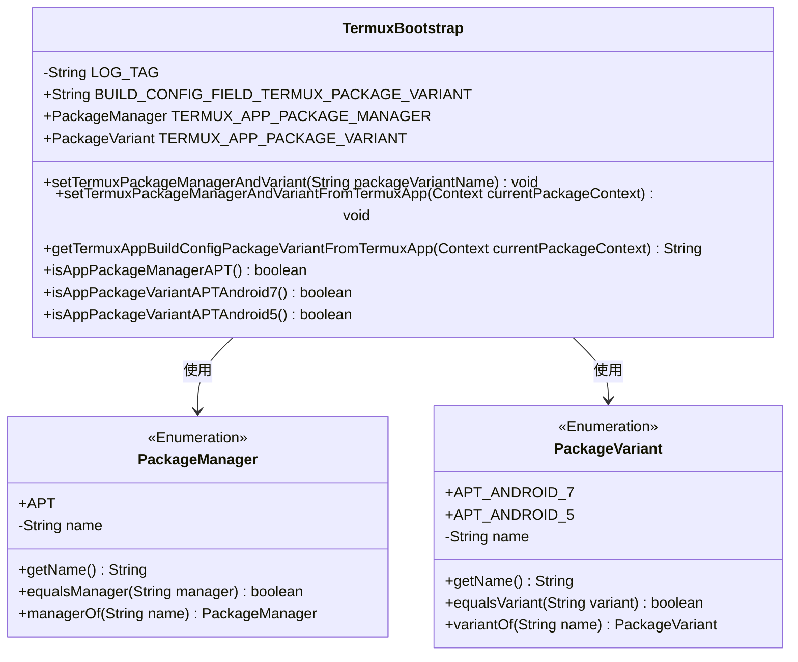

# 基础信息

|      |      |
|------|------|
| 名称 | TermuxBootstrap |
| 编码语言 | .java |
| 代码路径 | termux-app/termux-shared/src/main/java/com/termux/shared/termux/TermuxBootstrap.java |
| 包名 | com.termux.shared.termux |
| 依赖项 | ['android.content.Context', 'androidx.annotation.NonNull', 'androidx.annotation.Nullable', 'com.termux.shared.logger.Logger', 'com.termux.shared.termux.TermuxConstants.TERMUX_APP'] |
| 概述说明 | TermuxBootstrap类管理Termux应用的包管理器和变体配置。 |

# 说明

TermuxBootstrap类用于管理Termux应用的包管理和变体配置。它包含静态变量TERMUX_APP_PACKAGE_MANAGER和TERMUX_APP_PACKAGE_VARIANT，分别表示包管理器和包变体。通过setTermuxPackageManagerAndVariant方法，可以根据传入的包变体名称设置这两个变量，若无效则抛出异常。还提供从Termux应用获取包变体的方法setTermuxPackageManagerAndVariantFromTermuxApp。类中定义了PackageManager枚举（如APT）和PackageVariant枚举（如APT_ANDROID_7），用于表示支持的包管理器和变体类型。此外，包含多个方法检查当前包管理器或变体是否匹配特定类型。

# 类列表 Class Summary

| 名称   | 类型  | 说明 |
|-------|------|-------------|
| TermuxBootstrap | class | TermuxBootstrap类管理Termux应用包变体和包管理器。 |

## 类 TermuxBootstrap

|      |      |
|------|------|
| 访问范围 | public |
| 类型 | class |
| 名称 | TermuxBootstrap |
| 说明 | TermuxBootstrap类管理Termux应用包变体和包管理器。 |

### UML类图

这段代码描述了一个TermuxBootstrap类，主要用于管理Termux应用的包管理器和包变体。TermuxBootstrap类包含静态方法用于设置和获取包管理器（PackageManager）和包变体（PackageVariant），其中PackageManager和PackageVariant都是枚举类型，分别定义了APT等包管理器和对应的Android版本变体。类图展示了TermuxBootstrap与这两个枚举类之间的使用关系，TermuxBootstrap通过静态成员和方法操作这些枚举值来管理应用的包配置。

### 内部方法调用关系图

```mermaid
graph TD
    A["类TermuxBootstrap"]
    B["常量: LOG_TAG"]
    C["常量: BUILD_CONFIG_FIELD_TERMUX_PACKAGE_VARIANT"]
    D["静态变量: TERMUX_APP_PACKAGE_MANAGER"]
    E["静态变量: TERMUX_APP_PACKAGE_VARIANT"]
    F["方法: setTermuxPackageManagerAndVariant"]
    G["方法: setTermuxPackageManagerAndVariantFromTermuxApp"]
    H["方法: getTermuxAppBuildConfigPackageVariantFromTermuxApp"]
    I["方法: isAppPackageManagerAPT"]
    J["方法: isAppPackageVariantAPTAndroid7"]
    K["方法: isAppPackageVariantAPTAndroid5"]
    L["枚举类: PackageManager"]
    M["枚举类: PackageVariant"]

    A --> B
    A --> C
    A --> D
    A --> E
    A --> F
    A --> G
    A --> H
    A --> I
    A --> J
    A --> K
    A --> L
    A --> M

    F --> F1["调用PackageVariant.variantOf"]
    F --> F2["调用Logger.logVerbose"]
    F --> F3["调用PackageManager.managerOf"]
    F --> F4["抛出RuntimeException"]
    G --> G1["调用getTermuxAppBuildConfigPackageVariantFromTermuxApp"]
    G --> G2["调用setTermuxPackageManagerAndVariant"]
    G --> G3["调用Logger.logError"]
    H --> H1["调用TermuxUtils.getTermuxAppAPKBuildConfigClassField"]
    H --> H2["调用Logger.logStackTraceWithMessage"]
```

该流程图展示了TermuxBootstrap类的核心结构和主要方法调用关系。类包含两个枚举类型(PackageManager和PackageVariant)和多个静态方法，主要用于管理Termux应用的包变体和包管理器。关键方法setTermuxPackageManagerAndVariant负责根据输入参数设置包变体和包管理器，而其他方法则提供各种验证和查询功能。流程图清晰地呈现了类成员之间的层级关系和方法间的调用链。

### 字段列表 Field List

| 名称  | 类型  | 说明 |
|-------|-------|------|
| LOG_TAG = "TermuxBootstrap" | String | 私有常量LOG_TAG值为TermuxBootstrap |
| TERMUX_APP_PACKAGE_VARIANT | PackageVariant | 静态包变量TERMUX_APP_PACKAGE_VARIANT |
| TERMUX_APP_PACKAGE_MANAGER | PackageManager | 静态包管理器变量TERMUX_APP_PACKAGE_MANAGER |
| BUILD_CONFIG_FIELD_TERMUX_PACKAGE_VARIANT = "TERMUX_PACKAGE_VARIANT" | String | Termux包变体的构建配置字段常量。 |

### 方法列表 Method List

| 名称  | 类型  | 说明 |
|-------|-------|------|
| getTermuxAppBuildConfigPackageVariantFromTermuxApp | String | 获取Termux应用包变体配置，失败返回null并记录日志。 |
| isAppPackageVariantAPTAndroid7 | boolean | 检查应用包变体是否为APT_ANDROID_7。 |
| setTermuxPackageManagerAndVariantFromTermuxApp | void | 静态方法设置Termux包管理器和变体，失败时记录错误。 |
| isAppPackageManagerAPT | boolean | 检查应用包管理器是否为APT类型。 |
| setTermuxPackageManagerAndVariant | void | 设置Termux包管理器和变体，验证并记录配置。 |
| isAppPackageVariantAPTAndroid5 | boolean | 检查应用包变体是否为APT_ANDROID_5。 |

