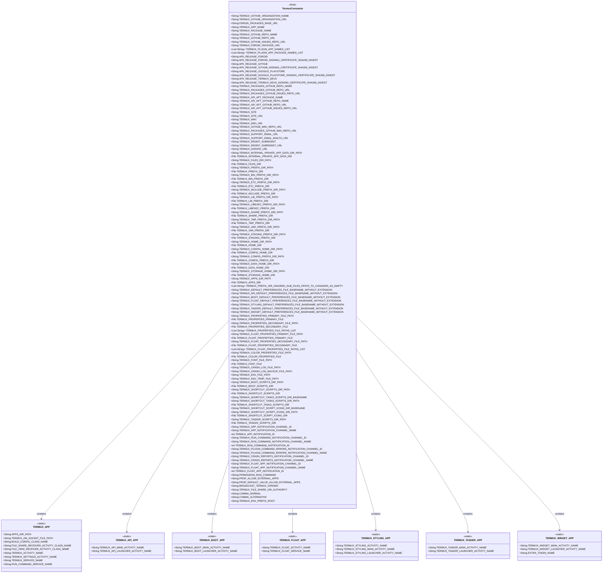
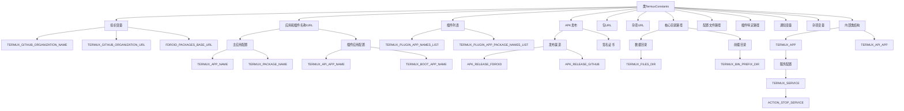

# 基础信息

|      |      |
|------|------|
| 名称 | TermuxConstants |
| 编码语言 | .java |
| 代码路径 | termux-app/termux-shared/src/main/java/com/termux/shared/termux/TermuxConstants.java |
| 包名 | com.termux.shared.termux |
| 依赖项 | ['android.annotation.SuppressLint', 'android.content.Intent', 'com.termux.shared.shell.command.ExecutionCommand', 'com.termux.shared.shell.command.ExecutionCommand.Runner', 'java.io.File', 'java.util.Arrays', 'java.util.Formatter', 'java.util.List'] |
| 概述说明 | Termux应用及其插件的主要常量定义，包括包名、路径、服务、通知等。 |

# 说明

TermuxConstants类定义了Termux应用及其插件相关的常量，包括组织信息、应用名称、包名、GitHub仓库URL、F-Droid包URL、核心目录路径、配置文件路径、通知变量、权限控制等。该类还包含多个子类，分别对应Termux主应用及其插件（如Termux:API、Termux:Boot、Termux:Float等），每个子类定义了各自特有的活动、服务、意图动作及额外参数。此外，还提供了APK发布渠道的签名证书摘要、脚本目录路径、环境变量前缀等关键信息，全面支持Termux生态系统的功能扩展与集成。

# 类列表 Class Summary

| 名称   | 类型  | 说明 |
|-------|------|-------------|
| TermuxConstants | class | Termux应用及其插件常量定义，包含组织信息、包名、GitHub/F-Droid链接、目录路径、通知变量等。 |

## 类 TermuxConstants

|      |      |
|------|------|
| 访问范围 | public final |
| 类型 | class |
| 名称 | TermuxConstants |
| 说明 | Termux应用及其插件常量定义，包含组织信息、包名、GitHub/F-Droid链接、目录路径、通知变量等。 |

### UML类图

这段代码定义了一个名为`TermuxConstants`的Java类，包含了Termux应用及其插件的大量常量定义。这些常量包括组织信息、应用名称、包名、GitHub仓库URL、文件路径、通知设置等。类图中展示了`TermuxConstants`与各个子类（如`TERMUX_APP`、`TERMUX_API_APP`等）之间的关系，这些子类分别对应Termux主应用及其插件应用的特定常量。整体结构清晰，便于管理和维护Termux应用的配置信息。

### 内部方法调用关系图

该流程图展示了TermuxConstants类的核心结构和关键常量分组。作为Termux应用的中央配置类，它定义了组织信息、应用/插件元数据、文件路径、Intent动作等全局常量。主要分为9大模块：组织变量管理GitHub和F-Droid基础URL；应用配置存储主应用和7个插件的包名/名称；插件列表维护所有插件集合；APK发布渠道定义不同构建来源；目录路径管理应用内部的文件系统结构；通知变量控制各类消息通道；内部类进一步封装各子模块专属配置。这种分层设计使得近千个常量能够分类管理，支撑Termux核心功能如命令行执行、插件通信、文件共享等场景的配置需求。

### 字段列表 Field List

| 名称  | 类型  | 说明 |
|-------|-------|------|
| APK_RELEASE_FDROID = "F-Droid" | String | APK发布渠道为F-Droid |
| TERMUX_ENV_TEMP_FILE_PATH = TERMUX_CONFIG_PREFIX_DIR_PATH + "/termux.env.tmp" | String | Termux环境临时文件路径变量定义。 |
| TERMUX_STYLING_APP_NAME = "Termux:Styling" | String | Termux样式应用名称常量 |
| TERMUX_SUPPORT_EMAIL_MAILTO_URL = "mailto:" + TERMUX_SUPPORT_EMAIL_URL | String | 定义邮件链接常量，指向Termux支持邮箱。 |
| TERMUX_FLOAT_FDROID_PACKAGE_URL = FDROID_PACKAGES_BASE_URL + "/" + TERMUX_FLOAT_PACKAGE_NAME | String | 静态常量字符串，存储Termux Float应用在F-Droid的完整包URL。 |
| TERMUX_SHARE_PREFIX_DIR = new File(TERMUX_SHARE_PREFIX_DIR_PATH) | File | 定义常量TERMUX_SHARE_PREFIX_DIR，指向指定路径的File对象。 |
| TERMUX_SHARE_PREFIX_DIR_PATH = TERMUX_PREFIX_DIR_PATH + "/share" | String | Termux共享目录路径常量定义 |
| TERMUX_BOOT_DEFAULT_PREFERENCES_FILE_BASENAME_WITHOUT_EXTENSION = TERMUX_BOOT_PACKAGE_NAME + "_preferences" | String | Termux启动默认偏好文件名，不含扩展名。 |
| TERMUX_GITHUB_ISSUES_REPO_URL = TERMUX_GITHUB_REPO_URL + "/issues" | String | Termux的GitHub问题仓库URL由基础URL加/issues构成。 |
| TERMUX_SHORTCUT_TASKS_SCRIPTS_DIR_BASENAME =  "tasks" | String | Termux任务脚本目录基础名称为"tasks"。 |
| TERMUX_STYLING_PACKAGE_NAME = TERMUX_PACKAGE_NAME + ".styling" | String | Termux样式包名常量定义 |
| TERMUX_PROPERTIES_SECONDARY_FILE_PATH = TERMUX_CONFIG_HOME_DIR_PATH + "/termux.properties" | String | Termux配置文件的次要路径。 |
| TERMUX_PLUGIN_APP_PACKAGE_NAMES_LIST = Arrays.asList(        TERMUX_API_PACKAGE_NAME,        TERMUX_BOOT_PACKAGE_NAME,        TERMUX_FLOAT_PACKAGE_NAME,        TERMUX_STYLING_PACKAGE_NAME,        TERMUX_TASKER_PACKAGE_NAME,        TERMUX_WIDGET_PACKAGE_NAME) | List<String> | Termux插件应用包名列表常量 |
| TERMUX_WIDGET_PACKAGE_NAME = TERMUX_PACKAGE_NAME + ".widget" | String | Termux组件包名常量定义 |
| TERMUX_API_APT_GITHUB_ISSUES_REPO_URL = TERMUX_API_APT_GITHUB_REPO_URL + "/issues" | String | Termux API的GitHub问题仓库URL |
| TERMUX_TMP_PREFIX_DIR = new File(TERMUX_TMP_PREFIX_DIR_PATH) | File | 定义静态常量TERMUX_TMP_PREFIX_DIR，指向指定路径的File对象。 |
| TERMUX_PACKAGES_GITHUB_WIKI_REPO_URL = TERMUX_PACKAGES_GITHUB_REPO_URL + "/wiki" | String | Termux包GitHub仓库wiki链接由主仓库URL加/wiki组成。 |
| TERMUX_INCLUDE_PREFIX_DIR_PATH = TERMUX_PREFIX_DIR_PATH + "/include" | String | Termux包含目录路径常量，基于前缀路径拼接。 |
| TERMUX_APP_NOTIFICATION_ID = 1337 | int | Termux应用通知ID设为1337。 |
| TERMUX_TASKER_PACKAGE_NAME = TERMUX_PACKAGE_NAME + ".tasker" | String | Termux Tasker包名为Termux包名加.tasker后缀。 |
| TERMUX_PROPERTIES_SECONDARY_FILE = new File(TERMUX_PROPERTIES_SECONDARY_FILE_PATH) | File | 定义静态常量TERMUX_PROPERTIES_SECONDARY_FILE，指向指定路径文件。 |
| TERMUX_PREFIX_DIR_PATH = TERMUX_FILES_DIR_PATH + "/usr" | String | Termux前缀目录路径为文件目录加"/usr"。 |
| TERMUX_SHORTCUT_SCRIPT_ICONS_DIR = new File(TERMUX_SHORTCUT_SCRIPT_ICONS_DIR_PATH) | File | Termux快捷脚本图标目录路径常量定义。 |
| TERMUX_FILES_DIR = new File(TERMUX_FILES_DIR_PATH) | File | 定义静态常量TERMUX_FILES_DIR，路径为TERMUX_FILES_DIR_PATH。 |
| TERMUX_PACKAGES_GITHUB_REPO_URL = TERMUX_GITHUB_ORGANIZATION_URL + "/" + TERMUX_PACKAGES_GITHUB_REPO_NAME | String | Termux包GitHub仓库URL由组织URL和仓库名拼接而成。 |
| TERMUX_HOME_DIR = new File(TERMUX_HOME_DIR_PATH) | File | 定义静态常量TERMUX_HOME_DIR，指向TERMUX_HOME_DIR_PATH路径的文件对象。 |
| APK_RELEASE_GITHUB = "Github" | String | APK发布渠道为Github。 |
| TERMUX_PACKAGES_GITHUB_REPO_NAME = "termux-packages" | String | Termux包GitHub仓库名称为termux-packages。 |
| TERMUX_STYLING_DEFAULT_PREFERENCES_FILE_BASENAME_WITHOUT_EXTENSION = TERMUX_STYLING_PACKAGE_NAME + "_preferences" | String | Termux样式默认首选项文件名（无扩展名）。 |
| TERMUX_BIN_PREFIX_DIR_PATH = TERMUX_PREFIX_DIR_PATH + "/bin" | String | Termux二进制文件目录路径常量定义 |
| TERMUX_REDDIT_SUBREDDIT = "r/termux" | String | Termux的Reddit子论坛地址是r/termux。 |
| TERMUX_INTERNAL_PRIVATE_APP_DATA_DIR_PATH = "/data/data/" + TERMUX_PACKAGE_NAME | String | Termux内部私有应用数据目录路径常量定义。 |
| TERMUX_SHORTCUT_TASKS_SCRIPTS_DIR = new File(TERMUX_SHORTCUT_TASKS_SCRIPTS_DIR_PATH) | File | 定义静态常量TERMUX_SHORTCUT_TASKS_SCRIPTS_DIR，指向指定路径的File对象。 |
| TERMUX_API_FDROID_PACKAGE_URL = FDROID_PACKAGES_BASE_URL + "/" + TERMUX_API_PACKAGE_NAME | String | Termux API的F-Droid包URL由基础URL和包名拼接而成。 |
| APK_RELEASE_GOOGLE_PLAYSTORE = "Google Play Store" | String | APK发布渠道为Google Play商店 |
| TERMUX_API_GITHUB_REPO_NAME = "termux-api" | String | Termux API的GitHub仓库名为termux-api。 |
| TERMUX_WIDGET_DEFAULT_PREFERENCES_FILE_BASENAME_WITHOUT_EXTENSION = TERMUX_WIDGET_PACKAGE_NAME + "_preferences" | String | Termux组件默认无扩展名偏好文件名由包名加_preferences组成。 |
| TERMUX_STAGING_PREFIX_DIR_PATH = TERMUX_FILES_DIR_PATH + "/usr-staging" | String | Termux暂存目录路径常量 |
| TERMUX_DATA_HOME_DIR = new File(TERMUX_DATA_HOME_DIR_PATH) | File | 定义常量TERMUX_DATA_HOME_DIR，指向路径TERMUX_DATA_HOME_DIR_PATH。 |
| TERMUX_DONATE_URL = TERMUX_SITE_URL + "/donate" | String | Termux捐赠链接常量 |
| TERMUX_STYLING_GITHUB_REPO_URL = TERMUX_GITHUB_ORGANIZATION_URL + "/" + TERMUX_STYLING_GITHUB_REPO_NAME | String | Termux样式库GitHub仓库URL由组织URL和仓库名拼接而成。 |
| TERMUX_TASKER_GITHUB_ISSUES_REPO_URL = TERMUX_TASKER_GITHUB_REPO_URL + "/issues" | String | Termux Tasker GitHub问题仓库URL。 |
| TERMUX_SHORTCUT_TASKS_SCRIPTS_DIR_PATH = TERMUX_SHORTCUT_SCRIPTS_DIR_PATH + "/" + TERMUX_SHORTCUT_TASKS_SCRIPTS_DIR_BASENAME | String | Termux任务脚本目录路径由基础路径和子目录名组成。 |
| APK_RELEASE_TERMUX_DEVS_SIGNING_CERTIFICATE_SHA256_DIGEST = "F7A038EB551F1BE8FDF388686B784ABAB4552A5D82DF423E3D8F1B5CBE1C69AE" | String | APK签名证书SHA256摘要：F7A038EB551F1BE8FDF388686B784ABAB4552A5D82DF423E3D8F1B5CBE1C69AE |
| APK_RELEASE_GITHUB_SIGNING_CERTIFICATE_SHA256_DIGEST = "B6DA01480EEFD5FBF2CD3771B8D1021EC791304BDD6C4BF41D3FAABAD48EE5E1" | String | GitHub发布APK的SHA256签名证书摘要。 |
| TERMUX_TASKER_DEFAULT_PREFERENCES_FILE_BASENAME_WITHOUT_EXTENSION = TERMUX_TASKER_PACKAGE_NAME + "_preferences" | String | Termux Tasker默认无扩展名偏好文件名基。 |
| TERMUX_PROPERTIES_FILE_PATHS_LIST = Arrays.asList(        TERMUX_PROPERTIES_PRIMARY_FILE_PATH,        TERMUX_PROPERTIES_SECONDARY_FILE_PATH) | List<String> | Termux属性文件路径列表包含主路径和次路径。 |
| TERMUX_REDDIT_SUBREDDIT_URL = "https://www.reddit.com/r/termux" | String | Termux的Reddit子论坛链接。 |
| TERMUX_VAR_PREFIX_DIR = new File(TERMUX_VAR_PREFIX_DIR_PATH) | File | 定义静态常量文件路径TERMUX_VAR_PREFIX_DIR，指向TERMUX_VAR_PREFIX_DIR_PATH。 |
| TERMUX_INTERNAL_PRIVATE_APP_DATA_DIR = new File(TERMUX_INTERNAL_PRIVATE_APP_DATA_DIR_PATH) | File | 定义Termux内部私有应用数据目录的静态常量文件对象。 |
| APK_RELEASE_FDROID_SIGNING_CERTIFICATE_SHA256_DIGEST = "228FB2CFE90831C1499EC3CCAF61E96E8E1CE70766B9474672CE427334D41C42" | String | APK签名证书SHA256摘要值。 |
| TERMUX_API_APP_NAME = "Termux:API" | String | Termux API应用名称常量定义为"Termux:API"。 |
| TERMUX_FDROID_PACKAGE_URL = FDROID_PACKAGES_BASE_URL + "/" + TERMUX_PACKAGE_NAME | String | Termux应用F-Droid包URL由基础URL和包名组成。 |
| TERMUX_BOOT_SCRIPTS_DIR_PATH = TERMUX_DATA_HOME_DIR_PATH + "/boot" | String | Termux启动脚本目录路径为数据主目录下的boot子目录。 |
| TERMUX_API_PACKAGE_NAME = TERMUX_PACKAGE_NAME + ".api" | String | Termux API包名常量定义，由基础包名加.api组成。 |
| TERMUX_ENV_FILE_PATH = TERMUX_CONFIG_PREFIX_DIR_PATH + "/termux.env" | String | Termux环境文件路径常量，基于配置前缀目录路径。 |
| TERMUX_BOOT_SCRIPTS_DIR = new File(TERMUX_BOOT_SCRIPTS_DIR_PATH) | File | Termux启动脚本目录的静态常量文件对象。 |
| TERMUX_FLOAT_GITHUB_ISSUES_REPO_URL = TERMUX_FLOAT_GITHUB_REPO_URL + "/issues" | String | Termux Float的GitHub问题仓库URL。 |
| TERMUX_GITHUB_WIKI_REPO_URL = TERMUX_GITHUB_REPO_URL + "/wiki" | String | Termux的GitHub Wiki仓库URL由主仓库URL加上"/wiki"组成。 |
| TERMUX_FLOAT_PROPERTIES_PRIMARY_FILE_PATH = TERMUX_DATA_HOME_DIR_PATH + "/termux.float.properties" | String | Termux浮动属性主文件路径常量定义。 |
| TERMUX_LIBEXEC_PREFIX_DIR = new File(TERMUX_LIBEXEC_PREFIX_DIR_PATH) | File | Termux库执行目录路径静态常量定义。 |
| TERMUX_GITHUB_REPO_URL = TERMUX_GITHUB_ORGANIZATION_URL + "/" + TERMUX_GITHUB_REPO_NAME | String | Termux的GitHub仓库URL由组织和仓库名拼接而成。 |
| TERMUX_API_DEFAULT_PREFERENCES_FILE_BASENAME_WITHOUT_EXTENSION = TERMUX_API_PACKAGE_NAME + "_preferences" | String | Termux API默认无扩展名偏好文件名由包名加_preferences组成。 |
| TERMUX_CRASH_LOG_BACKUP_FILE_PATH = TERMUX_HOME_DIR_PATH + "/crash_log_backup.md" | String | Termux崩溃日志备份文件路径常量。 |
| TERMUX_WIKI_URL = "https://wiki.termux.com" | String | Termux官方Wiki网址常量定义。 |
| TERMUX_FLOAT_GITHUB_REPO_URL = TERMUX_GITHUB_ORGANIZATION_URL + "/" + TERMUX_FLOAT_GITHUB_REPO_NAME | String | Termux Float仓库URL由组织URL和仓库名拼接而成。 |
| TERMUX_TMP_PREFIX_DIR_PATH = TERMUX_PREFIX_DIR_PATH + "/tmp" | String | Termux临时目录路径常量定义 |
| TERMUX_LIBEXEC_PREFIX_DIR_PATH = TERMUX_PREFIX_DIR_PATH + "/libexec" | String | Termux库执行路径为前缀路径加/libexec。 |
| TERMUX_DEFAULT_PREFERENCES_FILE_BASENAME_WITHOUT_EXTENSION = TERMUX_PACKAGE_NAME + "_preferences" | String | Termux默认无扩展名偏好文件名由包名加_preferences组成。 |
| TERMUX_WIDGET_FDROID_PACKAGE_URL = FDROID_PACKAGES_BASE_URL + "/" + TERMUX_WIDGET_PACKAGE_NAME | String | Termux组件F-Droid包URL由基础URL和包名组成。 |
| TERMUX_CRASH_LOG_FILE_PATH = TERMUX_HOME_DIR_PATH + "/crash_log.md" | String | Termux崩溃日志文件路径为TERMUX_HOME_DIR加上/crash_log.md。 |
| TERMUX_WIDGET_GITHUB_ISSUES_REPO_URL = TERMUX_WIDGET_GITHUB_REPO_URL + "/issues" | String | Termux小部件GitHub问题仓库URL |
| TERMUX_WIKI = TERMUX_APP_NAME + " Wiki" | String | Termux应用Wiki常量定义 |
| TERMUX_FLOAT_GITHUB_REPO_NAME = "termux-float" | String | Termux浮动窗口GitHub仓库名称为termux-float。 |
| TERMUX_BOOT_PACKAGE_NAME = TERMUX_PACKAGE_NAME + ".boot" | String | Termux启动模块包名常量定义 |
| TERMUX_PREFIX_DIR_IGNORED_SUB_FILES_PATHS_TO_CONSIDER_AS_EMPTY = Arrays.asList(        TermuxConstants.TERMUX_TMP_PREFIX_DIR_PATH, TermuxConstants.TERMUX_ENV_TEMP_FILE_PATH, TermuxConstants.TERMUX_ENV_FILE_PATH) | List<String> | 定义忽略的空目录路径列表 |
| TERMUX_STYLING_GITHUB_ISSUES_REPO_URL = TERMUX_STYLING_GITHUB_REPO_URL + "/issues" | String | Termux样式GitHub问题仓库URL常量。 |
| TERMUX_FLOAT_DEFAULT_PREFERENCES_FILE_BASENAME_WITHOUT_EXTENSION = TERMUX_FLOAT_PACKAGE_NAME + "_preferences" | String | Termux浮窗默认偏好文件名（无扩展名） |
| TERMUX_FONT_FILE = new File(TERMUX_FONT_FILE_PATH) | File | 定义静态常量TERMUX_FONT_FILE，路径为TERMUX_FONT_FILE_PATH。 |
| TERMUX_WIDGET_GITHUB_REPO_URL = TERMUX_GITHUB_ORGANIZATION_URL + "/" + TERMUX_WIDGET_GITHUB_REPO_NAME | String | Termux小部件GitHub仓库URL由组织URL和仓库名拼接而成。 |
| TERMUX_GITHUB_REPO_NAME = "termux-app" | String | Termux应用GitHub仓库名常量定义。 |
| TERMUX_PLUGIN_APP_NAMES_LIST = Arrays.asList(        TERMUX_API_APP_NAME,        TERMUX_BOOT_APP_NAME,        TERMUX_FLOAT_APP_NAME,        TERMUX_STYLING_APP_NAME,        TERMUX_TASKER_APP_NAME,        TERMUX_WIDGET_APP_NAME) | List<String> | Termux插件应用列表包含API、启动、浮动窗口、样式、Tasker和小工具。 |
| TERMUX_FLOAT_PACKAGE_NAME = TERMUX_PACKAGE_NAME + ".window" | String | Termux浮动窗口包名常量定义 |
| TERMUX_PACKAGE_NAME = "com.termux" | String | Termux应用包名为com.termux |
| TERMUX_LIB_PREFIX_DIR_PATH = TERMUX_PREFIX_DIR_PATH + "/lib" | String | Termux库前缀路径为TERMUX_PREFIX_DIR_PATH加/lib。 |
| TERMUX_RUN_COMMAND_NOTIFICATION_CHANNEL_NAME = TermuxConstants.TERMUX_APP_NAME + " RunCommandService" | String | Termux应用运行命令服务的通知频道名称。 |
| TERMUX_FONT_FILE_PATH = TERMUX_DATA_HOME_DIR_PATH + "/font.ttf" | String | Termux字体文件路径常量定义 |
| TERMUX_WIDGET_GITHUB_REPO_NAME = "termux-widget" | String | Termux Widget的GitHub仓库名为termux-widget。 |
| TERMUX_SHORTCUT_SCRIPTS_DIR_PATH = TERMUX_HOME_DIR_PATH + "/.shortcuts" | String | Termux快捷脚本目录路径为Termux主目录下的.shortcuts文件夹。 |
| TERMUX_STORAGE_HOME_DIR = new File(TERMUX_STORAGE_HOME_DIR_PATH) | File | 静态常量TERMUX_STORAGE_HOME_DIR指向存储主目录路径的文件对象。 |
| TERMUX_SITE = TERMUX_APP_NAME + " Site" | String | Termux应用名称拼接Site的静态常量字符串。 |
| TERMUX_APP_NAME = "Termux" | String | Termux应用名称常量定义为"Termux"。 |
| TERMUX_INCLUDE_PREFIX_DIR = new File(TERMUX_INCLUDE_PREFIX_DIR_PATH) | File | 定义静态常量TERMUX_INCLUDE_PREFIX_DIR，指向路径TERMUX_INCLUDE_PREFIX_DIR_PATH的文件对象。 |
| TERMUX_RUN_COMMAND_NOTIFICATION_CHANNEL_ID = "termux_run_command_notification_channel" | String | Termux运行命令通知通道ID常量定义 |
| TERMUX_STORAGE_HOME_DIR_PATH = TERMUX_HOME_DIR_PATH + "/storage" | String | Termux存储主目录路径常量定义 |
| TERMUX_BOOT_FDROID_PACKAGE_URL = FDROID_PACKAGES_BASE_URL + "/" + TERMUX_BOOT_PACKAGE_NAME | String | Termux Boot应用在F-Droid的包URL地址。 |
| TERMUX_BOOT_GITHUB_ISSUES_REPO_URL = TERMUX_BOOT_GITHUB_REPO_URL + "/issues" | String | Termux Boot的GitHub问题仓库URL由基础仓库URL加/issues组成。 |
| TERMUX_COLOR_PROPERTIES_FILE_PATH = TERMUX_DATA_HOME_DIR_PATH + "/colors.properties" | String | Termux颜色属性文件路径常量定义 |
| TERMUX_STYLING_GITHUB_REPO_NAME = "termux-styling" | String | Termux样式库的GitHub仓库名为termux-styling。 |
| TERMUX_BIN_PREFIX_DIR = new File(TERMUX_BIN_PREFIX_DIR_PATH) | File | 定义常量TERMUX_BIN_PREFIX_DIR指向指定路径的File对象。 |
| TERMUX_DATA_HOME_DIR_PATH = TERMUX_HOME_DIR_PATH + "/.termux" | String | Termux数据主目录路径常量定义。 |
| TERMUX_API_APT_GITHUB_REPO_URL = TERMUX_GITHUB_ORGANIZATION_URL + "/" + TERMUX_API_APT_GITHUB_REPO_NAME | String | Termux API APT仓库URL由组织URL和仓库名拼接而成。 |
| TERMUX_WIDGET_APP_NAME = "Termux:Widget" | String | Termux小部件应用名称常量定义。 |
| FDROID_PACKAGES_BASE_URL = "https://f-droid.org/en/packages" | String | F-Droid软件包基础URL地址。 |
| TERMUX_GITHUB_ORGANIZATION_URL = "https://github.com" + "/" + TERMUX_GITHUB_ORGANIZATION_NAME | String | Termux的GitHub组织URL常量定义。 |
| TERMUX_ETC_PREFIX_DIR = new File(TERMUX_ETC_PREFIX_DIR_PATH) | File | 定义静态常量TERMUX_ETC_PREFIX_DIR，指向路径TERMUX_ETC_PREFIX_DIR_PATH的文件对象。 |
| TERMUX_APP_NOTIFICATION_CHANNEL_NAME = TermuxConstants.TERMUX_APP_NAME + " App" | String | Termux应用通知通道名称常量定义 |
| TERMUX_LIB_PREFIX_DIR = new File(TERMUX_LIB_PREFIX_DIR_PATH) | File | 静态常量TERMUX_LIB_PREFIX_DIR指向TERMUX_LIB_PREFIX_DIR_PATH路径的文件对象。 |
| TERMUX_FLOAT_PROPERTIES_FILE_PATHS_LIST = Arrays.asList(        TERMUX_FLOAT_PROPERTIES_PRIMARY_FILE_PATH,        TERMUX_FLOAT_PROPERTIES_SECONDARY_FILE_PATH) | List<String> | Termux浮窗属性文件路径列表，包含主次路径。 |
| TERMUX_BOOT_GITHUB_REPO_URL = TERMUX_GITHUB_ORGANIZATION_URL + "/" + TERMUX_BOOT_GITHUB_REPO_NAME | String | Termux Boot的GitHub仓库URL由组织URL和仓库名拼接而成。 |
| TERMUX_FLOAT_APP_NAME = "Termux:Float" | String | Termux浮动窗口应用名称常量定义。 |
| TERMUX_CONFIG_PREFIX_DIR = new File(TERMUX_CONFIG_PREFIX_DIR_PATH) | File | 静态常量TERMUX_CONFIG_PREFIX_DIR指向配置目录路径。 |
| TERMUX_API_APT_GITHUB_REPO_NAME = "termux-api-package" | String | Termux API的GitHub仓库名为termux-api-package。 |
| TERMUX_SITE_URL = "https://termux.dev" | String | Termux官网URL常量定义为https://termux.dev。 |
| TERMUX_TASKER_FDROID_PACKAGE_URL = FDROID_PACKAGES_BASE_URL + "/" + TERMUX_TASKER_PACKAGE_NAME | String | Termux Tasker应用在F-Droid的包URL地址。 |
| TERMUX_APP_NOTIFICATION_CHANNEL_ID = "termux_notification_channel" | String | Termux应用通知通道ID常量定义。 |
| TERMUX_ETC_PREFIX_DIR_PATH = TERMUX_PREFIX_DIR_PATH + "/etc" | String | Termux的etc目录路径常量 |
| TERMUX_SHORTCUT_SCRIPTS_DIR = new File(TERMUX_SHORTCUT_SCRIPTS_DIR_PATH) | File | 定义常量TERMUX_SHORTCUT_SCRIPTS_DIR，指向指定路径的File对象。 |
| TERMUX_FLOAT_PROPERTIES_SECONDARY_FILE = new File(TERMUX_FLOAT_PROPERTIES_SECONDARY_FILE_PATH) | File | 定义静态常量TERMUX_FLOAT_PROPERTIES_SECONDARY_FILE，指向指定路径文件。 |
| TERMUX_BOOT_GITHUB_REPO_NAME = "termux-boot" | String | Termux Boot的GitHub仓库名为termux-boot。 |
| TERMUX_CONFIG_PREFIX_DIR_PATH = TERMUX_ETC_PREFIX_DIR_PATH + "/termux" | String | Termux配置目录路径常量，基于ETC前缀路径。 |
| TERMUX_API_APT_PACKAGE_NAME = "termux-api" | String | Termux API的APT包名为termux-api。 |
| TERMUX_VAR_PREFIX_DIR_PATH = TERMUX_PREFIX_DIR_PATH + "/var" | String | Termux变量前缀目录路径为TERMUX_PREFIX_DIR_PATH加/var。 |
| TERMUX_GITHUB_ORGANIZATION_NAME = "termux" | String | Termux的GitHub组织名称常量定义为"termux"。 |
| TERMUX_TASKER_SCRIPTS_DIR = new File(TERMUX_TASKER_SCRIPTS_DIR_PATH) | File | 定义常量TERMUX_TASKER_SCRIPTS_DIR指向脚本目录路径。 |
| TERMUX_FLOAT_PROPERTIES_SECONDARY_FILE_PATH = TERMUX_CONFIG_HOME_DIR_PATH + "/termux.float.properties" | String | Termux浮动属性文件路径常量 |
| TERMUX_COLOR_PROPERTIES_FILE = new File(TERMUX_COLOR_PROPERTIES_FILE_PATH) | File | 定义静态常量文件对象，路径为TERMUX_COLOR_PROPERTIES_FILE_PATH。 |
| TERMUX_APPS_DIR_PATH = TERMUX_FILES_DIR_PATH + "/apps" | String | Termux应用目录路径常量，基于Termux文件目录路径。 |
| TERMUX_CONFIG_HOME_DIR = new File(TERMUX_CONFIG_HOME_DIR_PATH) | File | 定义常量TERMUX_CONFIG_HOME_DIR，路径为TERMUX_CONFIG_HOME_DIR_PATH。 |
| TERMUX_PACKAGES_GITHUB_ISSUES_REPO_URL = TERMUX_PACKAGES_GITHUB_REPO_URL + "/issues" | String | Termux包GitHub问题库链接 |
| TERMUX_TASKER_SCRIPTS_DIR_PATH = TERMUX_DATA_HOME_DIR_PATH + "/tasker" | String | Termux的Tasker脚本目录路径为数据主目录下的tasker子目录。 |
| TERMUX_SUPPORT_EMAIL_URL = "support@termux.dev" | String | Termux支持邮箱：support@termux.dev |
| TERMUX_BOOT_APP_NAME = "Termux:Boot" | String | Termux启动应用名称常量定义为Termux:Boot。 |
| TERMUX_CONFIG_HOME_DIR_PATH = TERMUX_HOME_DIR_PATH + "/.config/termux" | String | Termux配置目录路径常量，基于主目录路径拼接。 |
| TERMUX_TASKER_GITHUB_REPO_NAME = "termux-tasker" | String | Termux Tasker的GitHub仓库名为termux-tasker。 |
| TERMUX_TASKER_APP_NAME = "Termux:Tasker" | String | Termux任务插件应用名称常量。 |
| TERMUX_SHORTCUT_SCRIPT_ICONS_DIR_PATH = TERMUX_SHORTCUT_SCRIPTS_DIR_PATH + "/" + TERMUX_SHORTCUT_SCRIPT_ICONS_DIR_BASENAME | String | Termux快捷脚本图标目录路径常量定义 |
| TERMUX_FILES_DIR_PATH = TERMUX_INTERNAL_PRIVATE_APP_DATA_DIR_PATH + "/files" | String | Termux文件目录路径常量，基于内部私有数据目录。 |
| APK_RELEASE_TERMUX_DEVS = "Termux Devs" | String | Termux开发者发布的APK版本常量定义。 |
| TERMUX_API_GITHUB_ISSUES_REPO_URL = TERMUX_API_GITHUB_REPO_URL + "/issues" | String | Termux API的GitHub问题仓库URL |
| TERMUX_HOME_DIR_PATH = TERMUX_FILES_DIR_PATH + "/home" | String | Termux主目录路径常量，由基础路径加"/home"组成。 |
| TERMUX_TASKER_GITHUB_REPO_URL = TERMUX_GITHUB_ORGANIZATION_URL + "/" + TERMUX_TASKER_GITHUB_REPO_NAME | String | Termux Tasker GitHub仓库URL由组织URL和仓库名拼接而成。 |
| TERMUX_STYLING_FDROID_PACKAGE_URL = FDROID_PACKAGES_BASE_URL + "/" + TERMUX_STYLING_PACKAGE_NAME | String | Termux样式包在F-Droid的完整URL路径。 |
| TERMUX_FLOAT_PROPERTIES_PRIMARY_FILE = new File(TERMUX_FLOAT_PROPERTIES_PRIMARY_FILE_PATH) | File | 定义静态常量TERMUX_FLOAT_PROPERTIES_PRIMARY_FILE，指向指定路径文件。 |
| TERMUX_PROPERTIES_PRIMARY_FILE = new File(TERMUX_PROPERTIES_PRIMARY_FILE_PATH) | File | 静态常量TERMUX_PROPERTIES_PRIMARY_FILE指向主配置文件路径。 |
| TERMUX_PREFIX_DIR = new File(TERMUX_PREFIX_DIR_PATH) | File | 定义静态常量TERMUX_PREFIX_DIR，指向路径TERMUX_PREFIX_DIR_PATH的文件对象。 |
| TERMUX_SHORTCUT_SCRIPT_ICONS_DIR_BASENAME =  "icons" | String | 静态常量定义图标目录基础名称为"icons"。 |
| APK_RELEASE_GOOGLE_PLAYSTORE_SIGNING_CERTIFICATE_SHA256_DIGEST = "738F0A30A04D3C8A1BE304AF18D0779BCF3EA88FB60808F657A3521861C2EBF9" | String | APK发布Google Play签名证书SHA256摘要值。 |
| TERMUX_API_GITHUB_REPO_URL = TERMUX_GITHUB_ORGANIZATION_URL + "/" + TERMUX_API_GITHUB_REPO_NAME | String | Termux API的GitHub仓库URL由组织URL和仓库名拼接而成。 |
| TERMUX_APPS_DIR = new File(TERMUX_APPS_DIR_PATH) | File | 定义静态常量TERMUX_APPS_DIR，指向TERMUX_APPS_DIR_PATH路径的文件对象。 |
| TERMUX_STAGING_PREFIX_DIR = new File(TERMUX_STAGING_PREFIX_DIR_PATH) | File | 定义静态常量文件路径TERMUX_STAGING_PREFIX_DIR。 |
| TERMUX_PROPERTIES_PRIMARY_FILE_PATH = TERMUX_DATA_HOME_DIR_PATH + "/termux.properties" | String | Termux主配置文件路径常量定义 |
| TERMUX_RUN_COMMAND_NOTIFICATION_ID = 1338 | int | Termux运行命令通知ID为1338。 |
| TERMUX_PLUGIN_COMMAND_ERRORS_NOTIFICATION_CHANNEL_ID = "termux_plugin_command_errors_notification_channel" | String | Termux插件命令错误通知通道ID常量定义。 |
| TERMUX_PLUGIN_COMMAND_ERRORS_NOTIFICATION_CHANNEL_NAME = TermuxConstants.TERMUX_APP_NAME + " Plugin Commands Errors" | String | Termux插件命令错误通知频道名称 |
| TERMUX_CRASH_REPORTS_NOTIFICATION_CHANNEL_ID = "termux_crash_reports_notification_channel" | String | Termux崩溃报告通知渠道ID常量定义。 |
| TERMUX_CRASH_REPORTS_NOTIFICATION_CHANNEL_NAME = TermuxConstants.TERMUX_APP_NAME + " Crash Reports" | String | Termux应用崩溃报告通知频道名称。 |
| TERMUX_FLOAT_APP_NOTIFICATION_CHANNEL_ID = "termux_float_notification_channel" | String | Termux浮窗应用通知通道ID常量定义。 |
| TERMUX_FLOAT_APP_NOTIFICATION_CHANNEL_NAME = TermuxConstants.TERMUX_FLOAT_APP_NAME + " App" | String | Termux浮动应用通知通道名称常量定义。 |
| TERMUX_FLOAT_APP_NOTIFICATION_ID = 1339 | int | Termux浮窗应用通知ID为1339 |
| PERMISSION_RUN_COMMAND = TERMUX_PACKAGE_NAME + ".permission.RUN_COMMAND" | String | Termux应用运行命令权限常量定义。 |
| PROP_ALLOW_EXTERNAL_APPS = "allow-external-apps" | String | 定义常量字符串PROP_ALLOW_EXTERNAL_APPS，值为"allow-external-apps"。 |
| PROP_DEFAULT_VALUE_ALLOW_EXTERNAL_APPS = "false" | String | 静态常量字符串，默认禁止外部应用访问。 |
| BROADCAST_TERMUX_OPENED = TERMUX_PACKAGE_NAME + ".app.OPENED" | String | Termux应用打开时的广播标识符。 |
| TERMUX_FILE_SHARE_URI_AUTHORITY = TERMUX_PACKAGE_NAME + ".files" | String | Termux文件共享URI权限常量定义 |
| COMMA_NORMAL = "," | String | 定义常量字符串COMMA_NORMAL，值为逗号。 |
| COMMA_ALTERNATIVE = "‚" | String | 静态常量字符串，逗号替代符"‚"。 |
| TERMUX_ENV_PREFIX_ROOT = "TERMUX" | String | Termux环境变量前缀为TERMUX |

### 方法列表 Method List

| 名称  | 类型  | 说明 |
|-------|-------|------|

