# 基础信息

|      |      |
|------|------|
| 名称 | termux |
| 编码语言 | .java |
| 代码路径 | termux-app/termux-shared/src/main/java/com/termux/shared/termux |
| 包名 | termux-app.termux-shared.src.main.java.com.termux.shared.termux |
| 概述说明 | Termux核心模块包含配置管理、崩溃处理、终端会话、URL工具、按键功能等组件。 |

# 说明

```markdown
## 概述

该模块是Termux Android终端模拟器的核心功能组件集合，采用分层架构设计，涵盖终端会话管理、配置系统、崩溃处理、交互增强等关键领域。模块由多个紧密协作的子系统组成，包括：

1. **统一配置管理系统**  
   - SharedPreferences管理：支持多进程安全访问与跨应用配置同步
   - 属性管理：三层架构实现（常量定义→抽象管理→应用实现）

2. **终端会话核心**  
   - 会话生命周期管理（TermuxSession）
   - 环境变量多级管理体系（系统/应用/插件/命令）
   - Shell任务调度与Socket服务管理

3. **交互增强体系**  
   - 扩展按键系统（ExtraKeys）：支持宏命令/组合键/动态样式
   - 终端视图客户端：标准化触觉反馈与多事件监听

4. **辅助工具集**  
   - 崩溃处理（CrashUtils）
   - 文件路径处理（FileUtils）
   - URL提取（UrlUtils）
   - 主题管理（ThemeUtils）

## 主要业务场景

### 终端环境管理
- **会话全生命周期控制**  
  通过`TermuxSession`实现创建→执行→销毁的全流程管理，支持同步/异步命令模式
- **多级环境变量体系**  
  实现从系统基础环境到临时命令环境的四级变量继承，包含SELinux安全适配
- **Shell任务调度**  
  通过`TermuxShellManager`单例统一管理前后台任务，维护全局会话计数器

### 配置管理
- **跨应用配置同步**  
  主应用与Float/API/Widget等插件的窗口位置、功能开关等配置实时同步
- **安全验证机制**  
  数值型配置范围检查（如字体大小）、枚举型双向映射验证（如光标样式）
- **高性能访问**  
  内存缓存+强制磁盘读取双模式，支持`MODE_MULTI_PROCESS`多进程安全

### 交互增强
- **扩展按键系统**  
  支持宏命令序列执行、特殊功能键（CTRL/ALT）状态锁定、动态样式切换
- **多模态反馈**  
  通过`BellHandler`实现振动反馈（≥150ms间隔保障），兼容各Android版本
- **终端事件响应**  
  处理文本变更/标题更新/会话结束等事件，集成剪贴板操作与颜色配置更新

### 工具服务
- **崩溃管理**  
  区分未捕获/捕获异常，记录崩溃日志并通过广播通知主应用
- **文件路径处理**  
  支持`$PREFIX/~`路径扩展与还原，严格验证目录权限与存在性
- **URL智能提取**  
  通过预编译正则匹配HTTP/FTP/SSH等多协议URL，保持顺序去重

### 扩展性设计
- **插件化架构**  
  配置管理器和终端客户端均提供抽象基类，支持派生新功能模块
- **统一入口**  
  关键组件（如属性管理/Shell管理）采用单例模式提供线程安全访问
- **多版本兼容**  
  特殊处理Android各版本差异（如振动API）和厂商设备特性
```


### 包内部结构视图

```mermaid
graph TD
    termux --> settings
    termux --> crash
    termux --> interact
    termux --> notification
    termux --> shell
    termux --> models
    termux --> data
    termux --> extrakeys
    termux --> terminal
    termux --> theme
    termux --> plugins
    termux --> file
    termux --> TermuxUtils.java
    termux --> TermuxConstants.java
    termux --> TermuxBootstrap.java
    settings --> preferences
    settings --> properties
    preferences --> TermuxAPIAppSharedPreferences.java
    preferences --> TermuxWidgetAppSharedPreferences.java
    preferences --> TermuxTaskerAppSharedPreferences.java
    preferences --> TermuxFloatAppSharedPreferences.java
    preferences --> TermuxStylingAppSharedPreferences.java
    preferences --> TermuxBootAppSharedPreferences.java
    preferences --> TermuxPreferenceConstants.java
    preferences --> TermuxAppSharedPreferences.java
    properties --> TermuxPropertyConstants.java
    properties --> TermuxAppSharedProperties.java
    properties --> TermuxSharedProperties.java
    crash --> TermuxCrashUtils.java
    interact --> TextInputDialogUtils.java
    notification --> TermuxNotificationUtils.java
    shell --> command
    shell --> am
    shell --> TermuxShellManager.java
    shell --> TermuxShellUtils.java
    command --> runner
    command --> environment
    runner --> terminal
    terminal --> TermuxSession.java
    environment --> TermuxAPIShellEnvironment.java
    environment --> TermuxShellEnvironment.java
    environment --> TermuxAppShellEnvironment.java
    environment --> TermuxShellCommandShellEnvironment.java
    am --> TermuxAmSocketServer.java
    models --> UserAction.java
    data --> TermuxUrlUtils.java
    extrakeys --> ExtraKeyButton.java
    extrakeys --> SpecialButtonState.java
    extrakeys --> ExtraKeysInfo.java
    extrakeys --> ExtraKeysView.java
    extrakeys --> SpecialButton.java
    extrakeys --> ExtraKeysConstants.java
    terminal --> io
    terminal --> TermuxTerminalViewClientBase.java
    terminal --> TermuxTerminalSessionClientBase.java
    io --> TerminalExtraKeys.java
    io --> BellHandler.java
    theme --> TermuxThemeUtils.java
    plugins --> TermuxPluginUtils.java
    file --> TermuxFileUtils.java
```



该流程图展示了Termux项目的完整目录结构，从顶层termux节点开始，向下展开为13个主要模块。其中settings模块包含preferences和properties两个子模块，preferences下包含8个具体配置类文件；shell模块结构最复杂，包含command、am等子模块，command又细分为runner和environment。整体呈现清晰的树形层级关系，共包含46个节点，完整覆盖了Termux项目的核心组件和工具类文件。

# 文件列表 File List

| 名称   | 类型  | 说明 |
|-------|------|-------------|
| [models](models/_module.md) | package | 输入内容为空，无法生成概要描述。请提供具体信息以便总结。 |
| [TermuxBootstrap.java](TermuxBootstrap.md) | file | TermuxBootstrap类管理Termux应用的包管理器和变体配置。 |
| [TermuxConstants.java](TermuxConstants.md) | file | Termux应用及其插件的主要常量定义，包括包名、路径、服务、通知等。 |
| [TermuxUtils.java](TermuxUtils.md) | file | Termux工具类，提供应用信息获取、上下文管理、调试日志等功能。 |
| [file](file/_module.md) | package | Termux文件工具类，提供路径转换、目录验证及权限检查功能。 |
| [plugins](plugins/_module.md) | package | 处理Termux插件执行命令结果和错误，发送通知和返回结果。 |
| [theme](theme/_module.md) | package | TermuxThemeUtils类提供设置夜间模式的方法，支持从文件或直接指定模式。 |
| [terminal](terminal/_module.md) | package | 终端模块含按键处理和振动反馈组件，支持跨版本兼容和设备适配。 |
| [extrakeys](extrakeys/_module.md) | package | 终端模拟器额外按键功能类集合：ExtraKeyButton定义按键属性，SpecialButtonState管理状态，ExtraKeysInfo处理按钮矩阵，ExtraKeysView实现交互布局，SpecialButton集中管理特殊按钮，ExtraKeysConstants提供常量与样式映射。 |
| [data](data/_module.md) | package | TermuxUrlUtils类提供URL正则匹配和提取功能，支持多种协议。 |
| [shell](shell/_module.md) | package | 代码模块含Termux会话管理和环境变量系统，支持多级环境控制与命令执行。 |
| [notification](notification/_module.md) | package | 获取唯一通知ID并构建通知。 |
| [interact](interact/_module.md) | package | 文本输入对话框工具类，支持设置初始文本和按钮回调。 |
| [crash](crash/_module.md) | package | TermuxCrashUtils处理应用崩溃日志和通知。 |
| [settings](settings/_module.md) | package | Termux共享偏好设置管理系统，分层设计支持多进程安全访问，管理主应用及插件配置。 |


