# 基础信息

|      |      |
|------|------|
| 名称 | TermuxCrashUtils |
| 编码语言 | .java |
| 代码路径 | termux-app/termux-shared/src/main/java/com/termux/shared/termux/crash/TermuxCrashUtils.java |
| 包名 | com.termux.shared.termux.crash |
| 依赖项 | ['android.app.Notification', 'android.app.NotificationManager', 'android.app.PendingIntent', 'android.content.Context', 'android.content.Intent', 'android.os.Build', 'android.os.Environment', 'androidx.annotation.NonNull', 'androidx.annotation.Nullable', 'com.termux.shared.activities.ReportActivity', 'com.termux.shared.android.AndroidUtils', 'com.termux.shared.crash.CrashHandler', 'com.termux.shared.data.DataUtils', 'com.termux.shared.errors.Error', 'com.termux.shared.file.FileUtils', 'com.termux.shared.logger.Logger', 'com.termux.shared.markdown.MarkdownUtils', 'com.termux.shared.models.ReportInfo', 'com.termux.shared.notification.NotificationUtils', 'com.termux.shared.termux.TermuxConstants', 'com.termux.shared.termux.TermuxConstants.TERMUX_APP', 'com.termux.shared.termux.TermuxUtils', 'com.termux.shared.termux.models.UserAction', 'com.termux.shared.termux.notification.TermuxNotificationUtils', 'com.termux.shared.termux.settings.preferences.TermuxAppSharedPreferences', 'com.termux.shared.termux.settings.preferences.TermuxPreferenceConstants', 'java.nio.charset.Charset'] |
| 概述说明 | TermuxCrashUtils处理应用崩溃日志和通知。 |

# 说明

TermuxCrashUtils是一个用于处理Termux应用及其插件崩溃的工具类，实现了CrashHandler.CrashHandlerClient接口。它提供了设置默认崩溃处理器、记录崩溃日志、发送崩溃通知等功能。主要功能包括：设置未捕获异常处理器、记录崩溃信息到指定文件路径、通过广播通知Termux应用崩溃事件、从崩溃日志文件读取信息并发送通知。支持强制显示通知、添加设备信息等选项，并管理崩溃报告的通知通道。该类严格区分未捕获异常和捕获异常，确保崩溃信息准确记录并及时通知用户。

# 类列表 Class Summary

| 名称   | 类型  | 说明 |
|-------|------|-------------|
| TermuxCrashUtils | class | TermuxCrashUtils类用于处理Termux应用及其插件的崩溃日志记录和通知。 |


## 类 TermuxCrashUtils

|      |      |
|------|------|
| 访问范围 | public |
| 类型 | class |
| 名称 | TermuxCrashUtils |
| 说明 | TermuxCrashUtils类用于处理Termux应用及其插件的崩溃日志记录和通知。 |


### UML类图

```mermaid
classDiagram
    class TermuxCrashUtils {
        <<enum>> TYPE
        -TYPE mType
        -String LOG_TAG
        +TermuxCrashUtils(TYPE type)
        +static setDefaultCrashHandler(Context context)
        +static setCrashHandler(Context context)
        +static getCrashHandler(Context context)
        +static logCrash(Context context, Throwable throwable)
        +onPreLogCrash(Context context, Thread thread, Throwable throwable) boolean
        +onPostLogCrash(Context context, Thread thread, Throwable throwable) void
        +getCrashLogFilePath(Context context) String
        +getAppInfoMarkdownString(Context context) String
        +static notifyAppCrashFromCrashLogFile(Context context, String logTagParam)
        -static notifyAppCrashFromCrashLogFileInner(Context context, String logTagParam)
        +static sendCrashReportNotification(Context context, String logTag, ...)
        +static getCrashReportsNotificationBuilder(Context context, ...) Notification.Builder
        +static setupCrashReportsNotificationChannel(Context context)
    }

    class CrashHandler {
        <<Interface>> CrashHandlerClient
        +static setDefaultCrashHandler(Context context, CrashHandlerClient client)
        +static setCrashHandler(Context context, CrashHandlerClient client)
        +static getCrashHandler(Context context, CrashHandlerClient client) CrashHandler
        +static logCrash(Context context, CrashHandlerClient client, Thread thread, Throwable throwable)
    }

    class TermuxConstants {
        <<final>> TERMUX_CRASH_LOG_FILE_PATH
        <<final>> TERMUX_PACKAGE_NAME
        <<final>> TERMUX_CRASH_REPORTS_NOTIFICATION_CHANNEL_ID
    }

    class TermuxUtils {
        +static getTermuxPackageContext(Context context) Context
        +static getAppInfoMarkdownString(Context context, boolean includePluginInfo) String
    }

    TermuxCrashUtils ..|> CrashHandler$CrashHandlerClient : 实现
    TermuxCrashUtils --> CrashHandler : 调用静态方法
    TermuxCrashUtils --> TermuxConstants : 使用常量
    TermuxCrashUtils --> TermuxUtils : 调用工具方法
```

这段类图展示了TermuxCrashUtils作为崩溃处理工具的核心结构，它实现了CrashHandler.CrashHandlerClient接口，主要功能包括设置默认崩溃处理器、记录崩溃日志、发送崩溃通知等。通过依赖TermuxConstants获取路径常量，调用TermuxUtils进行上下文操作，并与CrashHandler交互实现底层崩溃捕获逻辑。类中定义了UNCAUGHT_EXCEPTION和CAUGHT_EXCEPTION两种异常类型枚举，通过静态方法提供多种崩溃处理场景的入口，同时支持从日志文件读取崩溃信息并发送通知的完整流程。


### 内部方法调用关系图

```mermaid
graph TD
    A["类TermuxCrashUtils"]
    B["枚举TYPE: UNCAUGHT_EXCEPTION, CAUGHT_EXCEPTION"]
    C["属性: TYPE mType"]
    D["属性: String LOG_TAG"]
    E["构造方法: TermuxCrashUtils(TYPE type)"]
    F["静态方法: setDefaultCrashHandler(Context)"]
    G["静态方法: setCrashHandler(Context)"]
    H["静态方法: getCrashHandler(Context)"]
    I["静态方法: logCrash(Context, Throwable)"]
    J["方法: onPreLogCrash(Context, Thread, Throwable)"]
    K["方法: onPostLogCrash(Context, Thread, Throwable)"]
    L["方法: getCrashLogFilePath(Context)"]
    M["方法: getAppInfoMarkdownString(Context)"]
    N["静态方法: notifyAppCrashFromCrashLogFile(Context, String)"]
    O["静态方法: notifyAppCrashFromCrashLogFileInner(Context, String)"]
    P["静态方法: sendCrashReportNotification (多个重载版本)"]
    Q["静态方法: getCrashReportsNotificationBuilder"]
    R["静态方法: setupCrashReportsNotificationChannel"]

    A --> B
    A --> C
    A --> D
    A --> E
    A --> F
    A --> G
    A --> H
    A --> I
    A --> J
    A --> K
    A --> L
    A --> M
    A --> N
    N --> O
    A --> P
    P --> Q
    P --> R
```



该流程图展示了TermuxCrashUtils类的完整结构，包含枚举类型、属性、构造方法和主要功能方法。核心功能分为三部分：1) 异常处理设置(setDefaultCrashHandler/setCrashHandler)；2) 崩溃日志记录(logCrash/onPostLogCrash)；3) 崩溃通知系统(notifyAppCrashFromCrashLogFile/sendCrashReportNotification)。类实现了CrashHandlerClient接口，通过TYPE区分未捕获/已捕获异常，所有崩溃日志都写入TERMUX_CRASH_LOG_FILE_PATH路径，并通过NotificationManager发送带Markdown格式的崩溃报告通知。

### 字段列表 Field List

| 名称  | 类型  | 说明 |
|-------|-------|------|
| mType | TYPE | 私有常量类型mType |
| LOG_TAG = "TermuxCrashUtils" | String | 私有常量字符串LOG_TAG值为TermuxCrashUtils |

### 方法列表 Method List

| 名称  | 类型  | 说明 |
|-------|-------|------|
| getAppInfoMarkdownString | String | 重写方法返回应用信息Markdown字符串。 |
| onPreLogCrash | boolean | 重写日志崩溃预处理方法，默认返回false。 |
| sendCrashReportNotification | void | 发送崩溃报告通知，包含标题、消息和异常堆栈信息。 |
| setDefaultCrashHandler | void | 设置默认崩溃处理器，使用TermuxCrashUtils处理未捕获异常。 |
| setCrashHandler | void | 设置崩溃处理器，捕获异常并处理。 |
| notifyAppCrashFromCrashLogFileInner | void | 检查崩溃日志文件，读取内容并发送通知，处理错误后备份文件。 |
| logCrash | void | 记录崩溃信息，传入上下文和异常对象，调用CrashHandler处理。 |
| getCrashLogFilePath | String | 获取崩溃日志文件路径的方法，返回Termux常量中定义的路径。 |
| notifyAppCrashFromCrashLogFile | void | 检查上下文有效性，若允许崩溃报告则启动线程通知崩溃日志。 |
| sendCrashReportNotification | void | 发送崩溃报告通知的静态方法，带上下文、标签、标题、通知文本和消息参数。 |
| onPostLogCrash | void | 处理应用崩溃日志，若非Termux应用或自身崩溃则忽略，否则发送广播通知。 |
| getCrashHandler | CrashHandler | 获取CrashHandler实例，传入上下文和TermuxCrashUtils异常类型。 |
| sendCrashReportNotification | void | 发送崩溃报告通知，支持标题、消息、设备信息等参数。 |
| sendCrashReportNotification | void | 发送崩溃报告通知，包含日志、设备信息，支持弹窗和通知设置检查。 |
| getCrashReportsNotificationBuilder | Notification.Builder | 获取崩溃报告通知构建器，需上下文、标题、文本、意图及模式参数。 |
| setupCrashReportsNotificationChannel | void | 为Android O及以上版本创建崩溃报告通知渠道。 |


