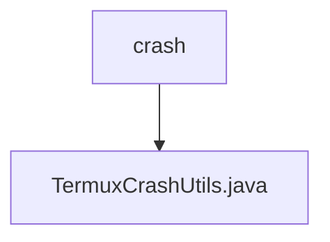

# 基础信息

|      |      |
|------|------|
| 名称 | crash |
| 编码语言 | .java |
| 代码路径 | termux-app/termux-shared/src/main/java/com/termux/shared/termux/crash |
| 包名 | termux-app.termux-shared.src.main.java.com.termux.shared.termux.crash |
| 概述说明 | TermuxCrashUtils处理应用崩溃日志和通知。 |

# 说明

TermuxCrashUtils是一个用于处理Termux应用及其插件崩溃的工具类，实现了CrashHandler.CrashHandlerClient接口。它提供了设置默认崩溃处理器、记录崩溃日志、发送崩溃通知等功能。主要功能包括：设置未捕获异常处理器、记录崩溃信息到指定文件路径、通过广播通知Termux应用崩溃事件、从崩溃日志文件读取信息并发送通知。支持强制显示通知、添加设备信息等选项，并管理崩溃报告的通知通道。该类严格区分未捕获异常和捕获异常，确保崩溃信息准确记录并及时通知用户。

### 包内部结构视图

该流程图展示了Termux项目中崩溃处理模块的简单结构。顶层节点"crash"表示崩溃处理目录，其下包含一个名为"TermuxCrashUtils.java"的Java工具类文件，用于处理应用程序崩溃相关功能。这种简洁的层级关系体现了单一职责原则，将崩溃处理功能集中在一个专门的目录中。

# 文件列表 File List

| 名称   | 类型  | 说明 |
|-------|------|-------------|
| [TermuxCrashUtils.java](TermuxCrashUtils.md) | file | TermuxCrashUtils处理应用崩溃日志和通知。 |

