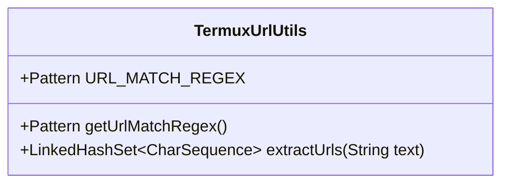
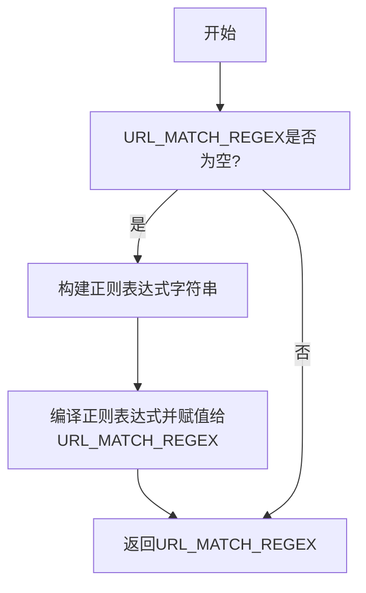
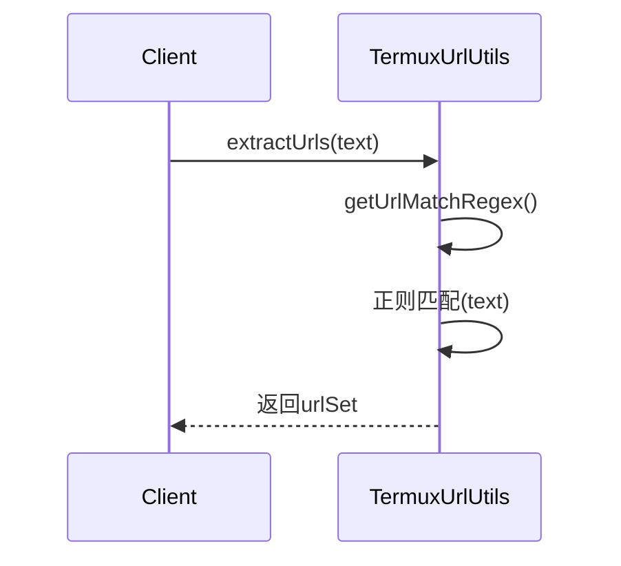
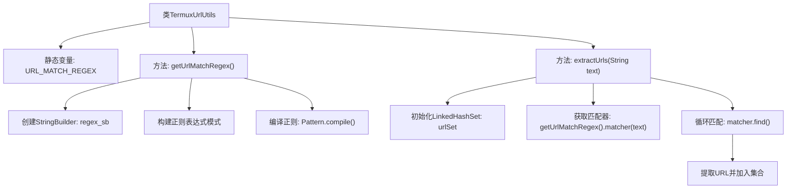

# 基础信息

|      |      |
|------|------|
| 名称 | TermuxUrlUtils |
| 编码语言 | .java |
| 代码路径 | termux-app/termux-shared/src/main/java/com/termux/shared/termux/data/TermuxUrlUtils.java |
| 包名 | com.termux.shared.termux.data |
| 依赖项 | ['java.util.LinkedHashSet', 'java.util.regex.Matcher', 'java.util.regex.Pattern'] |
| 概述说明 | TermuxUrlUtils类提供URL正则匹配和提取功能，支持多种协议。 |

# 说明

TermuxUrlUtils类包含用于URL匹配和提取的工具方法。URL_MATCH_REGEX静态变量存储预编译的正则表达式模式，通过getUrlMatchRegex方法实现懒加载。该正则表达式支持多种协议包括HTTP、FTP、SSH等，并匹配用户名密码、IP地址、域名、端口、路径等URL组成部分。extractUrls方法使用该正则从文本中提取所有URL，返回保持顺序且去重的LinkedHashSet。正则表达式编译时启用了不区分大小写、多行和点号匹配所有字符的选项。

# 类列表 Class Summary

| 名称   | 类型  | 说明 |
|-------|------|-------------|
| TermuxUrlUtils | class | TermuxUrlUtils类提供URL匹配正则表达式及提取方法，支持多种协议。 |

## 类 TermuxUrlUtils

|      |      |
|------|------|
| 访问范围 | public |
| 类型 | class |
| 名称 | TermuxUrlUtils |
| 说明 | TermuxUrlUtils类提供URL匹配正则表达式及提取方法，支持多种协议。 |

### UML类图

这段代码定义了一个TermuxUrlUtils工具类，主要用于URL的提取和匹配。该类包含两个核心方法：getUrlMatchRegex()用于构建和缓存一个复杂的URL正则表达式模式，支持多种协议和格式；extractUrls()则使用该正则表达式从文本中提取所有匹配的URL。类图展示了其静态成员和方法，流程图描述了正则表达式构建的惰性初始化过程，时序图则展示了URL提取的调用流程。该实现采用了正则表达式缓存优化和LinkedHashSet保证URL唯一性。

### 内部方法调用关系图

该流程图展示了TermuxUrlUtils类的核心功能结构。类包含两个主要方法：getUrlMatchRegex()用于构建和缓存URL匹配的正则表达式模式，通过StringBuilder逐步拼接复杂的正则规则；extractUrls()则利用该正则从文本中提取所有URL，使用LinkedHashSet保证唯一性和插入顺序。正则构建过程涉及多种协议和主机格式的匹配规则，最终生成一个支持多行、不区分大小写的匹配模式。

### 字段列表 Field List

| 名称  | 类型  | 说明 |
|-------|-------|------|
| URL_MATCH_REGEX | Pattern | 静态URL匹配正则表达式模式。 |

### 方法列表 Method List

| 名称  | 类型  | 说明 |
|-------|-------|------|
| extractUrls | LinkedHashSet<CharSequence> | 静态方法提取文本中的URL，返回有序无重复集合。 |
| getUrlMatchRegex | Pattern | 静态方法生成URL匹配正则，支持多种协议、主机、端口和路径。 |

