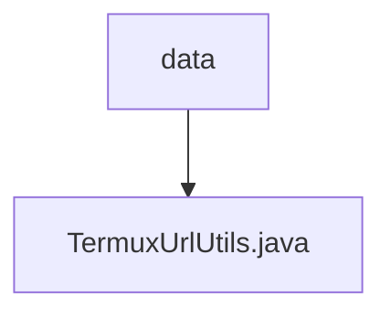

# 基础信息

|      |      |
|------|------|
| 名称 | data |
| 编码语言 | .java |
| 代码路径 | termux-app/termux-shared/src/main/java/com/termux/shared/termux/data |
| 包名 | termux-app.termux-shared.src.main.java.com.termux.shared.termux.data |
| 概述说明 | TermuxUrlUtils类提供URL正则匹配和提取功能，支持多种协议。 |

# 说明

TermuxUrlUtils类包含用于URL匹配和提取的工具方法。URL_MATCH_REGEX静态变量存储预编译的正则表达式模式，通过getUrlMatchRegex方法实现懒加载。该正则表达式支持多种协议包括HTTP、FTP、SSH等，并匹配用户名密码、IP地址、域名、端口、路径等URL组成部分。extractUrls方法使用该正则从文本中提取所有URL，返回保持顺序且去重的LinkedHashSet。正则表达式编译时启用了不区分大小写、多行和点号匹配所有字符的选项。

### 包内部结构视图

该流程图展示了Termux项目中termux-shared模块下的数据结构关系。根节点"data"表示数据存储目录，其下级包含一个具体的工具类文件TermuxUrlUtils.java。这种结构体现了典型的Java项目分层设计，其中数据相关工具类被集中存放在特定包路径下，便于维护和管理。

# 文件列表 File List

| 名称   | 类型  | 说明 |
|-------|------|-------------|
| [TermuxUrlUtils.java](TermuxUrlUtils.md) | file | TermuxUrlUtils类提供URL正则匹配和提取功能，支持多种协议。 |

