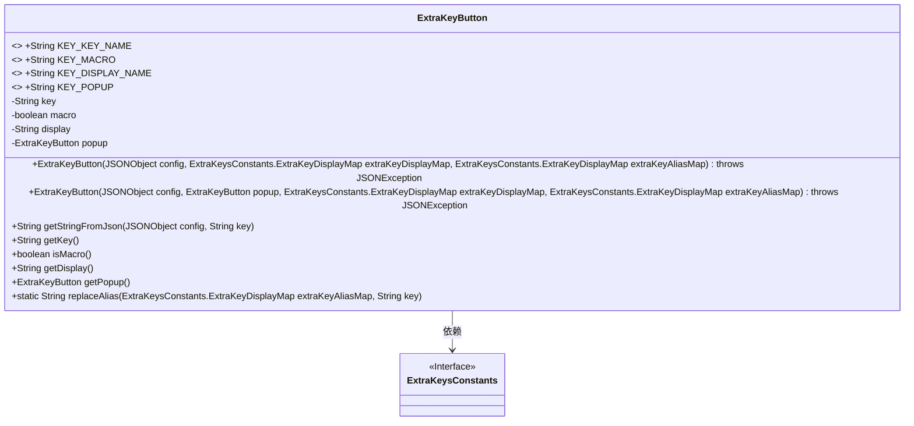
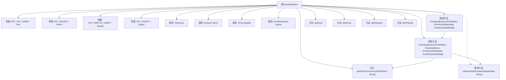

# 基础信息

|      |      |
|------|------|
| 名称 | ExtraKeyButton |
| 编码语言 | .java |
| 代码路径 | termux-app/termux-shared/src/main/java/com/termux/shared/termux/extrakeys/ExtraKeyButton.java |
| 包名 | com.termux.shared.termux.extrakeys |
| 依赖项 | ['android.text.TextUtils', 'androidx.annotation.NonNull', 'androidx.annotation.Nullable', 'org.json.JSONException', 'org.json.JSONObject', 'java.util.Arrays', 'java.util.stream.Collectors'] |
| 概述说明 | ExtraKeyButton类定义额外按键属性，包含键名、宏、显示文本和弹出按钮。 |

# 说明

ExtraKeyButton类用于定义终端模拟器的额外按键功能。该类包含四个静态常量KEY_KEY_NAME、KEY_MACRO、KEY_DISPLAY_NAME和KEY_POPUP，分别对应按键名称、宏定义、显示文本和弹出菜单的配置键。核心属性包括发送给终端的key值、是否为宏的macro标志、显示文本display以及可选的弹出按钮popup。构造函数通过JSONObject配置初始化按键，支持按键别名替换和显示文本映射。提供getKey()、isMacro()、getDisplay()和getPopup()方法访问属性。该类严格校验配置，确保key和macro不同时设置，并支持宏命令的多键序列处理。

# 类列表 Class Summary

| 名称   | 类型  | 说明 |
|-------|------|-------------|
| ExtraKeyButton | class | ExtraKeyButton类定义终端额外按键，含键名、宏、显示文本及弹出按钮配置。 |

## 类 ExtraKeyButton

|      |      |
|------|------|
| 访问范围 | public |
| 类型 | class |
| 名称 | ExtraKeyButton |
| 说明 | ExtraKeyButton类定义终端额外按键，含键名、宏、显示文本及弹出按钮配置。 |

### UML类图

这段代码定义了一个`ExtraKeyButton`类，用于处理终端模拟器中的额外按键配置。该类包含四个公共常量用于JSON键名定义，以及四个私有字段存储按键信息（键值、宏标志、显示文本和弹出按钮）。提供两个构造函数从JSON配置初始化对象，并包含获取字段值的方法。该类依赖于`ExtraKeysConstants`接口提供的键名映射功能，支持按键别名替换和显示文本的自定义配置。主要功能是解析JSON配置并生成可发送给终端的按键序列。

### 内部方法调用关系图

这段代码定义了一个ExtraKeyButton类，用于处理终端模拟器中的额外按键配置。类包含4个常量定义键名类型，4个核心属性存储按键信息，两个构造函数用于初始化按键配置（支持JSON解析和别名替换），以及多个getter方法获取属性值。主要逻辑集中在构造函数中，会处理按键/宏的互斥检查、别名替换和显示文本生成，支持嵌套的弹出按钮配置。流程图清晰展示了类成员结构和主要方法调用关系。

### 字段列表 Field List

| 名称  | 类型  | 说明 |
|-------|-------|------|
| KEY_MACRO = "macro" | String | 定义常量KEY_MACRO，值为"macro"。 |
| key | String | 私有字符串类型变量key |
| popup | ExtraKeyButton | 可空私有终态弹出按钮变量。 |
| KEY_POPUP = "popup" | String | 定义常量KEY_POPUP，值为"popup"。 |
| display | String | 私有字符串变量display |
| macro | boolean | 私有布尔变量macro |
| KEY_KEY_NAME = "key" | String | 静态常量字符串KEY_KEY_NAME值为"key"。 |
| KEY_DISPLAY_NAME = "display" | String | 静态常量字符串KEY_DISPLAY_NAME值为"display"。 |

### 方法列表 Method List

| 名称  | 类型  | 说明 |
|-------|-------|------|
| isMacro | boolean | 检查是否为宏的布尔方法。 |
| getDisplay | String | 获取display字符串的方法。 |
| getKey | String | 获取key值的字符串方法。 |
| getStringFromJson | String | 从JSON对象获取指定键的字符串值，异常时返回空。 |
| replaceAlias | String | 静态方法替换键别名，若映射不存在返回原键。 |
| getPopup | ExtraKeyButton | 可空方法返回弹出按钮对象。 |

