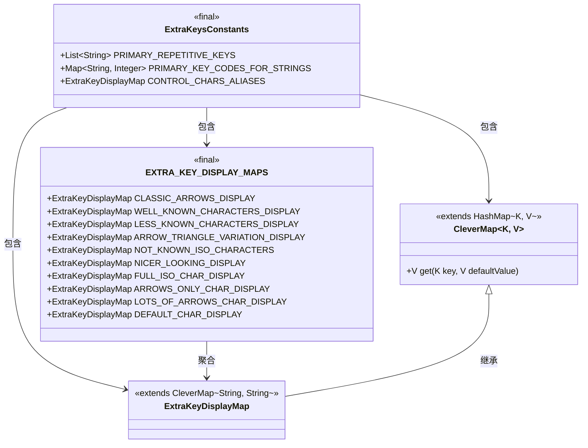

# 基础信息

|      |      |
|------|------|
| 名称 | ExtraKeysConstants |
| 编码语言 | .java |
| 代码路径 | termux-app/termux-shared/src/main/java/com/termux/shared/termux/extrakeys/ExtraKeysConstants.java |
| 包名 | com.termux.shared.termux.extrakeys |
| 依赖项 | ['android.view.KeyEvent', 'java.util.Arrays', 'java.util.HashMap', 'java.util.List', 'java.util.Map'] |
| 概述说明 | 定义键盘常量、键码映射及显示符号，支持重复键和别名。 |

# 说明

该代码定义了一个用于管理额外按键的常量类，包含三个核心部分：首先定义了一组可重复按键列表（如方向键、删除键等），其次建立了字符串与Android键码的映射关系（涵盖功能键、导航键等）。接着通过CleverMap扩展HashMap实现带默认值的查询功能，并创建ExtraKeyDisplayMap用于按键显示样式管理。最后提供了多种预定义的显示样式集合（如经典箭头、特殊符号等）以及按键别名映射表，支持灵活定制键盘UI的视觉呈现。

# 类列表 Class Summary

| 名称   | 类型  | 说明 |
|-------|------|-------------|
| ExtraKeysConstants | class | 定义键盘常量、键码映射及显示样式，支持多种符号和别名。 |

## 类 ExtraKeysConstants

|      |      |
|------|------|
| 访问范围 | public |
| 类型 | class |
| 名称 | ExtraKeysConstants |
| 说明 | 定义键盘常量、键码映射及显示样式，支持多种符号和别名。 |

### UML类图

这段代码定义了一个键盘常量工具类ExtraKeysConstants，包含三个核心部分：1) PRIMARY_REPETITIVE_KEYS定义可重复按键列表；2) PRIMARY_KEY_CODES_FOR_STRINGS映射键名到Android KeyEvent常量；3) 通过嵌套类实现键位显示定制系统。其中CleverMap扩展HashMap增加带默认值的get方法，ExtraKeyDisplayMap是其字符串特化版本。EXTRA_KEY_DISPLAY_MAPS类提供7种预定义的键位显示方案，使用Unicode符号实现不同风格的键位呈现。整个设计采用静态常量+嵌套类结构，支持键位别名管理和多套显示方案切换。

### 内部方法调用关系图

```mermaid
graph TD
    A["类ExtraKeysConstants"]
    B["静态变量: PRIMARY_REPETITIVE_KEYS"]
    C["静态变量: PRIMARY_KEY_CODES_FOR_STRINGS"]
    D["静态内部类: CleverMap<K,V>"]
    E["方法: get(K key, V defaultValue)"]
    F["静态内部类: ExtraKeyDisplayMap"]
    G["静态内部类: EXTRA_KEY_DISPLAY_MAPS"]
    H["静态变量: CLASSIC_ARROWS_DISPLAY"]
    I["静态变量: WELL_KNOWN_CHARACTERS_DISPLAY"]
    J["静态变量: LESS_KNOWN_CHARACTERS_DISPLAY"]
    K["静态变量: ARROW_TRIANGLE_VARIATION_DISPLAY"]
    L["静态变量: NOT_KNOWN_ISO_CHARACTERS"]
    M["静态变量: NICER_LOOKING_DISPLAY"]
    N["静态变量: FULL_ISO_CHAR_DISPLAY"]
    O["静态变量: ARROWS_ONLY_CHAR_DISPLAY"]
    P["静态变量: LOTS_OF_ARROWS_CHAR_DISPLAY"]
    Q["静态变量: DEFAULT_CHAR_DISPLAY"]
    R["静态变量: CONTROL_CHARS_ALIASES"]

    A --> B
    A --> C
    A --> D
    D --> E
    A --> F
    A --> G
    G --> H
    G --> I
    G --> J
    G --> K
    G --> L
    G --> M
    G --> N
    G --> O
    G --> P
    G --> Q
    A --> R
```

这段代码定义了一个名为`ExtraKeysConstants`的类，主要用于管理键盘按键的常量、键码映射和显示符号。类中包含静态列表`PRIMARY_REPETITIVE_KEYS`定义可重复按键，静态映射`PRIMARY_KEY_CODES_FOR_STRINGS`存储按键名称与键码的对应关系。内部类`CleverMap`扩展了`HashMap`并添加了带默认值的`get`方法，`ExtraKeyDisplayMap`继承自`CleverMap`用于存储按键显示符号。静态内部类`EXTRA_KEY_DISPLAY_MAPS`提供了多种预定义的按键显示符号集合，如经典箭头、常用字符等。最后还定义了`CONTROL_CHARS_ALIASES`用于按键名称的别名映射。整体结构清晰，便于管理和扩展键盘相关的常量和显示配置。

### 字段列表 Field List

| 名称  | 类型  | 说明 |
|-------|-------|------|
| PRIMARY_KEY_CODES_FOR_STRINGS = new HashMap<String, Integer>() {{        put("SPACE", KeyEvent.KEYCODE_SPACE);        put("ESC", KeyEvent.KEYCODE_ESCAPE);        put("TAB", KeyEvent.KEYCODE_TAB);        put("HOME", KeyEvent.KEYCODE_MOVE_HOME);        put("END", KeyEvent.KEYCODE_MOVE_END);        put("PGUP", KeyEvent.KEYCODE_PAGE_UP);        put("PGDN", KeyEvent.KEYCODE_PAGE_DOWN);        put("INS", KeyEvent.KEYCODE_INSERT);        put("DEL", KeyEvent.KEYCODE_FORWARD_DEL);        put("BKSP", KeyEvent.KEYCODE_DEL);        put("UP", KeyEvent.KEYCODE_DPAD_UP);        put("LEFT", KeyEvent.KEYCODE_DPAD_LEFT);        put("RIGHT", KeyEvent.KEYCODE_DPAD_RIGHT);        put("DOWN", KeyEvent.KEYCODE_DPAD_DOWN);        put("ENTER", KeyEvent.KEYCODE_ENTER);        put("F1", KeyEvent.KEYCODE_F1);        put("F2", KeyEvent.KEYCODE_F2);        put("F3", KeyEvent.KEYCODE_F3);        put("F4", KeyEvent.KEYCODE_F4);        put("F5", KeyEvent.KEYCODE_F5);        put("F6", KeyEvent.KEYCODE_F6);        put("F7", KeyEvent.KEYCODE_F7);        put("F8", KeyEvent.KEYCODE_F8);        put("F9", KeyEvent.KEYCODE_F9);        put("F10", KeyEvent.KEYCODE_F10);        put("F11", KeyEvent.KEYCODE_F11);        put("F12", KeyEvent.KEYCODE_F12);    }} | Map<String, Integer> | 定义字符串与按键码的映射关系表。 |
| PRIMARY_REPETITIVE_KEYS = Arrays.asList(        "UP", "DOWN", "LEFT", "RIGHT",        "BKSP", "DEL",        "PGUP", "PGDN") | List<String> | 主重复键列表：上下左右、退格删除、页上页下 |
| CONTROL_CHARS_ALIASES = new ExtraKeyDisplayMap() {{        put("ESCAPE", "ESC");        put("CONTROL", "CTRL");        put("SHFT", "SHIFT");        put("RETURN", "ENTER"); // Technically different keys, but most applications won't see the difference        put("FUNCTION", "FN");        // no alias for ALT        // Directions are sometimes written as first and last letter for brevety        put("LT", "LEFT");        put("RT", "RIGHT");        put("DN", "DOWN");        // put("UP", "UP"); well, "UP" is already two letters        put("PAGEUP", "PGUP");        put("PAGE_UP", "PGUP");        put("PAGE UP", "PGUP");        put("PAGE-UP", "PGUP");        // no alias for HOME        // no alias for END        put("PAGEDOWN", "PGDN");        put("PAGE_DOWN", "PGDN");        put("PAGE-DOWN", "PGDN");        put("DELETE", "DEL");        put("BACKSPACE", "BKSP");        // easier for writing in termux.properties        put("BACKSLASH", "\\");        put("QUOTE", "\"");        put("APOSTROPHE", "'");    }} | ExtraKeyDisplayMap | 键盘键名缩写映射表，如ESC、CTRL、PGUP等。 |

### 方法列表 Method List

| 名称  | 类型  | 说明 |
|-------|-------|------|

