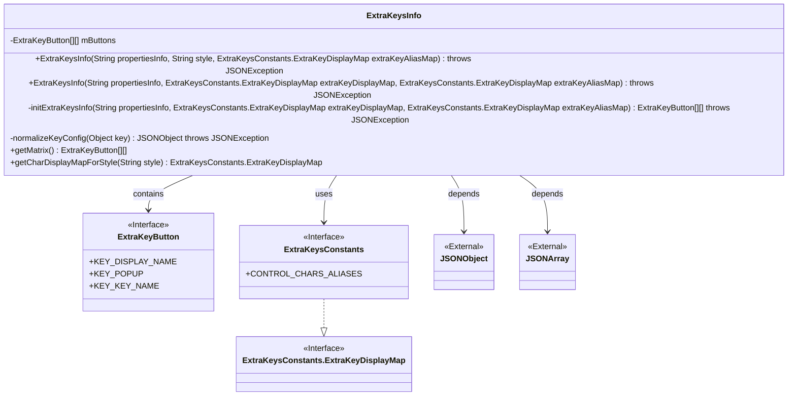
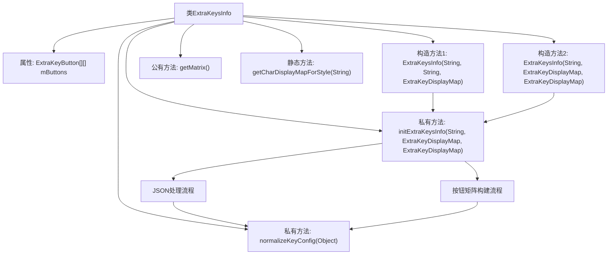

# 基础信息

|      |      |
|------|------|
| 名称 | ExtraKeysInfo |
| 编码语言 | .java |
| 代码路径 | termux-app/termux-shared/src/main/java/com/termux/shared/termux/extrakeys/ExtraKeysInfo.java |
| 包名 | com.termux.shared.termux.extrakeys |
| 依赖项 | ['android.view.View', 'android.widget.Button', 'androidx.annotation.NonNull', 'com.google.android.material.button.MaterialButton', 'com.termux.shared.termux.extrakeys.ExtraKeysConstants.EXTRA_KEY_DISPLAY_MAPS', 'com.termux.shared.termux.terminal.io.TerminalExtraKeys', 'org.json.JSONArray', 'org.json.JSONException', 'org.json.JSONObject'] |
| 概述说明 | ExtraKeysInfo类用于初始化和管理ExtraKeysView的按钮矩阵，支持自定义显示和别名映射。 |

# 说明

ExtraKeysInfo类用于管理ExtraKeysView中显示的按钮矩阵。它包含两个构造函数，分别接受字符串propertiesInfo、样式字符串或ExtraKeyDisplayMap对象，以及ExtraKeyAliasMap对象。类内部通过initExtraKeysInfo方法将输入的字符串或JSON数据转换为ExtraKeyButton二维数组。normalizeKeyConfig方法用于标准化键配置，支持字符串或JSONObject格式。getCharDisplayMapForStyle方法根据样式字符串返回对应的键显示映射。最终通过getMatrix方法获取按钮矩阵。

# 类列表 Class Summary

| 名称   | 类型  | 说明 |
|-------|------|-------------|
| ExtraKeysInfo | class | ExtraKeysInfo类用于初始化和管理ExtraKeysView中的按钮矩阵，支持自定义显示和别名映射。 |

## 类 ExtraKeysInfo

|      |      |
|------|------|
| 访问范围 | public |
| 类型 | class |
| 名称 | ExtraKeysInfo |
| 说明 | ExtraKeysInfo类用于初始化和管理ExtraKeysView中的按钮矩阵，支持自定义显示和别名映射。 |

### UML类图

这段代码描述了一个用于管理额外按键信息的`ExtraKeysInfo`类，它通过解析JSON配置来初始化一个二维的`ExtraKeyButton`矩阵。该类提供了两种构造函数，支持通过不同方式指定按键显示样式和别名映射。核心方法`initExtraKeysInfo()`负责将JSON数据转换为按钮矩阵，并处理按键的弹出菜单配置。辅助方法`normalizeKeyConfig()`用于统一按键配置格式，而`getCharDisplayMapForStyle()`则根据样式名称返回对应的字符显示映射。该类与`ExtraKeyButton`、`ExtraKeysConstants`等接口协作，并依赖外部JSON处理类。

### 内部方法调用关系图

这段代码流程图展示了ExtraKeysInfo类的完整结构和工作流程。该类主要用于管理额外按键的配置信息，核心是通过两种构造方法初始化按键矩阵。流程图清晰地呈现了从构造方法到内部初始化方法的调用链，以及JSON配置处理和按钮矩阵构建两个关键子流程。静态方法getCharDisplayMapForStyle提供了不同风格的按键显示映射，而normalizeKeyConfig方法则确保按键配置的统一格式化处理。整个设计体现了配置解析、数据转换和对象构建的完整生命周期。

### 字段列表 Field List

| 名称  | 类型  | 说明 |
|-------|-------|------|
| mButtons | ExtraKeyButton[][] | 私有二维数组mButtons，类型为ExtraKeyButton。 |

### 方法列表 Method List

| 名称  | 类型  | 说明 |
|-------|-------|------|
| getMatrix | ExtraKeyButton[][] | 获取按钮矩阵方法，返回mButtons数组。 |
| getCharDisplayMapForStyle | ExtraKeysConstants.ExtraKeyDisplayMap | 根据输入样式返回对应的字符显示映射表。 |
| initExtraKeysInfo | ExtraKeyButton[][] | 解析JSON配置生成自定义按钮矩阵。 |
| normalizeKeyConfig | JSONObject | 方法将字符串或JSON对象转为标准JSON对象，否则抛出异常。 |

