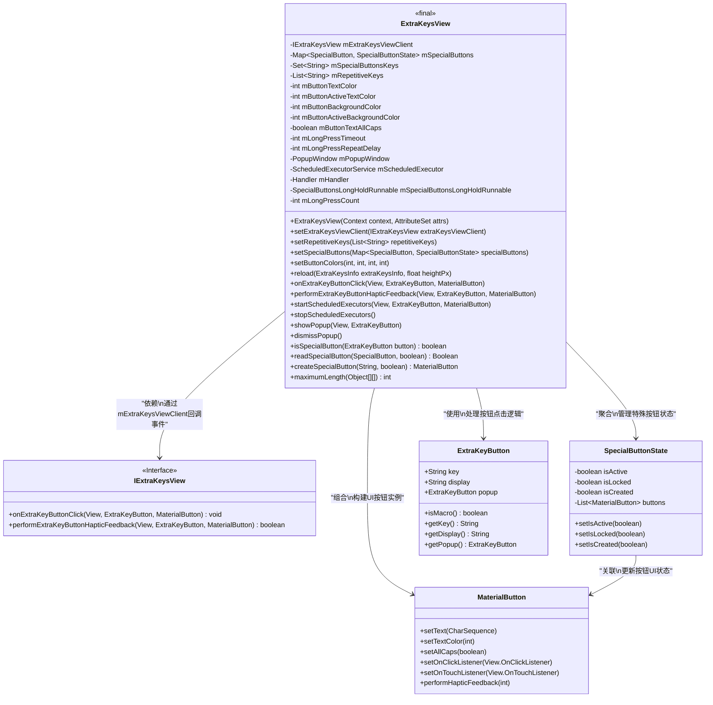
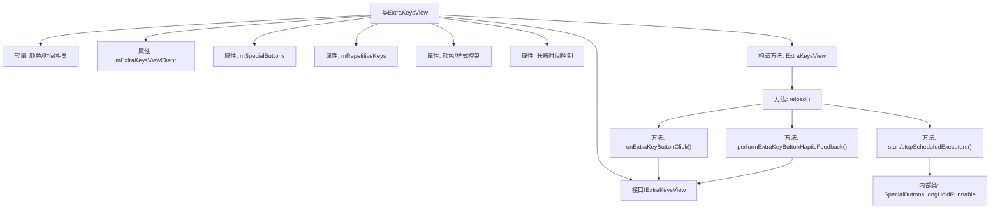
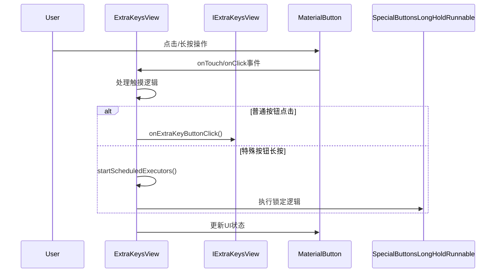

# 基础信息

|      |      |
|------|------|
| 名称 | ExtraKeysView |
| 编码语言 | .java |
| 代码路径 | termux-app/termux-shared/src/main/java/com/termux/shared/termux/extrakeys/ExtraKeysView.java |
| 包名 | com.termux.shared.termux.extrakeys |
| 依赖项 | ['android.annotation.SuppressLint', 'android.content.Context', 'android.os.Build', 'android.os.Handler', 'android.os.Looper', 'android.provider.Settings', 'android.util.AttributeSet', 'java.util.ArrayList', 'java.util.List', 'java.util.Set', 'java.util.concurrent.Executors', 'java.util.concurrent.TimeUnit', 'java.util.concurrent.ScheduledExecutorService', 'java.util.Map', 'java.util.HashMap', 'java.util.stream.Collectors', 'android.view.HapticFeedbackConstants', 'android.view.LayoutInflater', 'android.view.MotionEvent', 'android.view.View', 'android.view.ViewConfiguration', 'android.view.ViewGroup', 'android.widget.GridLayout', 'android.widget.PopupWindow', 'androidx.annotation.NonNull', 'androidx.annotation.Nullable', 'com.google.android.material.button.MaterialButton', 'com.termux.shared.R', 'com.termux.shared.termux.terminal.io.TerminalExtraKeys', 'com.termux.shared.theme.ThemeUtils'] |
| 概述说明 | ExtraKeysView类实现自定义键盘布局，支持按钮点击、长按重复、触觉反馈及特殊按钮状态管理。 |

# 说明

ExtraKeysView是一个继承自GridLayout的自定义视图组件，主要用于管理额外功能键的布局和交互。它定义了按钮点击、长按重复触发、触觉反馈等核心功能，并支持特殊按钮（如CTRL、ALT等）的状态管理。组件包含颜色配置、长按超时设置、重复延迟等可定制参数，通过IExtraKeysView接口与客户端交互。视图支持动态重载按钮矩阵，处理按钮点击、长按、滑动弹出菜单等交互逻辑，并内置了特殊按钮的激活/锁定状态切换机制。组件还实现了基于系统设置的触觉反馈功能，并通过PopupWindow处理按钮的弹出菜单显示。

# 类列表 Class Summary

| 名称   | 类型  | 说明 |
|-------|------|-------------|
| ExtraKeysView | class | ExtraKeysView是自定义键盘视图，支持特殊按钮、长按重复、触觉反馈及弹出菜单功能。 |

## 类 ExtraKeysView

|      |      |
|------|------|
| 访问范围 | public final |
| 类型 | class |
| 名称 | ExtraKeysView |
| 说明 | ExtraKeysView是自定义键盘视图，支持特殊按钮、长按重复、触觉反馈及弹出菜单功能。 |

### UML类图

这段代码定义了一个`ExtraKeysView`类，用于实现自定义的额外按键视图功能。主要功能包括：管理特殊按钮状态（如Ctrl/Alt/Shift）、处理长按重复触发、支持按键弹窗显示、提供触觉反馈等。通过`IExtraKeysView`接口与客户端交互，使用`MaterialButton`构建UI元素，并通过`SpecialButtonState`维护特殊按钮的激活/锁定状态。类图清晰展示了各组件间的依赖和组合关系，体现了模块化设计思想。

### 内部方法调用关系图

这段代码实现了一个可定制的扩展键盘视图(ExtraKeysView)，主要功能包括：1) 通过GridLayout管理按钮矩阵布局；2) 支持普通按钮点击和特殊按钮(如Ctrl/Alt)的状态管理；3) 实现按钮长按自动重复触发和长按锁定功能；4) 提供滑动弹出子菜单功能；5) 通过IExtraKeysView接口与外部模块交互。代码结构清晰，通过状态模式管理特殊按钮，使用线程池处理长按事件，并全面考虑了颜色主题、触觉反馈等细节实现。

### 字段列表 Field List

| 名称  | 类型  | 说明 |
|-------|-------|------|
| DEFAULT_LONG_PRESS_REPEAT_DELAY = 80 | int | 静态常量默认长按重复延迟80毫秒。 |
| ATTR_BUTTON_BACKGROUND_COLOR = R.attr.extraKeysButtonBackgroundColor | int | 定义按钮背景颜色属性常量。 |
| mButtonActiveTextColor | int | 保护整型变量mButtonActiveTextColor |
| mPopupWindow | PopupWindow | 保护成员变量PopupWindow实例mPopupWindow |
| mScheduledExecutor | ScheduledExecutorService | 保护类型定时任务执行服务变量mScheduledExecutor |
| mSpecialButtonsLongHoldRunnable | SpecialButtonsLongHoldRunnable | 保护成员变量mSpecialButtonsLongHoldRunnable，类型为SpecialButtonsLongHoldRunnable。 |
| ATTR_BUTTON_ACTIVE_TEXT_COLOR = R.attr.extraKeysButtonActiveTextColor | int | 定义常量ATTR_BUTTON_ACTIVE_TEXT_COLOR，引用R.attr.extraKeysButtonActiveTextColor。 |
| mRepetitiveKeys | List<String> | 保护类型字符串列表mRepetitiveKeys |
| DEFAULT_BUTTON_TEXT_COLOR = 0xFFFFFFFF | int | 默认按钮文本颜色为白色。 |
| mSpecialButtons | Map<SpecialButton, SpecialButtonState> | 特殊按钮状态映射表 |
| mButtonBackgroundColor | int | 受保护的整型按钮背景色变量 |
| mButtonTextAllCaps = true | boolean | 布尔变量mButtonTextAllCaps控制按钮文本是否全大写，默认值为true。 |
| FALLBACK_LONG_PRESS_DURATION = 400 | int | 定义长按事件默认持续时间为400毫秒。 |
| DEFAULT_BUTTON_ACTIVE_TEXT_COLOR = 0xFF80DEEA | int | 静态常量DEFAULT_BUTTON_ACTIVE_TEXT_COLOR值为0xFF80DEEA。 |
| MAX_LONG_PRESS__REPEAT_DELAY = 2000 | int | 静态常量MAX_LONG_PRESS_REPEAT_DELAY值为2000毫秒。 |
| mHandler | Handler | 保护型Handler变量mHandler |
| MIN_LONG_PRESS_DURATION = 200 | int | 最小长按持续时间200毫秒 |
| ATTR_BUTTON_ACTIVE_BACKGROUND_COLOR = R.attr.extraKeysButtonActiveBackgroundColor | int | 定义按钮激活背景色的静态常量属性。 |
| DEFAULT_BUTTON_ACTIVE_BACKGROUND_COLOR = 0xFF7F7F7F | int | 默认按钮激活背景颜色为0xFF7F7F7F |
| MIN_LONG_PRESS__REPEAT_DELAY = 5 | int | 长按重复延迟最小值为5。 |
| mExtraKeysViewClient | IExtraKeysView | 客户端额外按键视图保护对象 |
| mLongPressRepeatDelay | int | 保护的长按重复延迟变量 |
| mButtonTextColor | int | 保护成员变量mButtonTextColor，类型为int。 |
| DEFAULT_BUTTON_BACKGROUND_COLOR = 0x00000000 | int | 默认按钮背景色为透明。 |
| ATTR_BUTTON_TEXT_COLOR = R.attr.extraKeysButtonTextColor | int | 定义按钮文字颜色的静态常量属性。 |
| mSpecialButtonsKeys | Set<String> | 特殊按钮键集合 |
| mLongPressTimeout | int | 保护型整型变量，用于长按超时设置。 |
| mLongPressCount | int | 保护的长按计数变量 |
| mButtonActiveBackgroundColor | int | 保护整型变量mButtonActiveBackgroundColor，存储按钮激活状态背景色。 |
| MAX_LONG_PRESS_DURATION = 3000 | int | 常量MAX_LONG_PRESS_DURATION值为3000毫秒。 |

### 方法列表 Method List

| 名称  | 类型  | 说明 |
|-------|-------|------|
| getButtonActiveBackgroundColor | int | 获取按钮激活状态的背景颜色值。 |
| setLongPressRepeatDelay | void | 设置长按重复延迟，检查范围后赋值默认值或输入值。 |
| setButtonActiveTextColor | void | 设置按钮激活状态文本颜色 |
| onExtraKeyButtonClick | void | 方法处理额外按键点击，若客户端存在则转发事件。 |
| setButtonActiveBackgroundColor | void | 设置按钮激活状态的背景颜色。 |
| stopScheduledExecutors | void | 停止定时任务和长按回调处理。 |
| dismissPopup | void | 关闭弹窗并释放资源。 |
| isSpecialButton | boolean | 检查按钮是否为特殊按钮。 |
| readSpecialButton | Boolean | 读取特殊按钮状态，若未创建或非活跃返回false，自动设为非活跃后返回true。 |
| maximumLength | int | 计算二维数组最长行长度 |
| getDefaultSpecialButtons | Map<SpecialButton, SpecialButtonState> | 返回包含CTRL、ALT、SHIFT、FN默认状态的映射。 |
| setButtonColors | void | 设置按钮颜色：文本色、激活文本色、背景色、激活背景色。 |
| setSpecialButtons | void | 设置特殊按钮及其状态，并提取按钮键值集合。 |
| getButtonBackgroundColor | int | 获取按钮背景色值的方法。 |
| setButtonTextAllCaps | void | 设置按钮文本是否全大写 |
| getRepetitiveKeys | List<String> | 获取重复键列表，非空时返回新字符串列表。 |
| setButtonBackgroundColor | void | 设置按钮背景颜色方法，参数为整型。 |
| setRepetitiveKeys | void | 设置重复键列表。 |
| setButtonTextColor | void | 设置按钮文字颜色方法，参数为颜色值。 |
| setExtraKeysViewClient | void | 设置额外按键视图客户端接口。 |
| getButtonTextColor | int | 获取按钮文字颜色值的方法。 |
| getExtraKeysViewClient | IExtraKeysView | 返回客户端额外按键视图对象。 |
| getSpecialButtonsKeys | Set<String> | 获取特殊按钮键集合，非空时返回新字符串集合。 |
| getButtonActiveTextColor | int | 获取按钮激活状态的文本颜色值。 |
| setLongPressTimeout | void | 设置长按超时时间，超时范围检查，否则使用默认值。 |
| getSpecialButtons | Map<SpecialButton, SpecialButtonState> | 获取特殊按钮状态映射，非空时返回键值对集合。 |
| getLongPressRepeatDelay | int | 获取长按重复延迟时间。 |
| getLongPressTimeout | int | 获取长按超时时间 |
| reload | void | 动态生成网格布局按钮，处理点击、长按和滑动事件，支持特殊按钮和弹窗功能。 |
| performExtraKeyButtonHapticFeedback | void | 方法处理额外按键触觉反馈，先检查客户端处理，未处理则根据系统设置执行反馈。 |
| onAnyExtraKeyButtonClick | void | 处理特殊按钮点击事件：切换激活状态并解锁非激活状态，否则调用普通按钮点击方法。 |
| startScheduledExecutors | void | 启动定时任务：长按重复键自动触发点击，特殊键长按锁定。 |
| showPopup | void | 显示弹出窗口，设置按钮样式和尺寸，弹出窗口可触摸且无焦点。 |
| createSpecialButton | MaterialButton | 创建特殊按钮，设置状态和样式，按需更新按钮列表。 |

