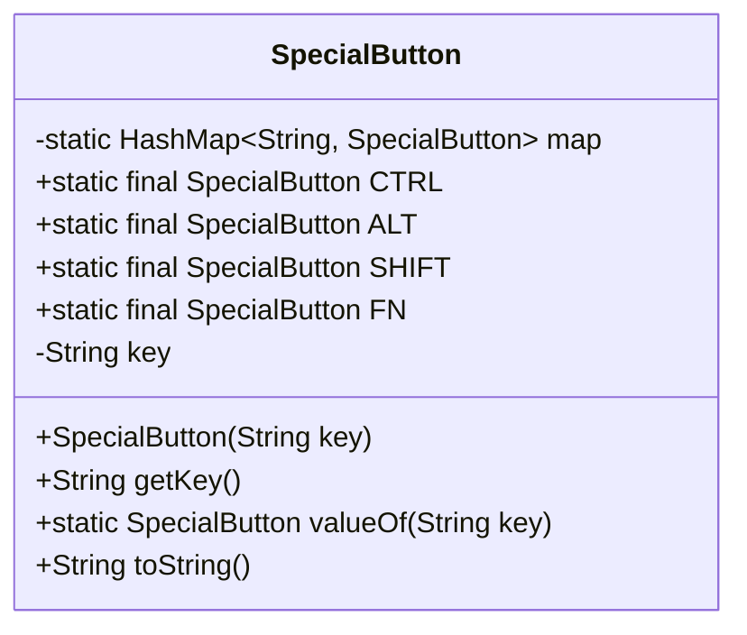
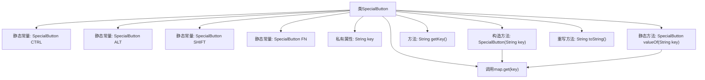

# 基础信息

|      |      |
|------|------|
| 名称 | SpecialButton |
| 编码语言 | .java |
| 代码路径 | termux-app/termux-shared/src/main/java/com/termux/shared/termux/extrakeys/SpecialButton.java |
| 包名 | com.termux.shared.termux.extrakeys |
| 依赖项 | ['androidx.annotation.NonNull', 'java.util.HashMap'] |
| 概述说明 | 定义特殊按钮类，包含CTRL、ALT、SHIFT、FN常量，通过键名获取实例。 |

# 说明

这是一个名为SpecialButton的Java类，用于表示特殊功能按钮。该类使用静态HashMap存储所有实例，并提供CTRL、ALT、SHIFT、FN四个预定义常量。每个SpecialButton实例通过唯一的字符串key标识，构造函数会自动将实例注册到静态映射表中。类提供了getKey方法获取按钮key，valueOf方法通过key查找对应按钮实例，并重写了toString方法返回key值。该类实现了特殊按钮的集中管理和快速查找功能。

# 类列表 Class Summary

| 名称   | 类型  | 说明 |
|-------|------|-------------|
| SpecialButton | class | SpecialButton类定义特殊按钮常量，通过键名存储和检索。 |

## 类 SpecialButton

|      |      |
|------|------|
| 访问范围 | public |
| 类型 | class |
| 名称 | SpecialButton |
| 说明 | SpecialButton类定义特殊按钮常量，通过键名存储和检索。 |

### UML类图

这段代码定义了一个`SpecialButton`类，用于表示特殊功能键（如Ctrl、Alt等）。该类使用静态HashMap维护所有实例的注册表，通过key-value方式存储。类中包含四个预定义的静态常量实例（CTRL/ALT/SHIFT/FN），提供构造方法注册新实例，并通过valueOf方法实现键名到实例的查找功能。这种设计实现了类似枚举的行为，但具有更好的扩展性，允许运行时动态添加新的特殊按钮类型。

### 内部方法调用关系图

这段代码定义了一个SpecialButton类，用于管理特殊按钮（如CTRL、ALT等）的静态实例。类中包含一个静态HashMap用于存储所有特殊按钮实例，通过valueOf方法可以根据键名获取对应的按钮实例。构造方法会自动注册实例到map中，toString()直接返回按钮键名。流程图展示了类结构、静态/实例成员关系以及关键方法间的调用链路。

### 字段列表 Field List

| 名称  | 类型  | 说明 |
|-------|-------|------|
| ALT = new SpecialButton("ALT") | SpecialButton | 定义静态常量ALT，类型为SpecialButton，值为"ALT"。 |
| CTRL = new SpecialButton("CTRL") | SpecialButton | 定义静态常量CTRL，类型为SpecialButton，值为"CTRL"。 |
| FN = new SpecialButton("FN") | SpecialButton | 定义静态常量FN，类型为SpecialButton，值为"FN"。 |
| map = new HashMap<>() | HashMap<String, SpecialButton> | 私有静态哈希映射存储字符串与特殊按钮的对应关系。 |
| SHIFT = new SpecialButton("SHIFT") | SpecialButton | 定义静态常量SHIFT按钮对象。 |
| key | String | 私有字符串类型变量key |

### 方法列表 Method List

| 名称  | 类型  | 说明 |
|-------|-------|------|
| getKey | String | 获取key的字符串值方法。 |
| valueOf | SpecialButton | 静态方法通过键值返回对应按钮对象。 |
| toString | String | 重写toString方法，返回key值。 |

