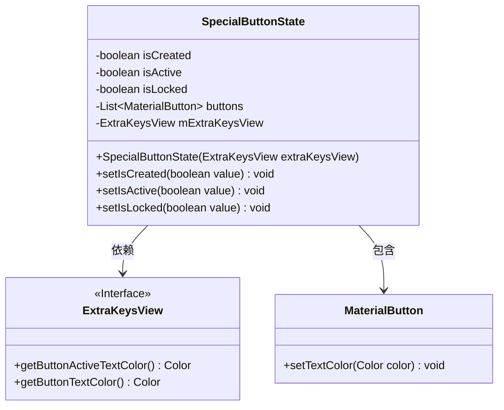
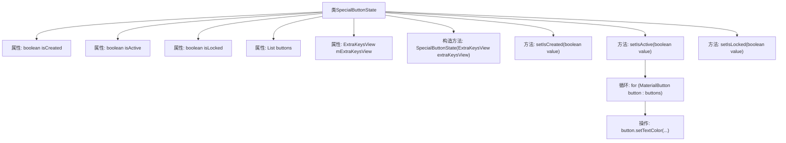

# 基础信息

|      |      |
|------|------|
| 名称 | SpecialButtonState |
| 编码语言 | .java |
| 代码路径 | termux-app/termux-shared/src/main/java/com/termux/shared/termux/extrakeys/SpecialButtonState.java |
| 包名 | com.termux.shared.termux.extrakeys |
| 依赖项 | ['com.google.android.material.button.MaterialButton', 'java.util.ArrayList', 'java.util.List'] |
| 概述说明 | SpecialButtonState类管理特殊按钮状态，含创建、激活、锁定标志及按钮列表。 |

# 说明

SpecialButtonState类用于管理ExtraKeysView中SpecialButton的状态。包含三个布尔变量：isCreated表示按钮是否创建，isActive表示按钮是否激活，isLocked表示按钮是否因长按锁定。类中还维护了一个MaterialButton列表和ExtraKeysView实例。提供三个方法分别设置这三个状态，其中设置isActive时会同步更新所有按钮的文本颜色。构造函数接收ExtraKeysView实例进行初始化。

# 类列表 Class Summary

| 名称   | 类型  | 说明 |
|-------|------|-------------|
| SpecialButtonState | class | SpecialButtonState类管理特殊按钮状态，包含创建、激活、锁定状态及按钮列表。 |

## 类 SpecialButtonState

|      |      |
|------|------|
| 访问范围 | public |
| 类型 | class |
| 名称 | SpecialButtonState |
| 说明 | SpecialButtonState类管理特殊按钮状态，包含创建、激活、锁定状态及按钮列表。 |

### UML类图

这段代码描述了一个`SpecialButtonState`类，用于管理特殊按钮的状态。该类维护三个布尔状态（是否创建、是否激活、是否锁定）和一个按钮列表，并通过`ExtraKeysView`接口获取颜色配置。当激活状态改变时，会遍历所有关联的`MaterialButton`更新文字颜色。类图清晰地展示了`SpecialButtonState`与`ExtraKeysView`接口的依赖关系，以及其包含多个`MaterialButton`的聚合关系，完整呈现了状态管理的核心逻辑。

### 内部方法调用关系图

该流程图展示了SpecialButtonState类的结构和主要方法调用关系。类包含三个布尔状态标志(isCreated/isActive/isLocked)、按钮列表和ExtraKeysView引用。核心方法包括设置三个状态的setter，其中setIsActive()会遍历buttons列表并调用setTextColor()来更新按钮文本颜色。构造方法接收ExtraKeysView参数进行初始化。整体结构清晰地反映了状态管理逻辑和视图更新机制。

### 字段列表 Field List

| 名称  | 类型  | 说明 |
|-------|-------|------|
| isActive = false | boolean | 布尔变量isActive设为false |
| isLocked = false | boolean | 布尔变量isLocked初始值为false。 |
| isCreated = false | boolean | 布尔变量isCreated初始值为假。 |
| buttons = new ArrayList<>() | List<MaterialButton> | 创建按钮列表对象。 |
| mExtraKeysView | ExtraKeysView | 声明ExtraKeysView类型的mExtraKeysView变量 |

### 方法列表 Method List

| 名称  | 类型  | 说明 |
|-------|-------|------|
| setIsCreated | void | 设置isCreated布尔值的方法。 |
| setIsActive | void | 设置按钮激活状态并更新文本颜色。 |
| setIsLocked | void | 设置锁定状态的方法。 |

