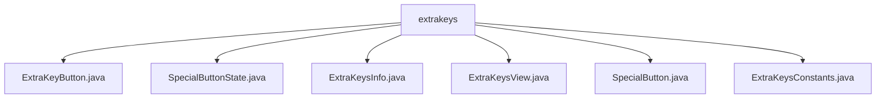

# 基础信息

|      |      |
|------|------|
| 名称 | extrakeys |
| 编码语言 | .java |
| 代码路径 | termux-app/termux-shared/src/main/java/com/termux/shared/termux/extrakeys |
| 包名 | termux-app.termux-shared.src.main.java.com.termux.shared.termux.extrakeys |
| 概述说明 | 终端模拟器额外按键功能类集合：ExtraKeyButton定义按键属性，SpecialButtonState管理状态，ExtraKeysInfo处理按钮矩阵，ExtraKeysView实现交互布局，SpecialButton集中管理特殊按钮，ExtraKeysConstants提供常量与样式映射。 |

# 说明

## 概述

该代码模块是Termux终端模拟器的额外按键功能实现，主要用于管理和显示终端模拟器的自定义功能按键。模块采用MVC架构设计，包含按键定义、状态管理、布局显示和交互处理等核心功能，支持宏命令、特殊功能键(CTRL/ALT/SHIFT等)、动态样式切换和触觉反馈等特性。

## 主要业务场景

1. **按键配置管理**
   - 通过`ExtraKeyButton`类定义单个按键的元数据（键值、宏、显示文本等）
   - 使用`ExtraKeysConstants`提供预定义的键码映射和显示样式
   - `ExtraKeysInfo`类负责将JSON/字符串配置转换为可操作的按钮矩阵

2. **特殊功能键处理**
   - `SpecialButton`实现CTRL/ALT等特殊按钮的集中管理
   - `SpecialButtonState`跟踪特殊按钮的创建/激活/锁定状态
   - 状态变化时自动更新关联按钮的视觉反馈

3. **交互界面实现**
   - `ExtraKeysView`继承GridLayout实现动态按键布局
   - 处理点击/长按/滑动等交互事件
   - 支持宏命令的多键序列执行
   - 通过PopupWindow实现弹出式菜单

4. **样式定制化**
   - 支持多种预定义显示样式（经典箭头、特殊符号等）
   - 通过`ExtraKeyDisplayMap`实现按键文本的动态映射
   - 允许通过别名系统替换实际键值

5. **终端控制集成**
   - 将按键事件转换为终端控制序列
   - 实现重复按键、触觉反馈等增强功能
   - 通过接口与终端模拟器核心通信

### 包内部结构视图

该流程图展示了Termux项目中extrakeys目录下的文件结构关系。所有Java文件（如ExtraKeyButton.java、SpecialButton.java等）都直接隶属于extrakeys目录，没有更深层级的子目录。这种扁平化结构表明这些文件可能共同实现键盘扩展功能模块，每个文件负责不同但相关的功能组件。

# 文件列表 File List

| 名称   | 类型  | 说明 |
|-------|------|-------------|
| [ExtraKeysConstants.java](ExtraKeysConstants.md) | file | 定义键盘常量、键码映射及显示符号，支持重复键和别名。 |
| [SpecialButton.java](SpecialButton.md) | file | 定义特殊按钮类，包含CTRL、ALT、SHIFT、FN常量，通过键名获取实例。 |
| [ExtraKeysView.java](ExtraKeysView.md) | file | ExtraKeysView类实现自定义键盘布局，支持按钮点击、长按重复、触觉反馈及特殊按钮状态管理。 |
| [ExtraKeysInfo.java](ExtraKeysInfo.md) | file | ExtraKeysInfo类用于初始化和管理ExtraKeysView的按钮矩阵，支持自定义显示和别名映射。 |
| [SpecialButtonState.java](SpecialButtonState.md) | file | SpecialButtonState类管理特殊按钮状态，含创建、激活、锁定标志及按钮列表。 |
| [ExtraKeyButton.java](ExtraKeyButton.md) | file | ExtraKeyButton类定义额外按键属性，包含键名、宏、显示文本和弹出按钮。 |

