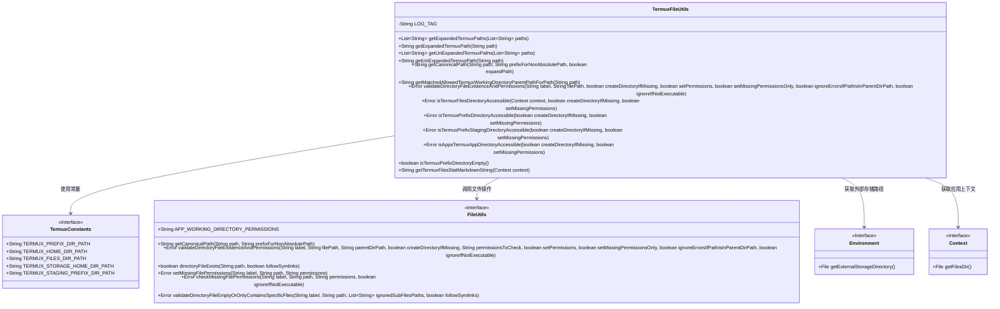
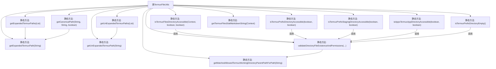
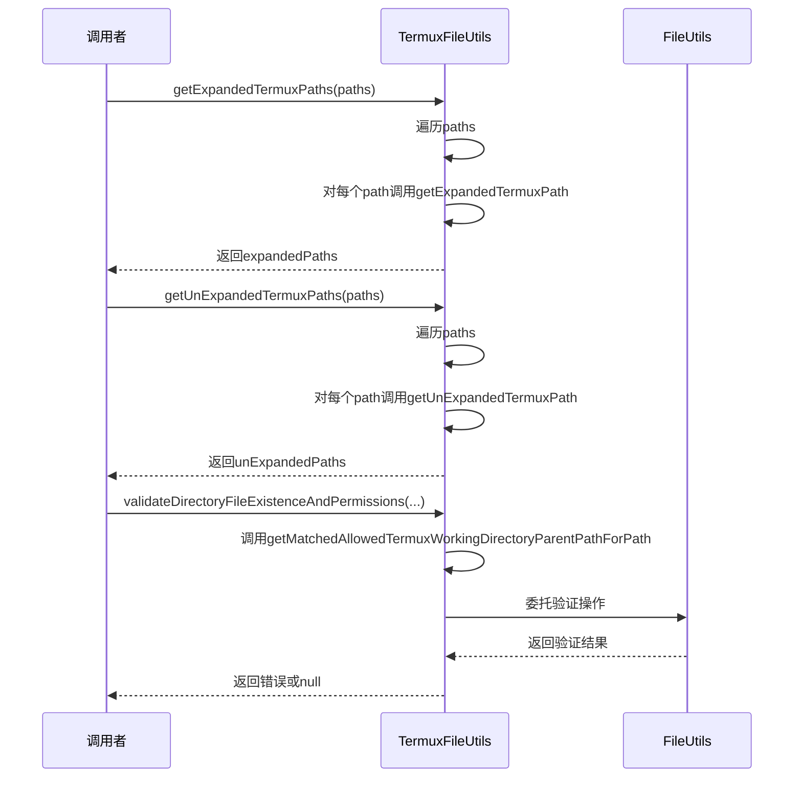

# 基础信息

|      |      |
|------|------|
| 名称 | TermuxFileUtils |
| 编码语言 | .java |
| 代码路径 | termux-app/termux-shared/src/main/java/com/termux/shared/termux/file/TermuxFileUtils.java |
| 包名 | com.termux.shared.termux.file |
| 依赖项 | ['com.termux.shared.termux.TermuxConstants.TERMUX_PREFIX_DIR_PATH', 'android.content.Context', 'android.os.Environment', 'androidx.annotation.NonNull', 'com.termux.shared.file.FileUtils', 'com.termux.shared.logger.Logger', 'com.termux.shared.markdown.MarkdownUtils', 'com.termux.shared.shell.command.ExecutionCommand', 'com.termux.shared.errors.Error', 'com.termux.shared.file.FileUtilsErrno', 'com.termux.shared.termux.shell.command.environment.TermuxShellEnvironment', 'com.termux.shared.shell.command.runner.app.AppShell', 'com.termux.shared.android.AndroidUtils', 'com.termux.shared.termux.TermuxConstants', 'com.termux.shared.termux.TermuxUtils', 'java.io.File', 'java.util.ArrayList', 'java.util.List', 'java.util.regex.Pattern'] |
| 概述说明 | Termux文件工具类，提供路径转换、目录验证及权限检查功能。 |

# 说明

TermuxFileUtils类提供处理Termux应用文件路径的工具方法，主要功能包括路径扩展与还原、规范路径获取、目录验证及权限检查。关键方法有：getExpandedTermuxPaths将$PREFIX/~替换为绝对路径；getUnExpandedTermuxPaths执行反向操作；getCanonicalPath获取规范路径；validateDirectoryFileExistenceAndPermissions验证目录存在性及权限；isTermuxFilesDirectoryAccessible检查Termux文件目录可访问性。类还包含对prefix/staging目录的校验逻辑，并支持生成文件状态统计报告。所有操作均基于TermuxConstants定义的常量路径，确保与Termux环境兼容。

# 类列表 Class Summary

| 名称   | 类型  | 说明 |
|-------|------|-------------|
| TermuxFileUtils | class | Termux文件工具类，提供路径转换、目录验证及权限检查功能。 |

## 类 TermuxFileUtils

|      |      |
|------|------|
| 访问范围 | public |
| 类型 | class |
| 名称 | TermuxFileUtils |
| 说明 | Termux文件工具类，提供路径转换、目录验证及权限检查功能。 |

### UML类图

该代码实现了一个Termux文件工具类，主要功能包括路径扩展/收缩、规范化路径处理、目录权限验证和文件系统状态检查。类图中展示了TermuxFileUtils与多个接口的依赖关系，包括文件操作工具类FileUtils、Android环境类Environment和上下文类Context，以及存储Termux特定路径常量的TermuxConstants接口。该类封装了Termux应用所需的文件系统操作，特别是处理$PREFIX和~路径替换、目录权限管理以及跨Android版本的文件系统兼容性检查。

### 内部方法调用关系图

该流程图展示了TermuxFileUtils类的主要方法调用关系，重点描述了路径转换和目录验证功能。类包含12个核心静态方法，主要处理Termux环境下的路径扩展/收缩转换、目录权限验证和状态检查。时序图则展示了getExpandedTermuxPaths、getUnExpandedTermuxPaths和validateDirectoryFileExistenceAndPermissions三个典型方法的调用序列，体现了方法间的协作关系和对FileUtils工具类的依赖。所有方法都围绕Termux特殊路径处理设计，确保Android环境下路径访问的安全性和兼容性。

### 字段列表 Field List

| 名称  | 类型  | 说明 |
|-------|-------|------|
| LOG_TAG = "TermuxFileUtils" | String | Termux文件工具日志标签常量 |

### 方法列表 Method List

| 名称  | 类型  | 说明 |
|-------|-------|------|
| getUnExpandedTermuxPath | String | 替换路径前缀为$PREFIX/或~/。 |
| isTermuxPrefixDirectoryEmpty | boolean | 检查Termux前缀目录是否为空，忽略特定文件，返回布尔结果。 |
| getTermuxFilesStatMarkdownString | String | 获取Termux文件状态信息并生成Markdown报告。 |
| isTermuxFilesDirectoryAccessible | Error | 检查Termux文件目录可访问性，必要时创建或设置权限。 |
| validateDirectoryFileExistenceAndPermissions | Error | 验证目录文件存在及权限，可创建目录和设置权限。 |
| getExpandedTermuxPaths | List<String> | 静态方法扩展Termux路径列表，返回新列表。 |
| isTermuxPrefixStagingDirectoryAccessible | Error | 检查Termux暂存目录可访问性，可选创建目录和设置权限。 |
| getCanonicalPath | String | 获取规范路径，支持非绝对路径前缀和路径扩展。 |
| isTermuxPrefixDirectoryAccessible | Error | 检查Termux前缀目录可访问性，可选创建目录或设置权限。 |
| getUnExpandedTermuxPaths | List<String> | 检查路径列表，返回未扩展的Termux路径列表。 |
| getExpandedTermuxPath | String | 替换路径中的变量为Termux实际路径。 |
| isAppsTermuxAppDirectoryAccessible | Error | 检查Termux应用目录可访问性，支持创建目录和设置权限。 |
| getMatchedAllowedTermuxWorkingDirectoryParentPathForPath | String | 获取路径匹配的Termux工作目录父路径：空或无效返回默认路径，否则匹配存储路径或返回默认。 |

