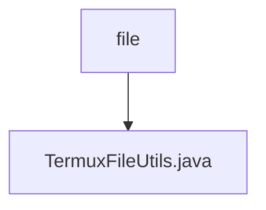

# 基础信息

|      |      |
|------|------|
| 名称 | file |
| 编码语言 | .java |
| 代码路径 | termux-app/termux-shared/src/main/java/com/termux/shared/termux/file |
| 包名 | termux-app.termux-shared.src.main.java.com.termux.shared.termux.file |
| 概述说明 | Termux文件工具类，提供路径转换、目录验证及权限检查功能。 |

# 说明

TermuxFileUtils类提供处理Termux应用文件路径的工具方法，主要功能包括路径扩展与还原、规范路径获取、目录验证及权限检查。关键方法有：getExpandedTermuxPaths将$PREFIX/~替换为绝对路径；getUnExpandedTermuxPaths执行反向操作；getCanonicalPath获取规范路径；validateDirectoryFileExistenceAndPermissions验证目录存在性及权限；isTermuxFilesDirectoryAccessible检查Termux文件目录可访问性。类还包含对prefix/staging目录的校验逻辑，并支持生成文件状态统计报告。所有操作均基于TermuxConstants定义的常量路径，确保与Termux环境兼容。

### 包内部结构视图

该流程图展示了Termux项目中文件模块的层级关系，顶层节点为"file"目录，其下包含一个具体的Java工具类文件TermuxFileUtils.java。这种结构体现了典型的模块化设计思想，将文件操作相关功能集中管理，便于维护和调用。

# 文件列表 File List

| 名称   | 类型  | 说明 |
|-------|------|-------------|
| [TermuxFileUtils.java](TermuxFileUtils.md) | file | Termux文件工具类，提供路径转换、目录验证及权限检查功能。 |

