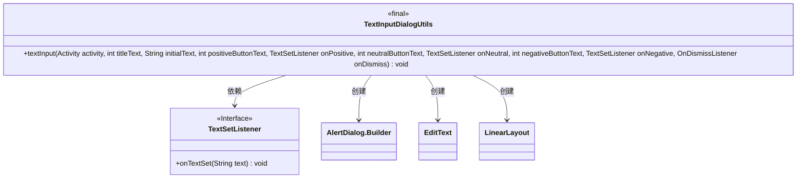
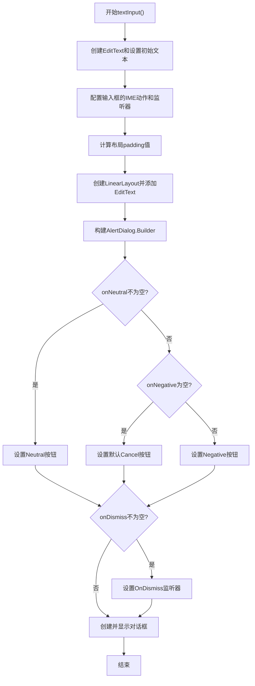
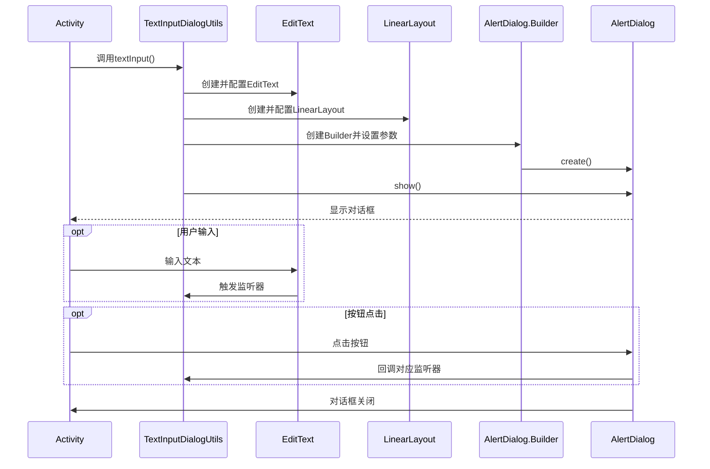
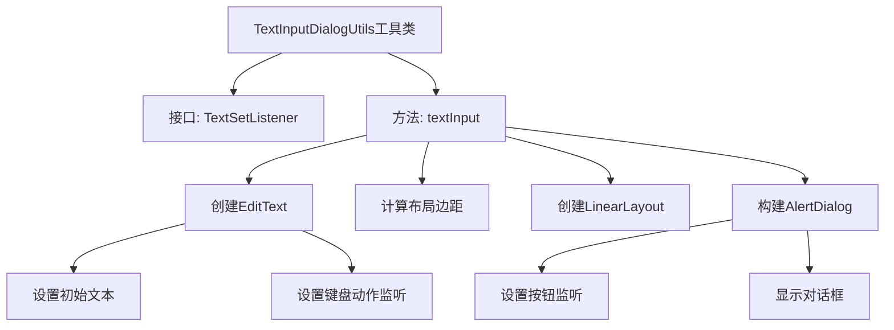
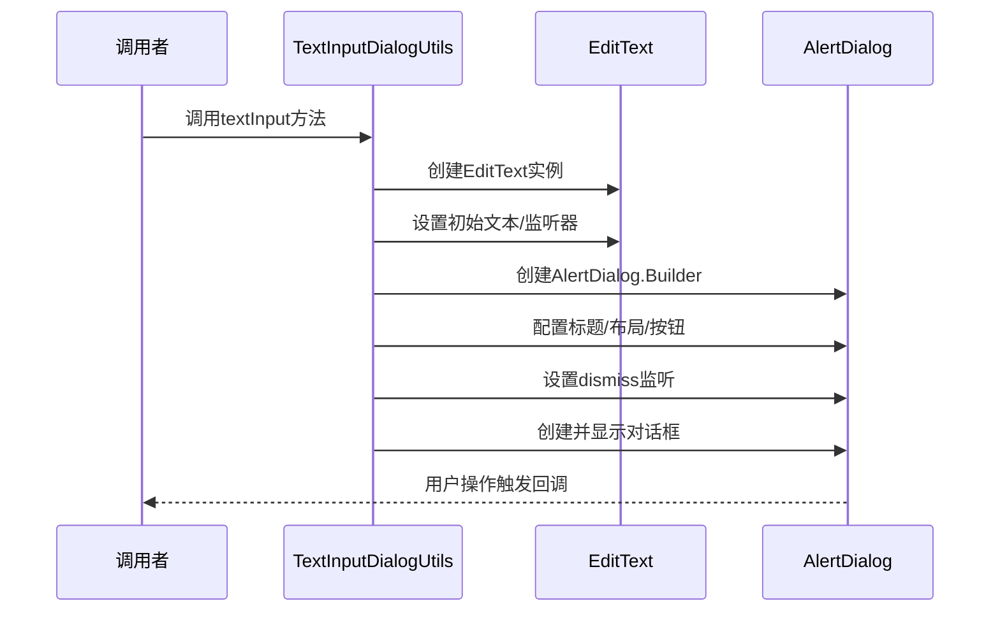

# 基础信息

|      |      |
|------|------|
| 名称 | TextInputDialogUtils |
| 编码语言 | .java |
| 代码路径 | termux-app/termux-shared/src/main/java/com/termux/shared/termux/interact/TextInputDialogUtils.java |
| 包名 | com.termux.shared.termux.interact |
| 依赖项 | ['android.app.Activity', 'android.app.AlertDialog', 'android.content.DialogInterface', 'android.text.Selection', 'android.util.TypedValue', 'android.view.KeyEvent', 'android.view.ViewGroup.LayoutParams', 'android.widget.EditText', 'android.widget.LinearLayout'] |
| 概述说明 | 文本输入对话框工具类，支持设置初始文本和按钮回调。 |

# 说明

TextInputDialogUtils是一个工具类，用于创建文本输入对话框。它包含一个TextSetListener接口用于回调文本设置事件。textInput方法接收Activity、标题文本、初始文本、按钮文本及对应监听器参数。该方法构建一个包含EditText的对话框，设置单行输入、初始文本和光标位置。对话框布局采用Material Design规范的内边距。支持设置正、中、负三个按钮的点击事件，其中正按钮绑定键盘回车事件。对话框不可通过外部触摸取消，创建后立即显示。

# 类列表 Class Summary

| 名称   | 类型  | 说明 |
|-------|------|-------------|
| TextInputDialogUtils | class | 工具类提供文本输入对话框功能，支持设置初始文本和按钮回调。 |

## 类 TextInputDialogUtils

|      |      |
|------|------|
| 访问范围 | public final |
| 类型 | class |
| 名称 | TextInputDialogUtils |
| 说明 | 工具类提供文本输入对话框功能，支持设置初始文本和按钮回调。 |

### UML类图

这段代码实现了一个文本输入对话框工具类，主要包含一个静态方法textInput()用于创建和显示自定义文本输入对话框。类图展示了工具类与接口、Android组件的关系；流程图详细描述了对话框构建过程的条件分支；时序图则说明了从Activity调用到对话框显示和交互的完整过程。该工具支持设置初始文本、三种按钮及其回调，以及对话框关闭监听，通过Builder模式灵活构建对话框界面。

### 内部方法调用关系图

这段代码实现了一个Android文本输入对话框工具类，主要功能是通过链式调用构建一个可定制的文本输入对话框。流程图展示了从创建输入框到最终显示对话框的完整过程，时序图则详细描述了调用者与工具类、UI组件之间的交互顺序。代码支持设置初始文本、三种按钮(positive/neutral/negative)的回调以及对话框关闭监听，并正确处理了键盘输入事件和布局边距计算等细节。

### 字段列表 Field List

| 名称  | 类型  | 说明 |
|-------|-------|------|

### 方法列表 Method List

| 名称  | 类型  | 说明 |
|-------|-------|------|
| textInput | void | 创建带输入框的对话框，支持确认、中立、取消按钮及文本设置回调。 |

