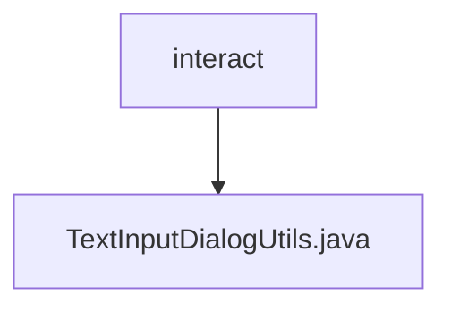

# 基础信息

|      |      |
|------|------|
| 名称 | interact |
| 编码语言 | .java |
| 代码路径 | termux-app/termux-shared/src/main/java/com/termux/shared/termux/interact |
| 包名 | termux-app.termux-shared.src.main.java.com.termux.shared.termux.interact |
| 概述说明 | 文本输入对话框工具类，支持设置初始文本和按钮回调。 |

# 说明

TextInputDialogUtils是一个工具类，用于创建文本输入对话框。它包含一个TextSetListener接口用于回调文本设置事件。textInput方法接收Activity、标题文本、初始文本、按钮文本及对应监听器参数。该方法构建一个包含EditText的对话框，设置单行输入、初始文本和光标位置。对话框布局采用Material Design规范的内边距。支持设置正、中、负三个按钮的点击事件，其中正按钮绑定键盘回车事件。对话框不可通过外部触摸取消，创建后立即显示。

### 包内部结构视图

该流程图展示了Termux项目中interact目录与TextInputDialogUtils.java文件的层级关系。interact作为父节点，包含一个子节点TextInputDialogUtils.java，表示这是一个Java工具类文件位于interact目录下，用于处理文本输入对话框的相关功能。整个结构简洁明了，体现了典型的源代码文件组织方式。

# 文件列表 File List

| 名称   | 类型  | 说明 |
|-------|------|-------------|
| [TextInputDialogUtils.java](TextInputDialogUtils.md) | file | 文本输入对话框工具类，支持设置初始文本和按钮回调。 |

