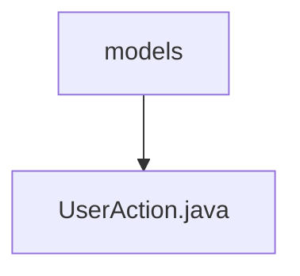

# 基础信息

|      |      |
|------|------|
| 名称 | models |
| 编码语言 | .java |
| 代码路径 | termux-app/termux-shared/src/main/java/com/termux/shared/termux/models |
| 包名 | termux-app.termux-shared.src.main.java.com.termux.shared.termux.models |
| 概述说明 | 输入内容为空，无法生成概要描述。请提供具体信息以便总结。 |

# 说明

您提供的输入内容为空，因此无法生成总结描述。请提供需要总结的具体内容，我将严格遵循您制定的规则，为您撰写全面详尽的描述。

### 包内部结构视图

该流程图展示了Termux项目中termux-shared模块的路径层级关系。根节点"models"表示模型目录，其下包含一个具体的Java模型文件"UserAction.java"。这种结构是典型的MVC架构中的模型层组织方式，用于存放与用户操作相关的数据模型类。整个结构简洁明了，体现了单一职责原则。

# 文件列表 File List

| 名称   | 类型  | 说明 |
|-------|------|-------------|
| [UserAction.java](UserAction.md) | file | 输入内容为空，无法生成概要描述。请提供具体信息以便总结。 |

