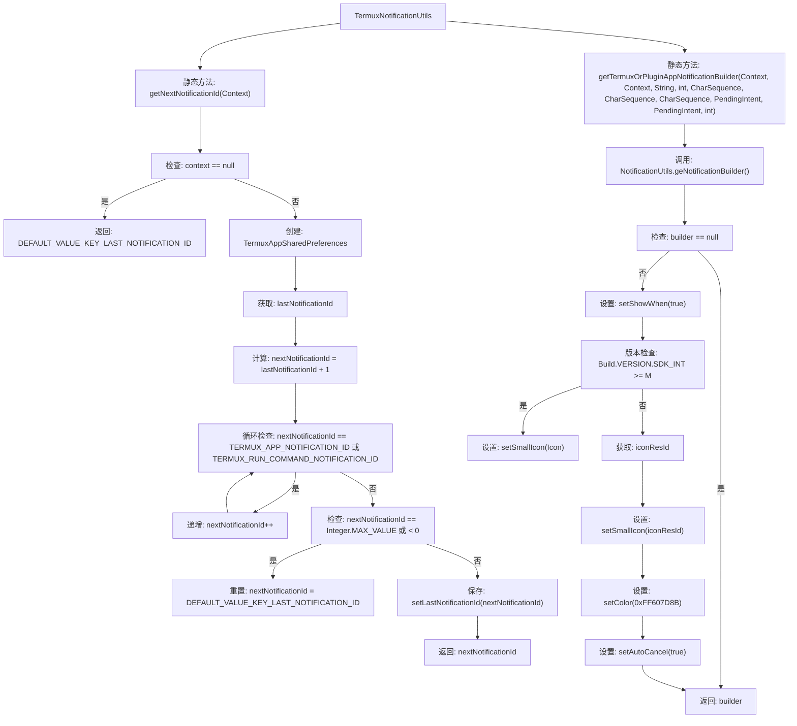

# 基础信息

|      |      |
|------|------|
| 名称 | TermuxNotificationUtils |
| 编码语言 | .java |
| 代码路径 | termux-app/termux-shared/src/main/java/com/termux/shared/termux/notification/TermuxNotificationUtils.java |
| 包名 | com.termux.shared.termux.notification |
| 依赖项 | ['android.app.Notification', 'android.app.PendingIntent', 'android.content.Context', 'android.graphics.drawable.Icon', 'android.os.Build', 'androidx.annotation.Nullable', 'com.termux.shared.R', 'com.termux.shared.android.resource.ResourceUtils', 'com.termux.shared.notification.NotificationUtils', 'com.termux.shared.termux.settings.preferences.TermuxAppSharedPreferences', 'com.termux.shared.termux.settings.preferences.TermuxPreferenceConstants', 'com.termux.shared.termux.TermuxConstants'] |
| 概述说明 | 获取唯一通知ID并构建通知。 |

# 说明

TermuxNotificationUtils类提供了两个关键功能。getNextNotificationId方法用于获取未被应用占用的唯一通知ID，处理ID冲突并确保不超出整数范围。getTermuxOrPluginAppNotificationBuilder方法构建通知对象，设置图标、颜色、点击行为等属性，兼容不同Android版本和插件应用场景。两者均处理上下文和资源问题，确保通知在Termux主应用和插件中正确显示。

# 类列表 Class Summary

| 名称   | 类型  | 说明 |
|-------|------|-------------|
| TermuxNotificationUtils | class | 获取唯一通知ID并构建通知，确保共享用户ID下的唯一性。 |

## 类 TermuxNotificationUtils

|      |      |
|------|------|
| 访问范围 | public |
| 类型 | class |
| 名称 | TermuxNotificationUtils |
| 说明 | 获取唯一通知ID并构建通知，确保共享用户ID下的唯一性。 |

### UML类图

```mermaid
classDiagram
    class TermuxNotificationUtils {
        <<static>>
        +synchronized getNextNotificationId(Context context) int
        +getTermuxOrPluginAppNotificationBuilder(Context currentPackageContext, Context termuxPackageContext, String channelId, int priority, CharSequence title, CharSequence notificationText, CharSequence notificationBigText, PendingIntent contentIntent, PendingIntent deleteIntent, int notificationMode) Notification$Builder
    }

    class TermuxPreferenceConstants {
        <<static>>
        // 常量类
    }

    class TermuxAppSharedPreferences {
        +build(Context context) TermuxAppSharedPreferences
        +getLastNotificationId() int
        +setLastNotificationId(int id) void
    }

    class TermuxConstants {
        <<static>>
        // 常量类
    }

    class NotificationUtils {
        <<static>>
        +geNotificationBuilder(Context context, String channelId, int priority, CharSequence title, CharSequence notificationText, CharSequence notificationBigText, PendingIntent contentIntent, PendingIntent deleteIntent, int notificationMode) Notification$Builder
    }

    class ResourceUtils {
        <<static>>
        +getDrawableResourceId(Context context, String name, String packageName, boolean logError) Integer
    }

    TermuxNotificationUtils --> TermuxPreferenceConstants : 使用常量
    TermuxNotificationUtils --> TermuxAppSharedPreferences : 读写配置
    TermuxNotificationUtils --> TermuxConstants : 使用常量
    TermuxNotificationUtils --> NotificationUtils : 构建通知
    TermuxNotificationUtils --> ResourceUtils : 获取资源ID
```

该代码实现了一个Android通知工具类，主要功能包括：1) 生成唯一通知ID（考虑多应用共享用户ID场景）；2) 构建跨应用兼容的通知Builder。核心逻辑涉及共享偏好设置管理、资源ID动态获取和不同Android版本的适配。类图展示了与常量类、偏好设置工具和资源工具等组件的协作关系，体现了对系统版本兼容性和资源隔离问题的处理。

### 内部方法调用关系图

流程图描述：该流程图展示了TermuxNotificationUtils类的两个核心方法。getNextNotificationId方法通过检查上下文有效性、获取上次通知ID、计算并验证新ID的合法性，最终返回安全可用的通知ID。getTermuxOrPluginAppNotificationBuilder方法则通过构建通知对象，设置图标、颜色等属性，并处理不同Android版本的兼容性问题，最终返回配置好的通知构建器。流程中包含了空值检查、版本判断和资源获取等关键步骤。

### 字段列表 Field List

| 名称  | 类型  | 说明 |
|-------|-------|------|

### 方法列表 Method List

| 名称  | 类型  | 说明 |
|-------|-------|------|
| getTermuxOrPluginAppNotificationBuilder | Notification.Builder | 获取Termux或插件应用通知构建器，设置图标、颜色及自动取消。 |
| getNextNotificationId | int | 获取下一个通知ID，处理无效值并保存。 |

