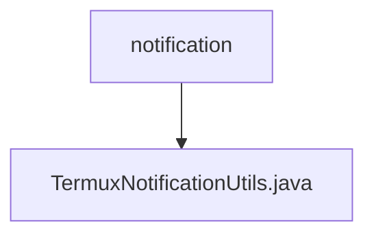

# 基础信息

|      |      |
|------|------|
| 名称 | notification |
| 编码语言 | .java |
| 代码路径 | termux-app/termux-shared/src/main/java/com/termux/shared/termux/notification |
| 包名 | termux-app.termux-shared.src.main.java.com.termux.shared.termux.notification |
| 概述说明 | 获取唯一通知ID并构建通知。 |

# 说明

TermuxNotificationUtils类提供了两个关键功能。getNextNotificationId方法用于获取未被应用占用的唯一通知ID，处理ID冲突并确保不超出整数范围。getTermuxOrPluginAppNotificationBuilder方法构建通知对象，设置图标、颜色、点击行为等属性，兼容不同Android版本和插件应用场景。两者均处理上下文和资源问题，确保通知在Termux主应用和插件中正确显示。

### 包内部结构视图

该流程图展示了Termux项目中通知模块的层级结构，顶层目录为notification，其下包含一个工具类文件TermuxNotificationUtils.java。这种结构体现了典型的Java项目组织方式，工具类文件直接存放在功能相关的包路径下，便于代码管理和维护。

# 文件列表 File List

| 名称   | 类型  | 说明 |
|-------|------|-------------|
| [TermuxNotificationUtils.java](TermuxNotificationUtils.md) | file | 获取唯一通知ID并构建通知。 |

