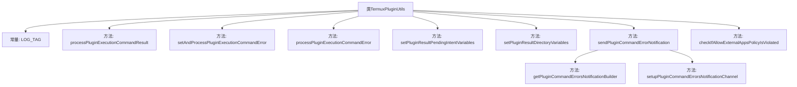
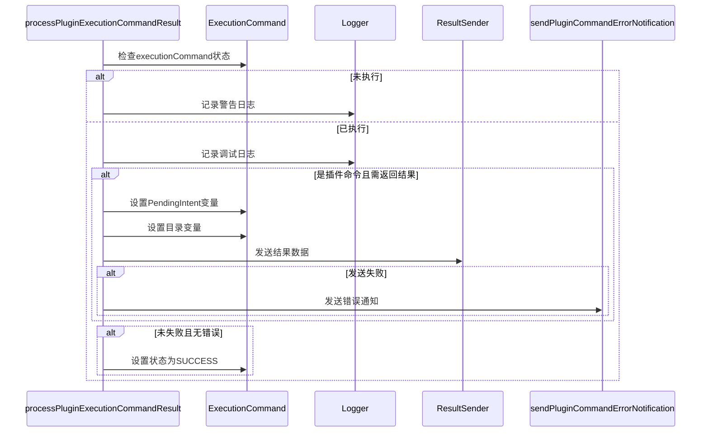

# 基础信息

|      |      |
|------|------|
| 名称 | TermuxPluginUtils |
| 编码语言 | .java |
| 代码路径 | termux-app/termux-shared/src/main/java/com/termux/shared/termux/plugins/TermuxPluginUtils.java |
| 包名 | com.termux.shared.termux.plugins |
| 依赖项 | ['android.app.Notification', 'android.app.NotificationManager', 'android.app.PendingIntent', 'android.content.Context', 'android.os.Build', 'android.os.Environment', 'androidx.annotation.NonNull', 'androidx.annotation.Nullable', 'com.termux.shared.R', 'com.termux.shared.activities.ReportActivity', 'com.termux.shared.file.FileUtils', 'com.termux.shared.termux.file.TermuxFileUtils', 'com.termux.shared.shell.command.result.ResultConfig', 'com.termux.shared.shell.command.result.ResultData', 'com.termux.shared.errors.Errno', 'com.termux.shared.errors.Error', 'com.termux.shared.notification.NotificationUtils', 'com.termux.shared.termux.models.UserAction', 'com.termux.shared.termux.notification.TermuxNotificationUtils', 'com.termux.shared.termux.settings.preferences.TermuxPreferenceConstants', 'com.termux.shared.shell.command.result.ResultSender', 'com.termux.shared.shell.ShellUtils', 'com.termux.shared.android.AndroidUtils', 'com.termux.shared.termux.TermuxConstants', 'com.termux.shared.termux.TermuxConstants.TERMUX_APP.TERMUX_SERVICE', 'com.termux.shared.logger.Logger', 'com.termux.shared.termux.settings.preferences.TermuxAppSharedPreferences', 'com.termux.shared.termux.settings.preferences.TermuxPreferenceConstants.TERMUX_APP', 'com.termux.shared.models.ReportInfo', 'com.termux.shared.termux.settings.properties.TermuxAppSharedProperties', 'com.termux.shared.shell.command.ExecutionCommand', 'com.termux.shared.data.DataUtils', 'com.termux.shared.markdown.MarkdownUtils', 'com.termux.shared.termux.TermuxUtils'] |
| 概述说明 | 处理Termux插件执行命令结果和错误，发送通知和返回结果。 |

# 说明

TermuxPluginUtils类提供处理Termux插件执行命令结果的工具方法。主要功能包括处理命令执行结果和错误，通过PendingIntent或文件目录返回结果给调用者，记录日志，发送错误通知等。关键方法有processPluginExecutionCommandResult处理成功结果，setAndProcessPluginExecutionCommandError设置并处理错误，sendPluginCommandErrorNotification发送错误通知。类还包含设置结果返回变量的辅助方法，检查外部应用访问权限的策略验证，以及配置通知渠道等功能。所有操作都严格遵循执行命令状态检查，确保正确处理流程。

# 类列表 Class Summary

| 名称   | 类型  | 说明 |
|-------|------|-------------|
| TermuxPluginUtils | class | Termux插件工具类，处理执行命令结果和错误，支持通知和回调。 |

## 类 TermuxPluginUtils

|      |      |
|------|------|
| 访问范围 | public |
| 类型 | class |
| 名称 | TermuxPluginUtils |
| 说明 | Termux插件工具类，处理执行命令结果和错误，支持通知和回调。 |

### UML类图

```mermaid
classDiagram
    class TermuxPluginUtils {
        -String LOG_TAG
        +processPluginExecutionCommandResult(Context context, String logTag, ExecutionCommand executionCommand) void
        +setAndProcessPluginExecutionCommandError(Context context, String logTag, ExecutionCommand executionCommand, boolean forceNotification, String errmsg) void
        +processPluginExecutionCommandError(Context context, String logTag, ExecutionCommand executionCommand, boolean forceNotification) void
        +setPluginResultPendingIntentVariables(ExecutionCommand executionCommand) void
        +setPluginResultDirectoryVariables(ExecutionCommand executionCommand) void
        +sendPluginCommandErrorNotification(Context currentPackageContext, String logTag, CharSequence title, String message, Throwable throwable) void
        +sendPluginCommandErrorNotification(Context currentPackageContext, String logTag, CharSequence title, String notificationTextString, String message) void
        +sendPluginCommandErrorNotification(Context currentPackageContext, String logTag, CharSequence title, String notificationTextString, String message, boolean forceNotification, boolean showToast, boolean addDeviceInfo) void
        +sendPluginCommandErrorNotification(Context currentPackageContext, String logTag, CharSequence title, String notificationTextString, String message, boolean forceNotification, boolean showToast, TermuxUtils.AppInfoMode appInfoMode, boolean addDeviceInfo, String callingPackageName) void
        +getPluginCommandErrorsNotificationBuilder(Context currentPackageContext, Context termuxPackageContext, CharSequence title, CharSequence notificationText, CharSequence notificationBigText, PendingIntent contentIntent, PendingIntent deleteIntent, int notificationMode) Notification.Builder
        +setupPluginCommandErrorsNotificationChannel(Context context) void
        +checkIfAllowExternalAppsPolicyIsViolated(Context context, String apiName) String
    }

    class ExecutionCommand {
        <<Interface>>
        +hasExecuted() boolean
        +isStateFailed() boolean
        +setStateFailed(int code, String errmsg) void
        +getCommandIdAndLabelLogString() String
        +getExecutionOutputLogString(ExecutionCommand executionCommand, boolean includeStackTrace, boolean includeResultData, boolean isExecutionCommandLoggingEnabled) String
        +getExecutionCommandMarkdownString(ExecutionCommand executionCommand) String
    }

    class ResultData {
        <<Interface>>
        +getErrCode() int
        +getErrorsListMinimalString(ResultData resultData) String
        +setStateFailed(Error error) void
    }

    class ResultConfig {
        <<Interface>>
    }

    class ResultSender {
        <<Interface>>
        +sendCommandResultData(Context context, String logTag, String commandIdAndLabel, ResultConfig resultConfig, ResultData resultData, boolean isExecutionCommandLoggingEnabled) Error
    }

    class Logger {
        <<Interface>>
        +logWarn(String logTag, String message) void
        +logError(String logTag, String message) void
        +logErrorPrivateExtended(String logTag, String message) void
        +logDebugExtended(String logTag, String message) void
        +shouldEnableLoggingForCustomLogLevel(int backgroundCustomLogLevel) boolean
        +showToast(Context context, String message, boolean longDuration) void
    }

    class TermuxUtils {
        <<Interface>>
        +getAppInfoMarkdownString(Context context, AppInfoMode appInfoMode, String callingPackageName) String
        +getReportIssueMarkdownString(Context context) String
    }

    class TermuxAppSharedPreferences {
        <<Interface>>
        +arePluginErrorNotificationsEnabled(boolean defaultValue) boolean
    }

    class NotificationUtils {
        <<Interface>>
        +setupNotificationChannel(Context context, String channelId, String channelName, int importance) void
        +getNotificationManager(Context context) NotificationManager
    }

    TermuxPluginUtils --> ExecutionCommand : 处理执行命令
    TermuxPluginUtils --> ResultData : 处理结果数据
    TermuxPluginUtils --> ResultConfig : 配置结果发送
    TermuxPluginUtils --> ResultSender : 发送命令结果
    TermuxPluginUtils --> Logger : 记录日志
    TermuxPluginUtils --> TermuxUtils : 获取应用信息
    TermuxPluginUtils --> TermuxAppSharedPreferences : 检查通知设置
    TermuxPluginUtils --> NotificationUtils : 管理通知
```

这段代码主要实现了一个Termux插件工具类，用于处理插件执行命令的结果和错误。类图中展示了TermuxPluginUtils与多个接口的交互关系，包括ExecutionCommand（执行命令）、ResultData（结果数据）、ResultConfig（结果配置）、ResultSender（结果发送）、Logger（日志记录）、TermuxUtils（工具方法）、TermuxAppSharedPreferences（偏好设置）和NotificationUtils（通知管理）。该类提供了处理命令结果、设置错误状态、发送通知等功能，并依赖于这些接口来完成具体的操作。

### 内部方法调用关系图

该流程图展示了TermuxPluginUtils类的核心结构和交互关系。主方法processPluginExecutionCommandResult负责处理命令执行结果，根据状态决定是否记录日志、发送结果或错误通知。类包含9个关键方法，其中错误处理流程涉及多个层级的方法调用，包括日志记录、结果发送和通知管理。时序图详细展示了命令结果处理过程中的对象协作，特别突出了条件分支和错误处理路径。整体设计体现了对Android插件化命令执行的完整生命周期管理。

### 字段列表 Field List

| 名称  | 类型  | 说明 |
|-------|-------|------|
| LOG_TAG = "TermuxPluginUtils" | String | Termux插件工具日志标签 |

### 方法列表 Method List

| 名称  | 类型  | 说明 |
|-------|-------|------|
| sendPluginCommandErrorNotification | void | 发送插件命令错误通知的静态方法，含上下文、标签、标题、消息等参数。 |
| sendPluginCommandErrorNotification | void | 发送插件错误通知，含标题、消息和异常堆栈。 |
| processPluginExecutionCommandError | void | 处理插件执行错误：检查状态、记录日志、发送结果通知。 |
| sendPluginCommandErrorNotification | void | 发送插件错误通知，含标题、消息和设备信息选项。 |
| setPluginResultPendingIntentVariables | void | 设置插件结果PendingIntent变量，包括输出、错误码等键值。 |
| setAndProcessPluginExecutionCommandError | void | 静态方法设置并处理插件执行命令错误，更新状态并触发错误处理。 |
| setPluginResultDirectoryVariables | void | 设置插件结果目录变量，处理路径规范化和默认文件名生成。 |
| processPluginExecutionCommandResult | void | 处理插件执行命令结果：检查状态、记录日志，若需返回结果则发送，失败时通知错误，成功则更新状态。 |
| sendPluginCommandErrorNotification | void | 发送插件命令错误通知，检查设置后生成报告并显示通知或Toast。 |
| getPluginCommandErrorsNotificationBuilder | Notification.Builder | 获取插件命令错误通知构建器，参数包括上下文、标题、文本、意图和模式。 |
| setupPluginCommandErrorsNotificationChannel | void | 为Android O及以上版本设置插件命令错误通知渠道。 |
| checkIfAllowExternalAppsPolicyIsViolated | String | 检查外部应用权限是否违规，返回错误信息。 |

