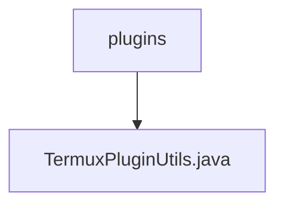

# 基础信息

|      |      |
|------|------|
| 名称 | plugins |
| 编码语言 | .java |
| 代码路径 | termux-app/termux-shared/src/main/java/com/termux/shared/termux/plugins |
| 包名 | termux-app.termux-shared.src.main.java.com.termux.shared.termux.plugins |
| 概述说明 | 处理Termux插件执行命令结果和错误，发送通知和返回结果。 |

# 说明

TermuxPluginUtils类提供处理Termux插件执行命令结果的工具方法。主要功能包括处理命令执行结果和错误，通过PendingIntent或文件目录返回结果给调用者，记录日志，发送错误通知等。关键方法有processPluginExecutionCommandResult处理成功结果，setAndProcessPluginExecutionCommandError设置并处理错误，sendPluginCommandErrorNotification发送错误通知。类还包含设置结果返回变量的辅助方法，检查外部应用访问权限的策略验证，以及配置通知渠道等功能。所有操作都严格遵循执行命令状态检查，确保正确处理流程。

### 包内部结构视图

该流程图展示了Termux项目中插件模块的层级结构。顶层节点为plugins文件夹，其下包含一个关键工具类文件TermuxPluginUtils.java。这种简洁的层级关系体现了插件工具类的集中管理方式，符合常见Java项目的模块化组织结构，便于开发者快速定位插件相关工具方法。

# 文件列表 File List

| 名称   | 类型  | 说明 |
|-------|------|-------------|
| [TermuxPluginUtils.java](TermuxPluginUtils.md) | file | 处理Termux插件执行命令结果和错误，发送通知和返回结果。 |

