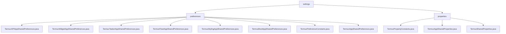

# 基础信息

|      |      |
|------|------|
| 名称 | settings |
| 编码语言 | .java |
| 代码路径 | termux-app/termux-shared/src/main/java/com/termux/shared/termux/settings |
| 包名 | termux-app.termux-shared.src.main.java.com.termux.shared.termux.settings |
| 概述说明 | Termux共享偏好设置管理系统，分层设计支持多进程安全访问，管理主应用及插件配置。 |

# 说明

```markdown
## 概述

该模块是Termux应用生态系统的统一配置管理核心，由两个紧密关联的子模块组成：

1. **SharedPreferences管理模块**  
   基于Android的`SharedPreferences`实现，采用分层设计架构（基础类+多插件子类），通过`SharedPreferenceUtils`工具类提供多进程安全访问能力。核心功能包括跨进程配置同步、带错误处理的实例构建、配置项验证及终端状态维护。

2. **属性管理系统**  
   采用三层架构设计（常量定义层→抽象管理层→应用实现层），支持多数据类型配置管理。通过单例模式、内存缓存和线程安全机制保障稳定性，提供属性验证、多源加载等高级功能。

## 主要业务场景

### 跨应用配置管理
- **主应用配置**  
  管理终端UI（字体/边距/工具栏）、功能开关（键盘/常亮/错误报告）、会话ID等运行时参数
- **插件专属配置**  
  - Float插件：浮动窗口的几何属性（位置/尺寸/透明度）
  - API插件：意图请求码管理
  - Widget插件：唯一令牌生成存储
  - 其他插件：日志级别控制/启动项管理/终端样式配置

### 高级配置处理
- **多进程同步**  
  通过`MODE_MULTI_PROCESS`确保窗口位置等关键配置在插件进程间一致性
- **属性验证体系**  
  对数值型配置实施范围检查（如字体大小），对枚举型配置建立双向映射（如光标样式）
- **容错机制**  
  提供默认值回退策略，结合日志记录实现配置错误可追溯

### 性能与扩展
- **高效访问**  
  内存缓存加速高频读取，支持强制磁盘读取保证数据新鲜度
- **架构扩展性**  
  抽象基类`TermuxSharedProperties`支持派生新配置管理器，插件化设计便于新增功能模块
- **统一入口**  
  通过单例模式（如`TermuxAppSharedProperties`）提供线程安全的全局访问点

### 状态维护
- 会话/终端唯一标识符生成
- 最后意图请求状态跟踪
- 配置修改的原子性提交（含立即持久化选项）
```


### 包内部结构视图



该流程图展示了Termux应用共享设置模块的层级结构，根节点为settings目录，下分preferences和properties两个子目录。preferences目录包含8个Java配置文件，涉及API、小部件、任务器等不同功能的偏好设置；properties目录包含3个属性相关文件，定义了属性常量和共享属性逻辑。整体结构清晰体现了配置文件的分类管理方式。

# 文件列表 File List

| 名称   | 类型  | 说明 |
|-------|------|-------------|
| [properties](properties/_module.md) | package | Termux属性常量类定义配置项，管理类处理属性加载与验证。 |
| [preferences](preferences/_module.md) | package | 
Termux应用及插件共享偏好设置管理类，提供日志级别、窗口位置、字体大小等配置项的存取功能，通过工具类实现多进程安全操作。 |


